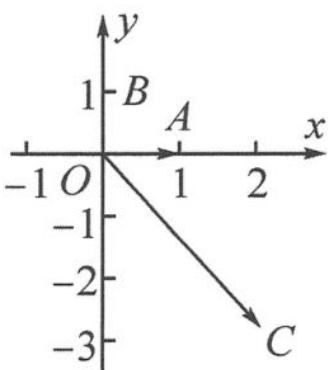

> [!faq]- 《高中数学新体系·向量的秘密》参考答案
>
> > [!success]- **【答案】** 详见解析
>
> > [!note]- **【分析】**
> > 本题未单列分析。
>
> > [!note]- **【解析】**
> > 解答 解法一: 因为 $a \cdot c = a \cdot (2a - \sqrt{5}b) = 2a^{2} - \sqrt{5}a \cdot b = 2$ ，且 $|c| = |2a - \sqrt{5}b| = \sqrt{4 + 5} = 3$ ，
> > 所以 $\cos\langle a,c\rangle=\frac{a\cdot c}{|a||c|}=\frac{2}{3}.$ 解法二: 结合坐标系, 可以作出几何图形, 如图.
> > 显然有点 A(1,0), B(0,1), C(2, -√5),
> > 所以 $\langle a,c\rangle=\angle AOC$ , 则 $\cos\langle a,c\rangle=\frac{2}{3}$ .
> > 
> > 第3题答图
