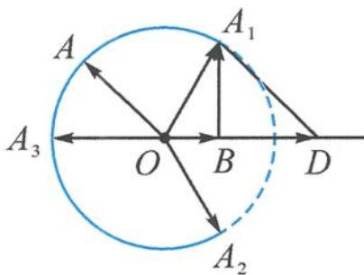
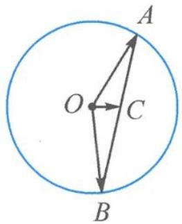

> [!faq]- 《高中数学新体系·向量的秘密》参考答案
>
> > [!success]- **【答案】** 详见解析
>
> > [!note]- **【分析】**
> > 本题未单列分析。
>
> > [!note]- **【解析】**
> > 解答 记 $a = \overrightarrow{OA}, b = \overrightarrow{OB}, \lambda b = \overrightarrow{OD}$ .
> > 因为点 A, B 为相对运动, 所以固定 OB, 取 $\beta=0$ , 则点 A 在半径为 2 的圆上运动, 点 D 在射线 OB 上运动, 如答图.
> > 
> > 第6题答图
> > $|a-\lambda b|$ 表示圆上一点到射线上的点的距离 $|AD|$ .
> > 显然, 当点 A 位于点 $A_{1}$ 时, $A_{1}B \perp OB$ , 此时点到线的垂直距离最短, 恰为 $\sqrt{3}$ .
> > 当点 A 自点 $A_{1}$ 按逆时针方向旋转时， $|a-\lambda b|>\sqrt{3}$ （当点 A 位于左上方的圆弧上时， $|a-\lambda b|>|AO|=2$ ，这是正实数 $\lambda$ 造成射线的缘故，如果题干改为实数 $\lambda$ ，那么结果就不一样），故向量 a, b 的夹角 $\theta\in\left[\frac{\pi}{3},\pi\right]$ .
> > 093 001 260 057<|box\_end|><|ref\_start|>text<|ref\_end|><|rotate\_up|>
> > <|box\_start|>314 008 990 058<|box\_end|><|ref\_start|>equation<|ref\_end|><|rotate\_up|>
> > <|box\_start|>006 092 455 138<|box\_end|><|ref\_start|>equation<|ref\_end|><|rotate\_up|>
> > <|box\_start|>095 172 774 222<|box\_end|><|ref\_start|>equation<|ref\_end|><|rotate\_up|>
> > <|box\_start|>006 092 774 222<|box\_end|><|ref\_start|>equation\_block<|ref\_end|><|rotate\_up|>
> > <|box\_start|>093 256 460 349<|box\_end|><|ref\_start|>text<|ref\_end|><|rotate\_up|>
> > <|box\_start|>468 256 990 349<|box\_end|><|ref\_start|>text<|ref\_end|><|rotate\_up|><|txt\_contd\_src|>
> > <|box\_start|>006 388 391 482<|box\_end|><|ref\_start|>equation<|ref\_end|><|rotate\_up|>
> > <|box\_start|>093 523 834 616<|box\_end|><|ref\_start|>text<|ref\_end|><|rotate\_up|><|txt\_contd\_tgt|>
> > <|box\_start|>093 635 763 698<|box\_end|><|ref\_start|>text<|ref\_end|><|rotate\_up|>
> > <|box\_start|>093 732 977 783<|box\_end|><|ref\_start|>text<|ref\_end|><|rotate\_up|>
> > <|box\_start|>006 818 994 994<|box\_end|><|ref\_start|>text<|ref\_end|><|rotate\_up|>
> > 
> > 第8题答图
> > 由垂径定理知, 当 $AB \perp OC$ 时, $|AB|$ 取得最小值,
> > 此时 $\cos\angle AOB=2\cos^{2}\angle AOC-1=2\times\left(\frac{1}{3}\right)^{2}$ $-1=-\frac{7}{9}.$
