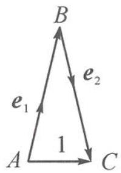
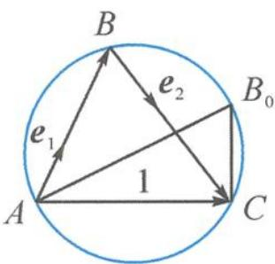
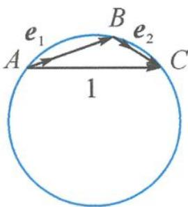
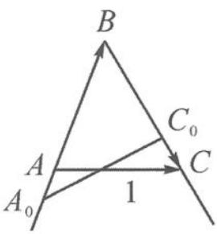
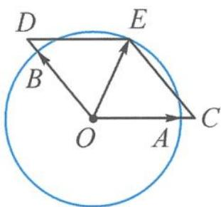
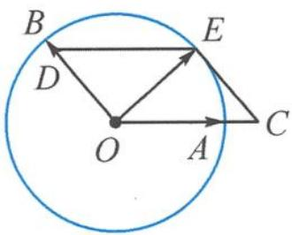

> [!faq]- 《高中数学新体系·向量的秘密》参考答案
>
> > [!success]- **【答案】** 详见解析
>
> > [!note]- **【分析】**
> > 本题未单列分析。
>
> > [!note]- **【解析】**
> > 解答 解法一: 记 $xe_{1}=\overrightarrow{AB}, ye_{2}=\overrightarrow{BC}$ ，则 $e=xe_{1}+ye_{2}=\overrightarrow{AC}$ .
> > 如答图 1, 构成 $\triangle ABC$ , 且 $|\overrightarrow{AB}| = x, |\overrightarrow{BC}| = y, |\overrightarrow{AC}| = 1$ .
> > 
> > 第9题答图1
> > 注意到 $e_{1}, e_{2}$ 的夹角为 $\pi - B$ ，对于确定的 $\angle B$ ，由“定弦对定角”知，点 B 在圆上运动，如答图 2.
> > 
> > 第9题答图2
> > 故 $|\overrightarrow{AB}| = x$ 的最大值恰为外接圆的直径 $2R = \frac{1}{\sin B} = \sqrt{2}$ , 即 $\sin B = \frac{\sqrt{2}}{2}$ , 得 $B = \frac{\pi}{4}$ 或 $B = \frac{3\pi}{4}$ .
> > 但因为题干要求 $x, y \in \mathbb{R}^*$ ，所以当 $B = \frac{3\pi}{4}$ 时，如答图3， $|\overrightarrow{AB}| = x < |\overrightarrow{AC}| = 1$ ，矛盾.
> > 
> > 第9题答图3
> > 故 $B = \frac{\pi}{4}, e_1, e_2$ 的夹角为 $\frac{3\pi}{4}$ .
> > 解法二:如答图 4,也可以理解为长度为 1 的线段 AC,两端点 A,C 分别在 BA,BC 两条射线上运动,且 $\left|\overrightarrow{AB}\right|=x$ 的最大值为 $\sqrt{2}$ .
> > 
> > 第9题答图4
> > 由正弦定理知 $\frac{x}{\sin C}=\frac{1}{\sin B}.$
> > 所以 $x=\frac{\sin C}{\sin B}\leqslant\frac{1}{\sin B}=\sqrt{2}$ ,
> > 即 $\sin B=\frac{\sqrt{2}}{2}$ ，得 $B=\frac{\pi}{4}$ ，此时 $C=\frac{\pi}{2}$ .
> > 注意到 $e_1, e_2$ 的夹角为 $\pi - B$ , 故 $e_1, e_2$ 的夹角为 $\frac{3\pi}{4}$ .
> > 解法三：记 $e_1 = \overrightarrow{OA}, e_2 = \overrightarrow{OB}, xe_1 = \overrightarrow{OC}, ye_2 = \overrightarrow{OD}$
> > 则 $e = xe_{1} + ye_{2} = \overrightarrow{OE}$ ，且 $|e| = |\overrightarrow{OE}| = 1.$
> > 故问题转化为点 E 是单位圆上一点, 由平面向量基本定理, 将向量 $\overrightarrow{OE}$ 分解到 $\overrightarrow{OA}, \overrightarrow{OB}$ 两个方向上, 构成平行四边形 OCED, 如答图 5.
> > 
> > 第9题答图5
> > 因为 $\overrightarrow{OE}$ 在 $\overrightarrow{OA}$ 上的分量最大为 $\sqrt{2} \overrightarrow{OA}$ , 即 $EC$ 恰为单位圆的切线时, $|\overrightarrow{OC}|$ 取得最大值 $\sqrt{2}$ .
> > 如答图 6, 此时 $OE \perp CE, |\overrightarrow{OE}| = 1, |\overrightarrow{OC}| = \sqrt{2}$ ,
> > 所以 $\triangle OEC$ 为等腰直角三角形，
> > 故 $\angle BOC=\frac{3\pi}{4}$ ，即 $e_{1},e_{2}$ 的夹角为 $\frac{3\pi}{4}$ .
> > 
> > 第9题答图6
