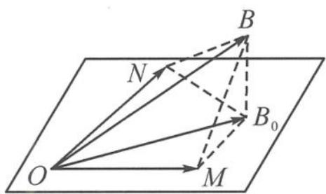

> [!faq]- 《高中数学新体系·向量的秘密》参考答案
>
> > [!success]- **【答案】** 详见解析
>
> > [!note]- **【分析】**
> > 本题未单列分析。
>
> > [!note]- **【解析】**
> > 解答 如答图, 记 $b = \overrightarrow{OB}$ , 则 $b \cdot e_1 = 2, b \cdot e_2 = \frac{5}{2}$ 刻画了向量 $b$ 在 $e_1$ 和 $e_2$ 上的投影值恰为 2 和 $\frac{5}{2}$ , 即 $BM \perp OM, BN \perp ON$ 且 $|\overrightarrow{OM}| = 2, |\overrightarrow{ON}| = \frac{5}{2}$ .
> > 
> > 第10题答图
> > 对于任意的 $x, y \in \mathbb{R}, |b - (xe_1 + ye_2)| \geqslant |b - (x_0e_1 + y_0e_2)| = 1$ 表示空间向量 $\pmb{b}$ 的终点 $B$ 到平面上任一点距离的最小值就是连线垂直于平面时，即图中 $|\overrightarrow{BB_0}| = 1$ 且 $BB_0 \perp$ 平面 $MON$ ，其中向量 $\overrightarrow{OB_0} = x_0e_1 + y_0e_2$ 就是空间向量 $\pmb{b}$ 在平面 $\alpha$ 上的投影向量.
> > 易得 $\overrightarrow{OB_0} = e_1 + 2e_2, x_0 = 1, y_0 = 2, |\pmb{b}| = \sqrt{|\overrightarrow{OB_0}|^2 + 1} = 2\sqrt{2}$ .
