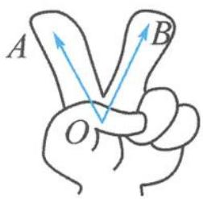

## 5.1 数量积的定义

数量积的代数形态: $a \cdot b = |a||b|\cos\theta.$

数量积的几何形态: $\overrightarrow{OA}\cdot\overrightarrow{OB}=|\overrightarrow{OA}||\overrightarrow{OB}|\cos\theta.$

数量积与两个向量的模长( $|\overrightarrow{OA}|,|\overrightarrow{OB}|$ )及夹角的余弦值( $\cos\theta$ )这三大要素有关.为方便讲解和记忆,请大家伸出两根手指头(如图所示),表示两个向量 $\overrightarrow{OA}$ , $\overrightarrow{OB}$ ,形成“剪刀手”模型.

![[高中/总复习/专题/高考数学秘密/浙大优辅《高中数学新体系 向量的秘密》/第5讲_玩转剪刀手模型_轻松搞定数量积/5_1_数量积的定义/questions/Q00036666.md]]
![[高中/总复习/专题/高考数学秘密/浙大优辅《高中数学新体系 向量的秘密》/第5讲_玩转剪刀手模型_轻松搞定数量积/5_1_数量积的定义/questions/Q00036667.md]]
