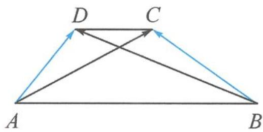

<!-- question-source:start -->
例 2 如图 5.2-2, 在梯形 ABCD 中, 已知 AB // CD, AB = 6, AD = DC = 2, 若 $\overrightarrow{AC} \cdot \overrightarrow{BD} = -12$ , 则 $\overrightarrow{AD} \cdot \overrightarrow{BC} =$ \_\_\_\_.

<!-- question-source:end -->

![[高中/总复习/专题/高考数学秘密/浙大优辅《高中数学新体系 向量的秘密》/第5讲_玩转剪刀手模型_轻松搞定数量积/5_2_要素一问三不知__转基底/questions/answers/Q00036669A1.md]]
