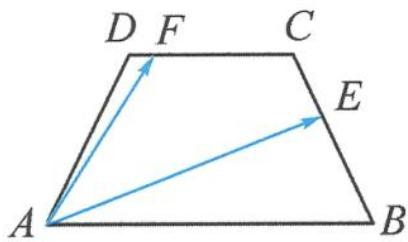

> [!faq]- 《高中数学新体系·向量的秘密》例题解析
>
> > [!success]- **【答案】** 详见解析
>
> > [!note]- **【分析】**
> > 本题要求两个向量的数量积,但由于 $|\overrightarrow{AE}|$ , $|\overrightarrow{AF}|$ , $\cos \theta$ 三者都未知(或不易求,称为“一问三不知”),所以考虑选取合适的基底来表示向量 $\overrightarrow{AE},\overrightarrow{AF}$ ,然后利用数量积运算求解.那么哪些向量适合作基底呢?显然题干给出的长度已知、夹角确定的 $\overrightarrow{AB},\overrightarrow{AD}$ 是不二之选.
>
> > [!note]- **【解析】**
> > 解答 如图 5.2-1, 取 $\overrightarrow{AB}, \overrightarrow{AD}$ 为一组基底, 在等腰梯形 ABCD 中, CD = AD = BC = 1.
> > 因为 $\overrightarrow{DF} = \frac{1}{6}\overrightarrow{DC},\overrightarrow{DC} = \frac{1}{2}\overrightarrow{AB}$ ，所以 $\overrightarrow{DF} = \frac{1}{12}\overrightarrow{AB}$ .在△ADF中，
> > 
> > $$
> > \overrightarrow {A F} = \overrightarrow {A D} + \overrightarrow {D F} = \overrightarrow {A D} + \frac {1}{1 2} \overrightarrow {A B}.
> > $$
> > 图 5.2-1
> > 在梯形 $ABCD$ 中， $\overrightarrow{BC} = \overrightarrow{BA} + \overrightarrow{AD} + \overrightarrow{DC} = -\overrightarrow{AB} + \overrightarrow{AD} + \frac{1}{2}\overrightarrow{AB} = -\frac{1}{2}\overrightarrow{AB} + \overrightarrow{AD}$ . 在 $\triangle ABE$ 中，
> > $$
> > \overrightarrow {A E} = \overrightarrow {A B} + \overrightarrow {B E} = \overrightarrow {A B} + \frac {2}{3} \overrightarrow {B C} = \overrightarrow {A B} + \frac {2}{3} \left(- \frac {1}{2} \overrightarrow {A B} + \overrightarrow {A D}\right) = \frac {2}{3} \overrightarrow {A B} + \frac {2}{3} \overrightarrow {A D}.
> > $$
> > 所以
> > $$
> > \begin{array}{r l} \overrightarrow {A E} \cdot \overrightarrow {A F} & = \left(\frac {2}{3} \overrightarrow {A B} + \frac {2}{3} \overrightarrow {A D}\right) \cdot \left(\frac {1}{1 2} \overrightarrow {A B} + \overrightarrow {A D}\right) = \frac {1}{1 8} | \overrightarrow {A B} | ^ {2} + \frac {2}{3} | \overrightarrow {A D} | ^ {2} + \frac {1 3}{1 8} \overrightarrow {A B} \cdot \overrightarrow {A D} \\ & = \frac {1}{1 8} \times 2 ^ {2} + \frac {2}{3} \times 1 ^ {2} + \frac {1 3}{1 8} \times 2 \times 1 \times \frac {1}{2} = \frac {2 9}{1 8}. \end{array}
> > $$
> > 点评 数量积是两个向量之间的一种运算,具有良好的运算律.转基底视角本质在于选择合适的基底,将两个未知向量之间的数量积运算转化为两个模长和夹角确定的基底向量之间的四则运算.
> > 【剪刀手模型1】伸出两根手指分别想象成两个向量,若两根手指的长度和夹角属于“一问三不知”,则可以总结口诀:要素“一问三不知”——转基底.
> > 用基底视角解决数量积问题,一般步骤如下.
> > - **①**：选取适当的基底,选择的基底向量应有利于化未知为已知、化凌乱为有序,从而达到简化问题的目的.
> > - **②**：借助平面向量基本定理,用基底表示要研究的向量.
> > - **③**：遵循向量数量积的运算律,将原本毫无联系的两个向量之间的运算转化为两个已知模长和夹角的基底向量之间的四则运算.
