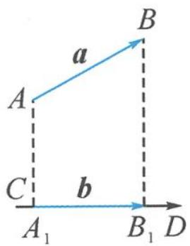
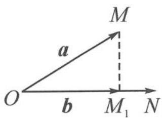

## 5.3 已知单向量模长——转投影

$\overrightarrow{OA} \cdot \overrightarrow{OB} = |\overrightarrow{OA}| |\overrightarrow{OB}| \cos \theta,$ 其中 $|\overrightarrow{OB}| \cos \theta$ 称为 $\overrightarrow{OB}$ 在 $\overrightarrow{OA}$ 上的投影值,投影值的正负与夹角 $\theta$ 的大小有关.

当 $\theta \in \left[0, \frac{\pi}{2}\right)$ 时， $|\overrightarrow{OB}| \cos \theta > 0$ ；当 $\theta = \frac{\pi}{2}$ 时， $|\overrightarrow{OB}| \cos \theta = 0$ ；当 $\theta \in \left(\frac{\pi}{2}, \pi\right]$ 时， $|\overrightarrow{OB}| \cos \theta < 0$ 。

那该如何作投影呢？

在现实生活中,太阳光线近似于平行线,照射到地面,形成物体的影子.类似地,在数学中,我们也过一个向量 $\overrightarrow{AB}$ 的起点A与终点B分别作另一个向量 $\overrightarrow{CD}$ 所在直线的垂线,垂足分别为 $A_{1},B_{1}$ ,从而得到向量 $\overrightarrow{AB}$ 在向量 $\overrightarrow{CD}$ 上的投影向量 $\overrightarrow{A_{1}B_{1}}$ ,如图5.3-1.

图5.3-1

图5.3-2

更特殊地,如图 5.3-2,当两个向量 $\overrightarrow{OM},\overrightarrow{ON}$ 共起点时,过点 M 作 $\overrightarrow{ON}$ 所在直线的垂线,垂足为 $M_{1}$ ,则 $\overrightarrow{OM_{1}}$ 就是向量 $\overrightarrow{OM}$ 在向量 $\overrightarrow{ON}$ 上的投影向量.

![[高中/总复习/专题/高考数学秘密/浙大优辅《高中数学新体系 向量的秘密》/第5讲_玩转剪刀手模型_轻松搞定数量积/5_3_已知单向量模长__转投影/questions/Q00036671.md]]
![[高中/总复习/专题/高考数学秘密/浙大优辅《高中数学新体系 向量的秘密》/第5讲_玩转剪刀手模型_轻松搞定数量积/5_3_已知单向量模长__转投影/questions/Q00036672.md]]
![[高中/总复习/专题/高考数学秘密/浙大优辅《高中数学新体系 向量的秘密》/第5讲_玩转剪刀手模型_轻松搞定数量积/5_3_已知单向量模长__转投影/questions/Q00036673.md]]
