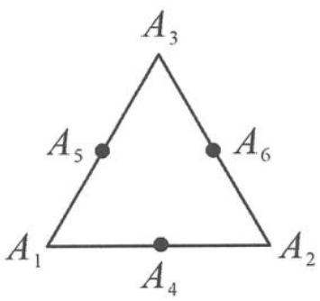

<!-- question-source:start -->
例 1 如图 5.3-3, 已知正三角形 $A_{1} A_{2} A_{3}$ 的边长为 $4, A_{4}, A_{5}, A_{6}$ 分别是所在边的中点. 当 $1 \leqslant i \leqslant 6, 1 \leqslant j \leqslant 6$ , 且 $i \neq j$ 时, 数量积 $\overrightarrow{A_{1} A_{2}} \cdot \overrightarrow{A_{i} A_{j}}$ 的不同值有 \_\_\_\_ 个.

<!-- question-source:end -->

![[高中/总复习/专题/高考数学秘密/浙大优辅《高中数学新体系 向量的秘密》/第5讲_玩转剪刀手模型_轻松搞定数量积/5_3_已知单向量模长__转投影/questions/answers/Q00036671A1.md]]
