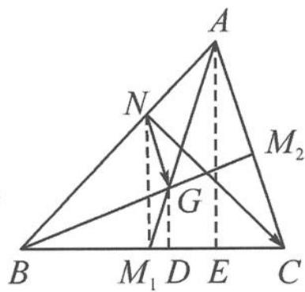

> [!faq]- 《高中数学新体系·向量的秘密》例题解析
>
> > [!success]- **【答案】** 详见解析
>
> > [!note]- **【分析】**
> > 本题未单列分析。
>
> > [!note]- **【解析】**
> > 解答 $\overrightarrow{NG} \cdot \overrightarrow{NC} - \overrightarrow{NG} \cdot \overrightarrow{NB} = \overrightarrow{NG} \cdot \overrightarrow{BC}$ . 因为 $| \overrightarrow{BC}| = 6$ 为定值, 所以考虑投影视角, 即 $\overrightarrow{NG}$ 在 $\overrightarrow{BC}$ 上的投影值为 1, 即 $|M_{1}D| = 1$ .
> > 
> > 图5.3-4
> > 因为 G 为 $\triangle ABC$ 的重心, 所以 $\frac{|M_{1}G|}{|M_{1}A|} = \frac{1}{3}$ , 所以 $|M_{1}E| = 3$ . 又 $|M_{1}C| = 3$ , 故 E, C 两点重合, 即 $AC \perp BC$ , 所以
> > $$
> > \overrightarrow {B A} \cdot \overrightarrow {B C} = | \overrightarrow {B C} | ^ {2} = 3 6.
> > $$
