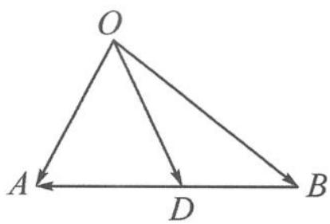

> [!faq]- 《高中数学新体系·向量的秘密》例题解析
>
> > [!success]- **【答案】** 详见解析
>
> > [!note]- **【分析】**
> > 伸出两根手指,将其想象成两个向量 $\overrightarrow{AB},\overrightarrow{AC}$ ,两根手指的长度和夹角都不确定,于是选取长度确定的 $\overrightarrow{AM},\overrightarrow{BC}$ 作为基底,用转基底视角解决.
>
> > [!note]- **【解析】**
> > 解答 $\overrightarrow{AB} \cdot \overrightarrow{AC} = (\overrightarrow{AM} + \overrightarrow{MB}) \cdot (\overrightarrow{AM} - \overrightarrow{MB}) = |\overrightarrow{AM}|^2 - \frac{|\overrightarrow{BC}|^2}{4} = -16.$
> > 小题蕴含大智慧,本题包含了一个重要的恒等式——极化恒等式.
> > 代数形式:先请同学们用 $a+b, a-b$ 表示 $a \cdot b$ .
> > $$
> > a \cdot b = \frac {(a + b) ^ {2} - (a - b) ^ {2}}{4}.
> > $$
> > 这个恒等式就称为极化恒等式,这是它的代数形式.
> > 几何形式:再请同学们画出几何图形帮助记忆.
> > 如图 5.4-1, 任意画 $a=\overrightarrow{OA}, b=\overrightarrow{OB}$ , 则可以很容易得到
> > $$
> > \overrightarrow {O A} \cdot \overrightarrow {O B} = | \overrightarrow {O D} | ^ {2} - \frac {| \overrightarrow {A B} | ^ {2}}{4}.
> > $$
> > 
> > 图5.4-1
> > 这就是极化恒等式的几何形式.
> > 至此可以发现,想象伸出两根手指就自动形成一个三角形.为表述方便,我们还可以得到它的文字形式:
> > 三角形的两腰(向量)点积等于中线平方减去四分之一的底边平方.
> > 小结 转极化视角本质即选取中线向量和底边向量作基底,转化为两者长度之间的关系.
