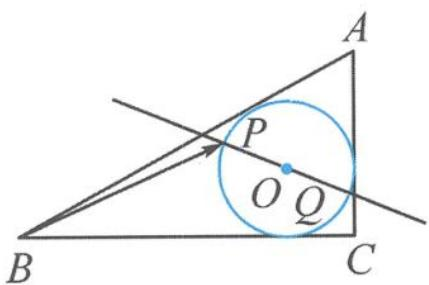
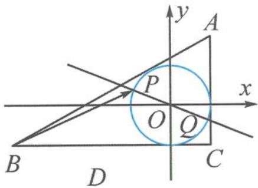

<!-- question-source:start -->
例 2 如图 5.5-2, 圆 O 为 Rt△ABC 的内切圆, 已知 AC=3, BC=4, AB=5, 过圆心 O 的直线 l 交圆 O 于 P, Q 两点, 则 $\overrightarrow{BP} \cdot \overrightarrow{CQ}$ 的取值范围是 \_\_\_\_.

图5.5-2

图5.5-3
<!-- question-source:end -->

![[高中/总复习/专题/高考数学秘密/浙大优辅《高中数学新体系 向量的秘密》/第5讲_玩转剪刀手模型_轻松搞定数量积/5_5_啥都不定可建系__转坐标/questions/answers/Q00036679A1.md]]
