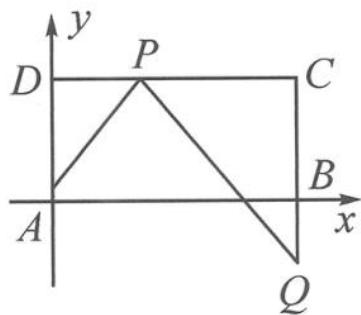

> [!faq]- 《高中数学新体系·向量的秘密》例题解析
>
> > [!success]- **【答案】** 详见解析
>
> > [!note]- **【分析】**
> > 本题的背景不符合前面三种情况,考虑到矩形 ABCD,故建系设点进行坐标运算.
>
> > [!note]- **【解析】**
> > 解答 如图 5.5-1 所示建立坐标系 $xAy$ ，设 $DP = t (0 \leqslant t \leqslant 2)$ ，则 $A(0,0), P(t,1)$ ， $Q(2,-t)$ ，故
> > $$
> > \overrightarrow {P A} = (- t, - 1), \overrightarrow {P Q} = (2 - t, - t - 1).
> > $$
> > 所以
> > $$
> > \overrightarrow {P A} \cdot \overrightarrow {P Q} = t ^ {2} - t + 1 = \left(t - \frac {1}{2}\right) ^ {2} + \frac {3}{4} \geqslant \frac {3}{4}.
> > $$
> > 
> > 图5.5-1
> > 当且仅当 $t=\frac{1}{2}$ 时取等号.
> > 【剪刀手模型 4】伸出两根手指分别想象成两个向量,因为两根手指长度、夹角、指尖连线都不确定,所以剩下最后一招:建系、设点、转坐标运算.可以总结口诀:啥都不定可建系——转坐标.其实建系就是选取了 x 轴、y 轴上的单位向量作为基底向量,用坐标运算解决问题.
