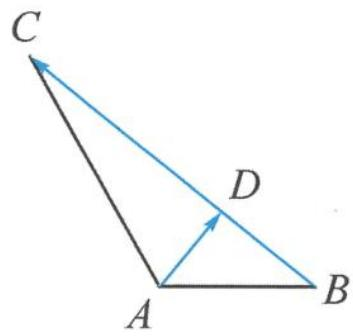

> [!faq]- 《高中数学新体系·向量的秘密》例题解析
>
> > [!success]- **【答案】** 详见解析
>
> > [!note]- **【分析】**
> > 本题未单列分析。
>
> > [!note]- **【解析】**
> > 解答 When, Where: 注意到 $\overrightarrow{AD} \cdot \overrightarrow{BC} = |\overrightarrow{AD}| |\overrightarrow{BC}| \cos \theta$ ，其中的三要素 $|\overrightarrow{AD}|, |\overrightarrow{BC}|, \cos \theta$ 均是未知的（至少是题干没有直接给出，不易算的）.
> > What: 选用数量积的基底视角解决问题.
> > 
> > 图5.6-1
> > How: ①题干给出了 $\angle BAC=120^{\circ}, AB=1, AC=2$ , 因此选择长度已知, 夹角确定的 $\overrightarrow{AB}$ , $\overrightarrow{AC}$ 作为基底向量.
> > - **②**：用基底向量 $\overrightarrow{AB},\overrightarrow{AC}$ 可以分别将 $\overrightarrow{AD},\overrightarrow{BC}$ 表示为 $\overrightarrow{AD}=\frac{2}{3}\overrightarrow{AB}+\frac{1}{3}\overrightarrow{AC},\overrightarrow{BC}=\overrightarrow{AC}-\overrightarrow{AB}.$
> > - **③**：$\overrightarrow{AD} \cdot \overrightarrow{BC} = \left(\frac{2}{3}\overrightarrow{AB} + \frac{1}{3}\overrightarrow{AC}\right) \cdot (\overrightarrow{AC} - \overrightarrow{AB}) = \frac{1}{3}$ .
> > Why: 请反思巩固每一个环节.
