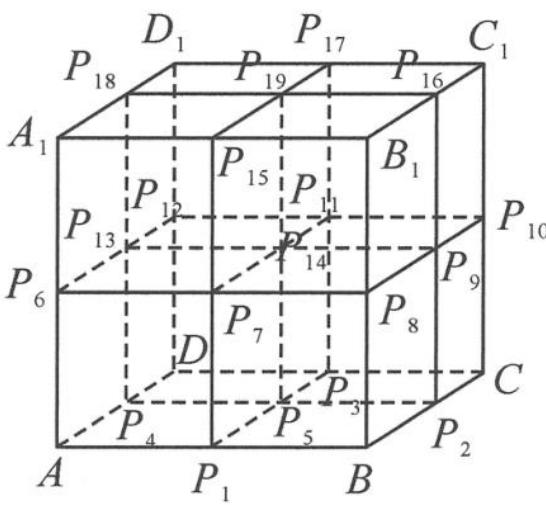

<!-- question-source:start -->
5. 如图, 将棱长为 2 的正方体 $ABCD-A_{1}B_{1}C_{1}D_{1}$ 切成 8 个全等的小正方体, $P_{i}(i=1,2,\cdots,19)$ 是八个小正方体的其余 19 个顶点, 则 $\overrightarrow{AP_{i}} \cdot \overrightarrow{AD}$ 的取值集合是 \_\_\_\_.

第5题图
<!-- question-source:end -->

![[Q00036688A1]]
