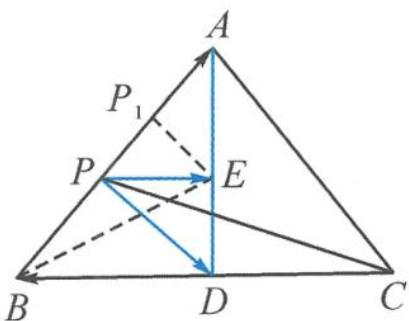

> [!faq]- 《高中数学新体系·向量的秘密》参考答案
>
> > [!success]- **【答案】** 详见解析
>
> > [!note]- **【分析】**
> > 本题未单列分析。
>
> > [!note]- **【解析】**
> > 解答 $\overrightarrow{PA} \cdot (\overrightarrow{PB} + \overrightarrow{PC}) = 2 \overrightarrow{PA} \cdot \overrightarrow{PD}$ .
> > 
> > 第 3 题答图
> > 如答图,取 AD 的中点为 E,
> > 则 $2\overrightarrow{PA}\cdot \overrightarrow{PD} = 2\left(|\overrightarrow{PE}|^2 -\frac{|\overrightarrow{AD}|^2}{4}\right) = 2|\overrightarrow{PE}|^2$ $-\frac{3}{2}$
> > 因为点 P 是正三角形 ABC 的三边上的动点，故当 $EP_{1} \perp AB$ 时，PE 取得的最小值 $P_{1}E = \frac{\sqrt{3}}{4}$ ; 当点 P 与点 B 重合时，PE 取得的最大值 $BE = \frac{\sqrt{7}}{2}$ .
> > 故 $2\overrightarrow{PA}\cdot\overrightarrow{PD}=2|\overrightarrow{PE}|^{2}-\frac{3}{2}\in\left[-\frac{9}{8},2\right]$
