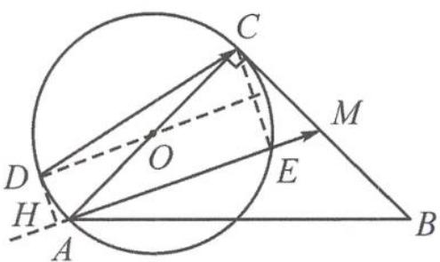

> [!faq]- 《高中数学新体系·向量的秘密》参考答案
>
> > [!success]- **【答案】** 详见解析
>
> > [!note]- **【分析】**
> > 本题未单列分析。
>
> > [!note]- **【解析】**
> > 解答 $\overrightarrow{AM} \cdot \overrightarrow{DC} = |\overrightarrow{AM}| |\overrightarrow{DC}| \cos \theta.$
> > 因为 $|\overrightarrow{AM}| = 2\sqrt{5}$ , 所以求 $\overrightarrow{AM} \cdot \overrightarrow{DC}$ 的最大值只需求 $\overrightarrow{DC}$ 在 $\overrightarrow{AM}$ 上投影值的最大值.
> > 如答图, 当 $DO \parallel AE$ 时, $\overrightarrow{DC}$ 在 $\overrightarrow{AM}$ 上投影的最大值为 $\left|\overrightarrow{HE}\right|$ ,
> > 
> > 第8题答图
> > 此时 $|\overrightarrow{HE}| = |\overrightarrow{OD}| + \frac{1}{2} |\overrightarrow{AE}| = 2 + \frac{1}{2}\times 4\times$ $\frac{2\sqrt{5}}{5} = 2 + \frac{4\sqrt{5}}{5}.$
> > $$
> > (\overrightarrow {A M} \cdot \overrightarrow {D C}) _ {\max} = 2 \sqrt {5} \times \left(2 + \frac {4 \sqrt {5}}{5}\right) = 8 + 4 \sqrt {5}.
> > $$
