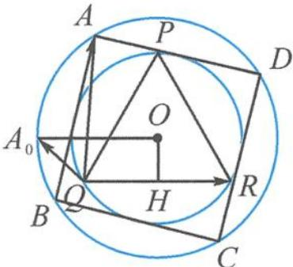

> [!faq]- 《高中数学新体系·向量的秘密》参考答案
>
> > [!success]- **【答案】** 详见解析
>
> > [!note]- **【分析】**
> > 本题未单列分析。
>
> > [!note]- **【解析】**
> > 解答 $\overrightarrow{AQ} \cdot \overrightarrow{QR} = -\overrightarrow{QA} \cdot \overrightarrow{QR}$ .
> > 因为 $|\overrightarrow{QR}| = 2\sqrt{3}$ 为定值，故选用投影视角解决.将 $\triangle PQR$ 绕着圆心 $O$ 旋转，与 $\triangle PQR$ 不动将正方形ABCD绕着圆心 $O$ 旋转是等价的.
> > 如答图, 当正方形 ABCD 绕着圆心 O 旋转时, 点 A 的轨迹是大圆 O. 显然当点 A 位于点 $A_{0}$ 时, $\overrightarrow{QA} \cdot \overrightarrow{QR}$ 取得的最小值为 $-2\sqrt{3} \times (2\sqrt{2} - \sqrt{3}) = 6 - 4\sqrt{6}$ .
> > 故 $\overrightarrow{AQ}\cdot\overrightarrow{QR}$ 的最大值为 $4\sqrt{6}-6$ .
> > 
> > 第10题答图
