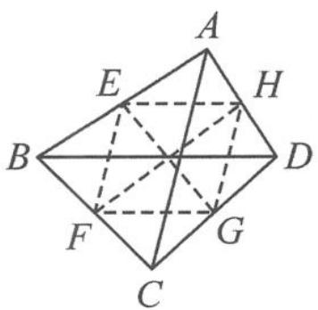
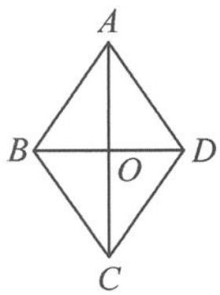

> [!faq]- 《高中数学新体系·向量的秘密》例题解析
>
> > [!success]- **【答案】** 详见解析
>
> > [!note]- **【分析】**
> > 本题未单列分析。
>
> > [!note]- **【解析】**
> > ## 解答 解法一: 回路恒等式
> > 由回路恒等式知
> > $$
> > \overrightarrow {A B} + \overrightarrow {D C} = \overrightarrow {A C} + \overrightarrow {D B}, \overrightarrow {B C} + \overrightarrow {A D} = \overrightarrow {B D} + \overrightarrow {A C} = \overrightarrow {A C} - \overrightarrow {D B}.
> > $$
> > 所以
> > $$
> > (\overrightarrow {A B} + \overrightarrow {D C}) \cdot (\overrightarrow {B C} + \overrightarrow {A D}) = (\overrightarrow {A C} + \overrightarrow {D B}) \cdot (\overrightarrow {A C} - \overrightarrow {D B}) = | \overrightarrow {A C} | ^ {2} - | \overrightarrow {B D} | ^ {2} = l _ {1} ^ {2} - l _ {2} ^ {2}.
> > $$
> > 点评 本题中 $\overrightarrow{AC},\overrightarrow{DB}$ 的模长已知,所以选取它们为基底.利用回路恒等式可以改变向量字母的先后顺序,实现两个向量的基底转化.
> > 解法二:如图 6.3-2, 设 E, F, G, H 分别为 AB, BC, CD, DA 的中点, 因为
> > $$
> > \overrightarrow {E G} = \overrightarrow {E B} + \overrightarrow {B C} + \overrightarrow {C G}, \overrightarrow {E G} = \overrightarrow {E A} + \overrightarrow {A D} + \overrightarrow {D G},
> > $$
> > 所以两式相加得
> > $$
> > 2 \overrightarrow {E G} = \overrightarrow {B C} + \overrightarrow {A D}.
> > $$
> > 同理
> > 
> > $$
> > 2 \overrightarrow {H F} = \overrightarrow {A B} + \overrightarrow {D C}.
> > $$
> > 图6.3-2
> > 所以
> > $$
> > (\overrightarrow {A B} + \overrightarrow {D C}) \cdot (\overrightarrow {B C} + \overrightarrow {A D}) = 4 \overrightarrow {E G} \cdot \overrightarrow {H F}.
> > $$
> > (通过中线模型,将原本四个向量之间的运算转化为两个向量之间的运算,出路只有转基底.选谁作基底?显然知道长度的 $\overrightarrow{AC},\overrightarrow{BD}$ 是最佳选择,且 $\overrightarrow{EF}=\frac{\overrightarrow{AC}}{2},\overrightarrow{EH}=\frac{\overrightarrow{BD}}{2}$ .)
> > 因为
> > $$
> > \overrightarrow {E G} = \overrightarrow {E F} + \overrightarrow {E H} = \frac {\overrightarrow {A C} + \overrightarrow {B D}}{2}, \overrightarrow {H F} = \overrightarrow {E F} - \overrightarrow {E H} = \frac {\overrightarrow {A C} - \overrightarrow {B D}}{2},
> > $$
> > 所以
> > $$
> > (\overrightarrow {A B} + \overrightarrow {D C}) \cdot (\overrightarrow {B C} + \overrightarrow {A D}) = 4 \overrightarrow {E G} \cdot \overrightarrow {H F} = (\overrightarrow {A C} + \overrightarrow {B D}) \cdot (\overrightarrow {A C} - \overrightarrow {B D}) = \overrightarrow {A C ^ {2}} - \overrightarrow {B D ^ {2}} = l _ {1} ^ {2} - l _ {2} ^ {2}.
> > $$
> > 解法三: 向量余弦定理
> > $$
> > \begin{array}{r l} & (\overrightarrow {A B} + \overrightarrow {D C}) \cdot (\overrightarrow {B C} + \overrightarrow {A D}) = \overrightarrow {A B} \cdot \overrightarrow {A D} + \overrightarrow {A B} \cdot \overrightarrow {B C} + \overrightarrow {D C} \cdot \overrightarrow {A D} + \overrightarrow {D C} \cdot \overrightarrow {B C} \\ & = \overrightarrow {A B} \cdot \overrightarrow {A D} - \overrightarrow {B A} \cdot \overrightarrow {B C} - \overrightarrow {D C} \cdot \overrightarrow {D A} + \overrightarrow {C D} \cdot \overrightarrow {C B} \\ & = | \overrightarrow {A B} | | \overrightarrow {A D} | \cos \angle B A D - | \overrightarrow {B A} | | \overrightarrow {B C} | \cos \angle A B C - | \overrightarrow {D C} | | \overrightarrow {D A} | \cos \angle A D C + \\ & | \overrightarrow {C D} | | \overrightarrow {C B} | \cos \angle D C B \\ & = \frac {| \overrightarrow {A B} | ^ {2} + | \overrightarrow {A D} | ^ {2} - | \overrightarrow {B D} | ^ {2}}{2} - \frac {| \overrightarrow {B A} | ^ {2} + | \overrightarrow {B C} | ^ {2} - | \overrightarrow {A C} | ^ {2}}{2} - \frac {| \overrightarrow {D C} | ^ {2} + | \overrightarrow {D A} | ^ {2} - | \overrightarrow {A C} | ^ {2}}{2} + \\ & \frac {| \overrightarrow {C D} | ^ {2} + | \overrightarrow {C B} | ^ {2} - | \overrightarrow {B D} | ^ {2}}{2} \\ & = | \overrightarrow {A C} | ^ {2} - | \overrightarrow {B D} | ^ {2} = l _ {1} ^ {2} - l _ {2} ^ {2}. \end{array}
> > $$
> > 解法四:由于本题是填空题,看似变化的四边形,却得到了恒定的数量积,故可以采用特值法求解.如图6.3-3,设四边形ABCD为菱形,则
> > 
> > 图6.3-3
> > $$
> > \begin{array}{r l} (\overrightarrow {A B} + \overrightarrow {D C}) \cdot (\overrightarrow {B C} + \overrightarrow {A D}) & = 4 \overrightarrow {A B} \cdot \overrightarrow {A D} = 4 \left(| \overrightarrow {A O} | ^ {2} - \frac {| \overrightarrow {B D} | ^ {2}}{4}\right) \\ & = | \overrightarrow {A C} | ^ {2} - | \overrightarrow {B D} | ^ {2} = l _ {1} ^ {2} - l _ {2} ^ {2}. \end{array}
> > $$
