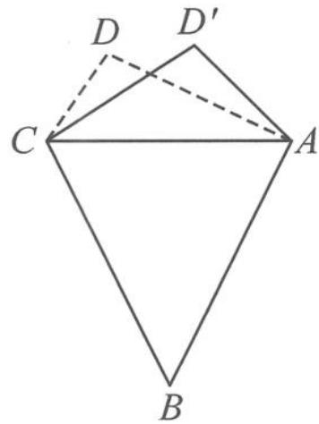

<!-- question-source:start -->
例 1 如图 6.4-1, 在平面四边形 ABCD 中, 已知 AB = BC = 3, CD = 1, $AD = \sqrt{5}$ , $\angle ADC = 90^{\circ}$ . 沿直线 AC 将 $\triangle ACD$ 翻折成 $\triangle ACD'$ , 直线 AC 与 $BD'$ 所成角的余弦的最大值是 \_\_\_\_.

<!-- question-source:end -->

![[高中/总复习/专题/高考数学秘密/浙大优辅《高中数学新体系 向量的秘密》/第6讲_向量运算的灵魂__运算法则显威力/6_4_向量对角线定理/questions/answers/Q00036700A1.md]]
