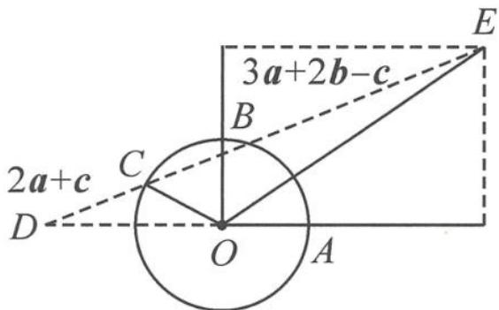

> [!faq]- 《高中数学新体系·向量的秘密》例题解析
>
> > [!success]- **【答案】** 详见解析
>
> > [!note]- **【分析】**
> > 已知条件中 $a, b, c$ 是平面内的三个单位向量, 隐藏着条件: 这三个向量的模长都相等, 故 $|a + 2c| = |2a + c|$ . 如此转换后, 再使用向量三角不等式就得心应手了.
>
> > [!note]- **【解析】**
> > 解答 因为 $|a| = |c|$ , 由互换系数恒等式知
> > $$
> > \vert a + 2 c \vert = \vert 2 a + c \vert ,
> > $$
> > 所以
> > $$
> > \vert a + 2 c \vert + \vert 3 a + 2 b - c \vert = \vert 2 a + c \vert + \vert 3 a + 2 b - c \vert \geqslant \vert 5 a + 2 b \vert = \sqrt {5 ^ {2} + 2 ^ {2}} = \sqrt {2 9}.
> > $$
> > 当 $2a + c$ 与 $3a + 2b - c$ 同向时取等号. 记向量 $a = \overrightarrow{OA}, b = \overrightarrow{OB}, c = \overrightarrow{OC}$ . 如图6.5-1, 向量 $2a + c$ 与 $3a + 2b - c$ 同向是可以做到的, 故 $|a + 2c| + |3a + 2b - c|$ 的最小值为 $\sqrt{29}$ .
> > 
> > 图6.5-1
> > ## 反思 为什么会想到转换系数呢？
> > 从代数角度看,遇见双模长之和的问题,我们容易想到向量三角不等式,但是本题若直接使用三角不等式,无法消去向量 c,难以继续.使用互换系数恒等式后,解题思路豁然开朗,收到了意想不到的效果.
> > 从几何角度看, 将双模长之和想象成距离之和或许是个很好的突破口. $|a + 2c| + |3a + 2b - c|$ 是哪两个距离之和呢? 似乎没有很好的几何意义. 其中 $a, b$ 都是确定的向量, 只有 $c$ 在运动, 因此 $|2a + c| = |c - (-2a)|$ , $|3a + 2b - c| = |c - (3a + 2b)|$ , 分别看成圆上的动点 $C$ 到两个定点 $D, E$ 的距离, 问题解决就有了抓手.
