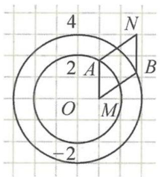

> [!faq]- 《高中数学新体系·向量的秘密》参考答案
>
> > [!success]- **【答案】** 详见解析
>
> > [!note]- **【分析】**
> > 本题未单列分析。
>
> > [!note]- **【解析】**
> > 解答 如答图, 记 O 为坐标原点,
> > 
> > 第8题答图
> > $\overrightarrow{MA} \cdot \overrightarrow{MB} = (\overrightarrow{OA} - \overrightarrow{OM}) \cdot (\overrightarrow{OB} - \overrightarrow{OM})$ $= \overrightarrow{OA} \cdot \overrightarrow{OB} - \overrightarrow{OA} \cdot \overrightarrow{OM} - \overrightarrow{OB} \cdot \overrightarrow{OM} + 1,$ 所以 $\overrightarrow{OA} \cdot \overrightarrow{OB} - \overrightarrow{OA} \cdot \overrightarrow{OM} - \overrightarrow{OB} \cdot \overrightarrow{OM} = \overrightarrow{MA} \cdot$ $\overrightarrow{MB} - 1.$ 由三项完全平方公式得 $(\overrightarrow{OA} + \overrightarrow{OB} - \overrightarrow{OM})^2 = 4 + 9 + 1 + 2(\overrightarrow{MA} \cdot \overrightarrow{MB} - 1) = 18.$ 故 $|\overrightarrow{OA} + \overrightarrow{OB} - \overrightarrow{OM}| = 3\sqrt{2}$ ,
> > 即 $|\overrightarrow{OA} + \overrightarrow{MB}| = 3\sqrt{2}$ .
> > 记 $\overrightarrow{MA} + \overrightarrow{MB} = \overrightarrow{MN}$ , 则 $\overrightarrow{MB} = \overrightarrow{AN}$ ,
> > 即 $|\overrightarrow{OA} + \overrightarrow{AN}| = |\overrightarrow{ON}| = 3\sqrt{2}$ .
> > 故点 $N$ 在圆 $x^2 + y^2 = 18$ 上.
> > 由定点到圆上任意一点距离范围得
> > $$
> > M N \in [ 3 \sqrt {2} - 1, 3 \sqrt {2} + 1 ].
> > $$
> > 故 $|\overrightarrow{MA} +\overrightarrow{MB} |$ 的取值范围是 $[3\sqrt{2} -1,3\sqrt{2} +1]$
> > 点评 本题也可以从纯几何的视角,使用所谓的“平行四边形大法”.该方法将使用平行四边形的另一个性质,但更一般的方法仍然是三项完全平方公式.
