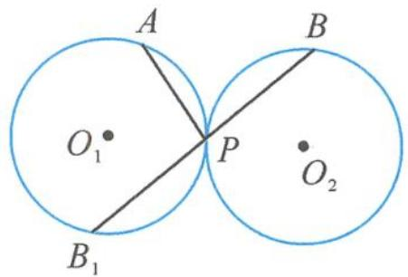

> [!faq]- 《高中数学新体系·向量的秘密》参考答案
>
> > [!success]- **【答案】** 详见解析
>
> > [!note]- **【分析】**
> > 本题未单列分析。
>
> > [!note]- **【解析】**
> > 解答 如答图, 延长线段 $BP$ , 交圆 $O_{1}$ 于点 $B_{1}$ ,
> > 
> > 第9题答图
> > 则 $\overrightarrow{PA} \cdot \overrightarrow{PB} = \overrightarrow{PA} \cdot \overrightarrow{B_1P}$ $= (\overrightarrow{O_1A} - \overrightarrow{O_1P}) \cdot (\overrightarrow{O_1P} - \overrightarrow{O_1B_1})$ $= \overrightarrow{O_1A} \cdot \overrightarrow{O_1P} - \overrightarrow{O_1A} \cdot \overrightarrow{O_1B_1} - 1 + \overrightarrow{O_1B_1} \cdot \overrightarrow{O_1P}$ .
> > 所以 $\overrightarrow{O_1A} \cdot \overrightarrow{O_1P} - \overrightarrow{O_1A} \cdot \overrightarrow{O_1B_1} + \overrightarrow{O_1B_1} \cdot \overrightarrow{O_1P} = \overrightarrow{PA} \cdot \overrightarrow{PB} + 1$ .
> > 由三项完全平方公式得 $(\overrightarrow{O_{1}A}+\overrightarrow{O_{1}B_{1}}-\overrightarrow{O_{1}P})^{2}=3-2(\overrightarrow{PA}\cdot\overrightarrow{PB}+1)$ .
> > 由点 $A, B_{1}$ 的任意性知 $\left|\overrightarrow{O_{1}A}+\overrightarrow{O_{1}B_{1}}-\overrightarrow{O_{1}P}\right|\in[0,3]$ .
> > 所以 $3-2(\overrightarrow{PA}\cdot\overrightarrow{PB}+1)\in[0,9]$ .
> > 解得 $\overrightarrow{PA}\cdot\overrightarrow{PB}\in\left[-4,\frac{1}{2}\right]$ .
> > 所以 $\overrightarrow{PA}\cdot\overrightarrow{PB}$ 的取值范围是 $\left[-4,\frac{1}{2}\right]$ .
