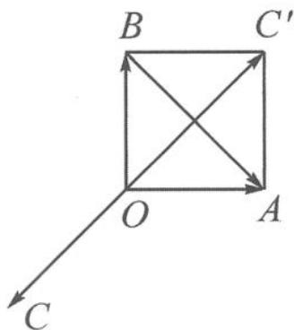

> [!faq]- 《高中数学新体系·向量的秘密》例题解析
>
> > [!success]- **【答案】** 详见解析
>
> > [!note]- **【分析】**
> > 本题未单列分析。
>
> > [!note]- **【解析】**
> > 解答 令 $a = \overrightarrow{OA}, b = \overrightarrow{OB}, c = \overrightarrow{OC}$ , 则代数式 $a + b + c = 0, (a - b) \perp c, a \perp b$ 转化为
> > $$
> > \overrightarrow {O A} + \overrightarrow {O B} + \overrightarrow {O C} = 0, \overrightarrow {B A} \perp \overrightarrow {O C}, \overrightarrow {O A} \perp \overrightarrow {O B}.
> > $$
> > 易画出如图 7.1-1 所示的图形, 它刻画的就是正方形.
> > 
> > 因为 $|a| = 1$ ，即 $|\overrightarrow{OA}| = 1$ ，由正方形知 $|\overrightarrow{OB}| = 1, |\overrightarrow{OC}| = \sqrt{2}$
> > 图7.1-1
> > 目标式 $|a|^{2}+|b|^{2}+|c|^{2}=|\overrightarrow{OA}|^{2}+|\overrightarrow{OB}|^{2}+|\overrightarrow{OC}|^{2}$ 就是正方形两条边长的平方与对角线平方的和,等于4.
> > 点评 第一步“以大换小”, 将题干所给的向量条件转化为图形, 利用向量加减的几何表示, 画出了正方形这一几何图形, 是定性分析. 第二步有了 $|a| = 1$ , 模长的引入使得问题得以进行定量计算.
