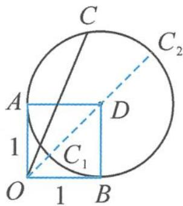

> [!faq]- 《高中数学新体系·向量的秘密》例题解析
>
> > [!success]- **【答案】** 详见解析
>
> > [!note]- **【分析】**
> > 本题未单列分析。
>
> > [!note]- **【解析】**
> > 解答 记 $a=\overrightarrow{OA}, b=\overrightarrow{OB}, c=\overrightarrow{OC}, a+b=\overrightarrow{OD}.$
> > 由 $|c - a - b| = 1$ ，得 $|\overrightarrow{DC}| = 1$ ，即动点 $C$ 的轨迹是以 $D$ 为圆心，1为半径的圆，如图7.2-1.
> > 由图易得， $|c|$ 的取值范围是 $\left[\sqrt{2}-1,\sqrt{2}+1\right]$ .
> > 
> > 图7.2-1
> > 点评 解本题的关键是将模长条件 $|c - a - b| = 1$ 理解为两点间的距离，其中向量 a, b 是平面内两个互相垂直的单位向量, 也就是已知的固定向量. 因此, 可将向量 $a + b$ 看作一个整体, 此时 $\left|c - a - b\right| = \left|c - (a + b)\right|$ . 再结合标准圆的理解即可作图求解问题.
