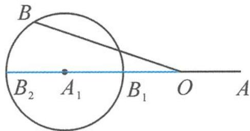

> [!faq]- 《高中数学新体系·向量的秘密》例题解析
>
> > [!success]- **【答案】** 详见解析
>
> > [!note]- **【分析】**
> > 本题未单列分析。
>
> > [!note]- **【解析】**
> > 解答 记 $a=\overrightarrow{OA}, b=\overrightarrow{OB}, -2a=\overrightarrow{OA_{1}}.$
> > 由 $|2a + b| = |b - (-2a)| = 2$ ，得 $|\overrightarrow{A_1B}| = 2$ ，即动点 $B$ 的轨迹是以 $A_{1}$ 为圆心，2为半径的圆，如图7.2-2.
> > 
> > 图7.2-2
> > 由图易得， $b$ 在 $a$ 方向上的投影向量与 $a$ 反向，且模的范围为 $[2,6]$ ，即 $\frac{a \cdot b}{|a|} \in [-6, -2]$ 。故 $a \cdot b \in [-12, -4]$ 。
> > 点评 遇见模长为定值,联想标准圆是一种常见的画图视角.关键在于确认以哪一个定点为圆心,哪一个动点为圆上的点.两个向量之差的模长更容易理解为两点间的距离,因此将向量加法变为减法,如本题中的 $|2a + b| = |b - (-2a)|$ ,更有助于作图.
> > (2) 直径圆及其推广
> > 平面内,与两个定点连接所成的角为直角的点的轨迹(含两个定点)称为圆,由此定义了直径圆.
> > 定义2 若向量 $a \in \alpha$ ( $\alpha$ 为平面), 满足 $(a - b) \cdot (a - c) = 0$ (定向量 $b, c \in \alpha$ ), 则称向量 $a$ 确定平面 $\alpha$ 上的直径圆, 其直径为 $|b - c|$ .
