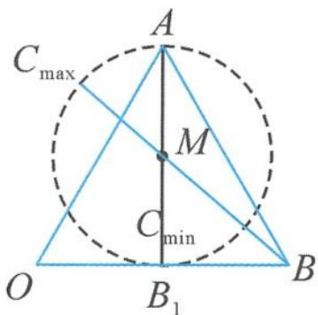

> [!faq]- 《高中数学新体系·向量的秘密》例题解析
>
> > [!success]- **【答案】** B
>
> > [!note]- **【分析】**
> > 本题未单列分析。
>
> > [!note]- **【解析】**
> > 解答 记 $a=\overrightarrow{OA}, b=\overrightarrow{OB}, \frac{b}{2}=\overrightarrow{OB_{1}}, c=\overrightarrow{OC}$ ,
> > 由 $(a - c) \cdot (b - 2c) = 0$ 得 $(a - c) \cdot \left(\frac{b}{2} - c\right) = 0$ ，得 $\overrightarrow{CA} \cdot \overrightarrow{CB_1} = 0$ .
> > 
> > 其中 $|\overrightarrow{OA}| = |\overrightarrow{OB}| = 2, \angle AOB = \frac{\pi}{3}, |\overrightarrow{B_1A}| = \sqrt{3}$ , 从而动点 $C$ 的轨迹是以 $AB_{1}$ 为直径的圆, 如图7.2-4. $|b - c|$ 表示定点 $B$ 到圆上动点 $C$ 的距离,由图易得最小值为 $\frac{\sqrt{7} - \sqrt{3}}{2}$ .
> > 图7.2-4
> > 点评 遇见数量积为 0 ,联想直径圆是一种常见的画图视角.关键在于确认以哪两个定点为直径端点,哪一个动点为圆上的点.如本题中的代数式 $(a-c)\cdot(b-2c)=0$ 的等号两边要除以 2 ,就是基于点 C 为动点.
> > 实际上,直径圆与标准圆一脉相承.因为数量积代数式(如 $(a-c)\cdot(b-c)=0$ )可以视为关于c的二次式,所以可以通过二次配方的方式,实现相互转化.
> > $$
> > (a - c) \cdot (b - c) = 0 \Leftrightarrow c ^ {2} - (a + b) \cdot c + a \cdot b = 0 \Leftrightarrow \left| c - \left(\frac {a + b}{2}\right) \right| = \left| \frac {a - b}{2} \right|.
> > $$
