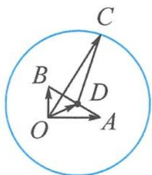

> [!faq]- 《高中数学新体系·向量的秘密》例题解析
>
> > [!success]- **【答案】** 详见解析
>
> > [!note]- **【分析】**
> > $(c-a)\cdot(c-b)=3$ ，其中的数量积不等于0，这是什么图形呢？
>
> > [!note]- **【解析】**
> > 解答 记 $a = \overrightarrow{OA}, b = \overrightarrow{OB}, c = \overrightarrow{OC}$ , 则 $\overrightarrow{OA} \perp \overrightarrow{OB}$ , 且 $|\overrightarrow{AB}| = 2, \overrightarrow{CA} \cdot \overrightarrow{CB} = 3$ . 如图7.2-5, 记 $AB$ 的中点为 $D$ , 由极化恒等式得
> > $$
> > \overrightarrow {C A} \cdot \overrightarrow {C B} = | \overrightarrow {C D} | ^ {2} - \frac {| \overrightarrow {A B} | ^ {2}}{4} = 3,
> > $$
> > 
> > 即 $|\overrightarrow{CD}| = 2$ . 故点 $C$ 的轨迹是以 $AB$ 的中点 $D$ 为圆心, 2 为半径的圆. 显然, 当 $O$ , 图7.2-5 $D, C$ 三点共线时, $|c|_{\min} = 1$ , $|c|_{\max} = 3$ . 故 $|c| \in [1,3]$ .
> > 【直径圆推广——数量积圆】 若向量 $a \in \alpha$ ( $\alpha$ 为平面), 满足 $(a - b) \cdot (a - c) = k$ (定向量 $b, c \in \alpha$ , 实数 $k$ 满足 $4k + |b - c|^2 > 0$ ), 则称向量 $a$ 确定平面 $\alpha$ 上的数量积圆. 其中直径
> > 为 $\sqrt{4k + |b - c|^2}$ .
> > ## (3) 阿氏圆
> > 平面内,到两个定点的距离的比值等于定值(不为1的正数)的点的轨迹,称为圆,由此定义了阿波罗尼斯圆(简称阿氏圆).
> > 定义 3 若向量 $a \in \alpha (\alpha$ 为平面)，满足 $|a - c| = \lambda |a - b| (\lambda > 0, \lambda \neq 1)$ ，定向量 $b, c \in \alpha$ ，则称向量 a 确定平面 $\alpha$ 上的阿氏圆，其直径为 $\frac{2\lambda}{|\lambda^{2} - 1|} |b - c|$ .
