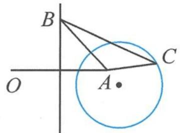
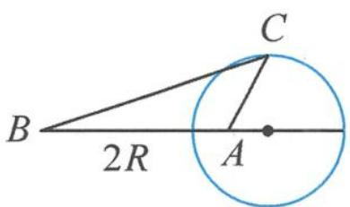

> [!faq]- 《高中数学新体系·向量的秘密》例题解析
>
> > [!success]- **【答案】** 详见解析
>
> > [!note]- **【分析】**
> > 已知条件 $|a|=2, a \cdot b=2$ 确定了点 $A$ 的位置与动点 $B$ 的轨迹, $|c-b|=2|c-a|$ 表示动点 $C$ 的轨迹是对应的阿氏圆, 最后利用几何直观解决 $\triangle ABC$ 面积的最值问题.
>
> > [!note]- **【解析】**
> > 解答 由 $|a|=2, a \cdot b=2$ , 结合投影知点 B 在线段 OA 的中垂线上运动, 如图 7.2-7.
> > 
> > 图7.2-7
> > 
> > 图7.2-8
> > 又 $|c-b|=2|c-a|$ ，即 $|\overrightarrow{BC}|=2|\overrightarrow{AC}|$ ，故点C在以A，B为“焦点”的阿氏圆上（图7.2-8）.
> > 故对于确定的点 B, $\triangle ABC$ 面积的最大值为
> > $$
> > S _ {\max} = \frac {1}{2} | A B | \cdot R.
> > $$
> > 另一方面,我们知道 $R=\frac{2}{3}|AB|$ , 故
> > $$
> > S _ {\max} = \frac {1}{3} | A B | ^ {2}.
> > $$
> > 再让点 B 按照要求运动起来, 当点 B 在 OA 中点时, $\left|AB\right|_{\min}=1$ , 此时 $(S_{\max})_{\min}=\frac{1}{3}$ .
> > 点评 本题是“两动”问题, 点 $B$ 在 $OA$ 的中垂线上运动, 点 $C$ 在以 $A, B$ 为“焦点”的阿氏圆上. 用分步的方式来处理, 先固定点 $B$ , 结合几何直观得到面积最大的临界状态, 再让点 $B$ 动起来, 观察面积最大值的最小值状态, 进而算出最小值. 此外, 理解阿氏圆的定义与识别其向量表示形式也是解题的关键.
