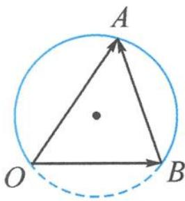

> [!faq]- 《高中数学新体系·向量的秘密》例题解析
>
> > [!success]- **【答案】** 详见解析
>
> > [!note]- **【分析】**
> > 本题未单列分析。
>
> > [!note]- **【解析】**
> > 解答 如图 7.2-10, 记 $a=\overrightarrow{OA}, b=\overrightarrow{OB}$ , 则
> > $$
> > \langle \overrightarrow {O A}, \overrightarrow {B A} \rangle = \langle \overrightarrow {A O}, \overrightarrow {A B} \rangle = \frac {\pi}{3}, \text {且} | b | = | \overrightarrow {O B} | = 1.
> > $$
> > 
> > 从而点 $A$ 在以 $OB$ 为弦, 圆周角为 $\frac{\pi}{3}$ 的圆周优弧上运动. 问题转化为求两条线段之和 $|a| + |a - b| = |\overrightarrow{AO}| + |\overrightarrow{AB}|$ 的取值范围.
> > 图7.2-10
> > 设 $\angle AOB = \theta, \theta \in \left(0, \frac{2\pi}{3}\right)$ , 由正弦定理得
> > $$
> > \frac {| A O |}{\sin \left(\frac {2 \pi}{3} - \theta\right)} = \frac {| A B |}{\sin \theta} = \frac {| O B |}{\sin \frac {\pi}{3}} = \frac {2 \sqrt {3}}{3}.
> > $$
> > 从而
> > $$
> > \vert A O \vert + \vert A B \vert = \frac {2 \sqrt {3}}{3} \left[ \sin \left(\frac {2 \pi}{3} - \theta\right) + \sin \theta \right] \in (1, 2 ].
> > $$
> > 点评 解本题的关键是识别定边对定角的外接圆模型.
