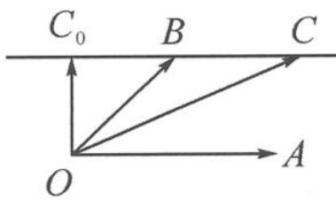

> [!faq]- 《高中数学新体系·向量的秘密》例题解析
>
> > [!success]- **【答案】** B
>
> > [!note]- **【分析】**
> > 记 $\overrightarrow{OC}=c=b+ta=\overrightarrow{OB}+t\overrightarrow{OA}$ ，那么随着 t 的变化，向量 $\overrightarrow{OC}$ 发生变化，终点 C 的轨迹是什么呢？
>
> > [!note]- **【解析】**
> > 解答 如图 7.2-14, 记 $a = \overrightarrow{OA}, b = \overrightarrow{OB}, c = \overrightarrow{OC}$ , 则 $\overrightarrow{OC} = c = b + ta = \overrightarrow{OB} + t\overrightarrow{OA}$ , 即
> > $$
> > \overrightarrow {B C} = t \overrightarrow {O A}.
> > $$
> > 由共线定理知, 点 $C$ 的轨迹就是过点 $B$ 且与 $OA$ 平行的平行线 $l$ . 由题意知 $|\overrightarrow{OC}|$ 的最小值显然在 $OC_0 \perp l$ 时取得. 当 $\theta$ 确定时, 在 Rt $\triangle OBC_0$ 中, $|b| = \frac{1}{\sin \theta}$ 唯一确定, 故选 B.
> > 
> > 图7.2-14
> > 点评 代数式 $c = b + {ta}$ 刻画的几何图形就是平行线.
