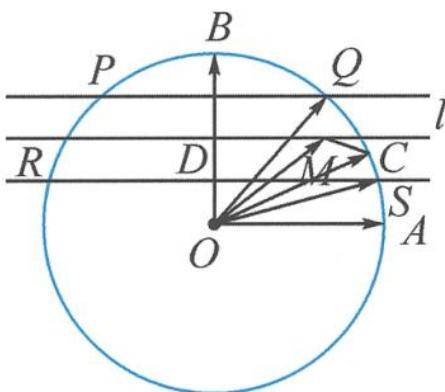

> [!faq]- 《高中数学新体系·向量的秘密》例题解析
>
> > [!success]- **【答案】** 详见解析
>
> > [!note]- **【分析】**
> > 本题未单列分析。
>
> > [!note]- **【解析】**
> > 解答 如图 7.2-15, 记 $a = \overrightarrow{OA}, b = \overrightarrow{OB}, c = \overrightarrow{OC}$ , 线段 $OB$ 的中点为 $D$ , 则 $x a + \frac{b}{2} = \overrightarrow{OM}$ 刻画的就是过点 $D$ 与 $O A$ 平行的直线 $l$ . $\left| x a + \frac{b}{2} - c \right| = \frac{1}{4}$ 有解, 即平行线 $l$ 上存在点 $M$ 与圆 $O$ 上的点 $C$ 的距离 $|M C|$ 恰为 $\frac{1}{4}$ .
> > 
> > 图7.2-15
> > 设到直线 l 距离为 $\frac{1}{4}$ 的两条平行线与圆 O 的交点分别为 P, Q, R, S, 当点 C 位于圆弧 $\widehat{QS}$ (或 $\widehat{PR}$ ) 上时, 存在点 M 使得 $|MC| = \frac{1}{4}$ .
> > 又 $\sin \angle AOS = \frac{1}{4},\sin \angle AOQ = \frac{3}{4}$ 故 $\frac{1}{4} \leqslant \sin \theta \leqslant \frac{3}{4}$ .
> > (3)垂线
