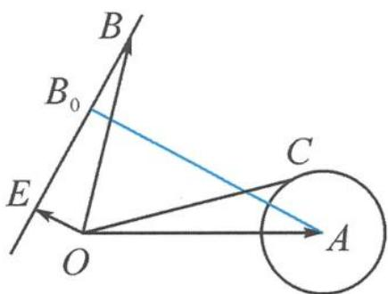

> [!faq]- 《高中数学新体系·向量的秘密》例题解析
>
> > [!success]- **【答案】** 详见解析
>
> > [!note]- **【分析】**
> > 对任意的实数 $t$ , 恒有 $|b - te| \geqslant |b - e|$ , 该如何解读? 它刻画了什么几何特征?
>
> > [!note]- **【解析】**
> > 解答 如图 7.2-16, 记 $a=\overrightarrow{OA}, b=\overrightarrow{OB}, c=\overrightarrow{OC}, e=\overrightarrow{OE}.$
> > 由 $\frac{a\cdot e}{|a||e|}=-\frac{\sqrt{3}}{2}$ 知， $\angle AOE=150^{\circ}$ .
> > 由 $|a - c| = 1$ 知，点 $C$ 在以 $A$ 为圆心，1为半径的圆上运动.
> > 
> > 图7.2-16
> > $|b-te|\geqslant|b-e|$ 恒成立,即随着t的变化,模长 $|b-te|$ 也发生变化,且存在着最小值 $|b-e|$ ,当且仅当t=1时取得,即点B到直线OE的距离恰为 $|BE|$ ,故 $OE\perp BE$ ,点B的轨迹就是过点E且与OE垂直的垂线.
> > 求 $|b-c|$ 的最小值即求圆上的动点 C 与直线上的动点 B 之间距离的最小值. 过点 A 作 $AB_{0} \_ BE$ , 交 BE 于点 $B_{0}$ , 则
> > $$
> > \vert \boldsymbol {b} - \boldsymbol {c} \vert = \vert B C \vert = \vert B C \vert + \vert A C \vert - 1 \geqslant \vert A B _ {0} \vert - 1 = 2 \sqrt {3}.
> > $$
> > 点评 不等式 $|b - te| \geqslant |b - e|$ 刻画了点到直线垂直距离最短的基本事实, 同时也隐藏了垂线这一基本图形.
