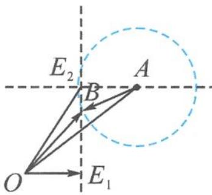
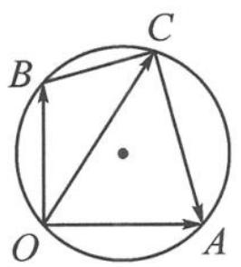
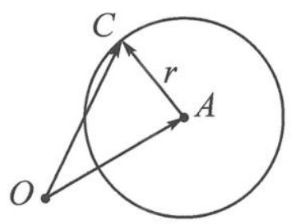
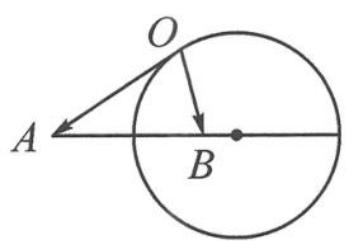
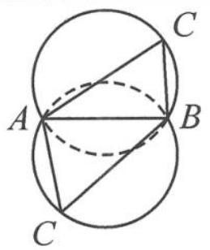
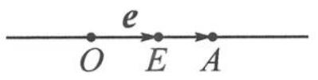
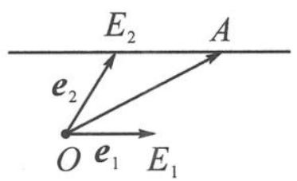
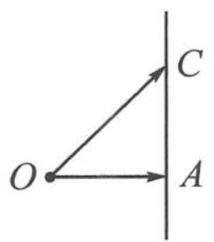
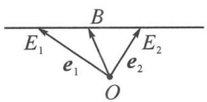

> [!faq]- 《高中数学新体系·向量的秘密》例题解析
>
> > [!success]- **【答案】** 详见解析
>
> > [!note]- **【分析】**
> > 题干中出现了三个主要的向量表达式: $a = x e_{1} + e_{2}, b = \lambda e_{1} + (1 - \lambda) e_{2}, |b - a| = 1$ . 请一一解读.
>
> > [!note]- **【解析】**
> > 解答 如图 7.2-18, 令 $a=\overrightarrow{OA}, b=\overrightarrow{OB}, e_{1}=\overrightarrow{OE_{1}}, e_{2}=\overrightarrow{OE_{2}}$ .
> > $\overrightarrow{OA}=x\overrightarrow{OE_{1}}+\overrightarrow{OE_{2}}$ 表示点 A 在过点 $E_{2}$ 作的 $OE_{1}$ 的平行线上；
> > $\overrightarrow{OB}=\lambda\overrightarrow{OE_{1}}+(1-\lambda)\overrightarrow{OE_{2}}$ 表示 $B,E_{1},E_{2}$ 三点共线；
> > 
> > 图7.2-18
> > $|\overrightarrow{AB}|=1$ 表示点 B 在以 A 为圆心,1 为半径的圆上.
> > 因为有且只有一个 $\lambda$ ，满足 $\left|\overrightarrow{AB}\right|=1$ ，即只有一个点 B 符合条件，所以直线 $E_{1}E_{2}$ 恰与圆 A 相切，故 $\left|\overrightarrow{E_{2}A}\right|=\left|x\overrightarrow{OE_{1}}\right|=1$ ，即 $x=\pm1$ 。
> > 点评 这道题中蕴含了平行线、三点共线和圆等多种图形,几何元素可谓丰富多彩.
> > 我们可以看到, 直线的向量表示中一般都含有参数 (如 $t$ 或 $x$ 或 $\lambda$ ). 平面向量中引入了参数, 才激活了图形, 给整个图形以“动感”. 只要确定随着参数的变化, 图形发生了什么变化, 就能画出相应的图形.
> > 下面是常见的几何元素的“文式图”汇总.
> > <table><tr><td>几何元素(文)</td><td>向量表示(式)</td><td>图形呈现(图)</td></tr><tr><td>点</td><td>a=OA</td><td>O→a→A</td></tr><tr><td>直径圆</td><td>(c-a)·(c-b)=0</td><td></td></tr><tr><td>半径圆</td><td>|c-a|=r</td><td></td></tr><tr><td>阿氏圆</td><td>|a-b|=r, |a|=k|b|</td><td></td></tr><tr><td>外接圆(弧)</td><td>|a-b|=r0, ⟨a-c,b-c⟩=θ0</td><td></td></tr><tr><td>直线</td><td>a=te</td><td></td></tr><tr><td>平行线</td><td>a=xe1+e2</td><td></td></tr><tr><td>垂线</td><td>|c-ta|≥|c-a|, a·(c-a)=0</td><td></td></tr><tr><td>三点共线</td><td>b=λe1+(1-λ)e2</td><td></td></tr></table>
> > 有了这组“文式图”,就有了用图形解读向量条件和用向量语言描述图形的“弹药”,实现了代数与几何之间的自由切换.
