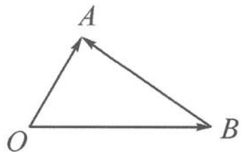
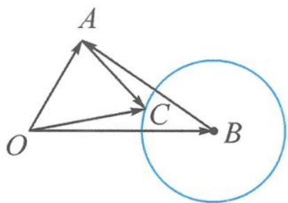

## 7.3 数形结合,开启编题之旅

有了这些基本几何图形,我们如何构建联系它们的桥梁呢?模长就是非常有效的手段.下面就和大家一起开启一次编题之旅.

母题 设向量 a, b 满足 $\left|a\right|=2,\left|b\right|=3,a\cdot b=3$ ，则 $\left|a-b\right|=$ \_\_\_\_.

这道题刻画的是一个两边长度与夹角确定的三角形(图 7.3-1), 求的是两个定点之间的距离, 所以用余弦定理可以求第三边的长度为 $\sqrt{7}$ .

图7.3-1

那么,能否在这个图的基础上,适当增加几何元素,让图形复杂起来呢?

编题 1 如图 7.3-2, 添加一个单位圆.

请大家思考如何用向量表述以 B 为圆心,1 为半径的圆?

$$
\vert \boldsymbol {c} - \boldsymbol {b} \vert = 1; \left(\boldsymbol {c} - \frac {2}{3} \boldsymbol {b}\right) \cdot \left(\boldsymbol {c} - \frac {4}{3} \boldsymbol {b}\right) = 0; \boldsymbol {c} ^ {2} - 2 \boldsymbol {b} \cdot \boldsymbol {c} + 8 = 0.
$$

可以分别用向量圆的标准式、直径式、二次式来表示圆.

图7.3-2

增添好了圆,可以设计求“定动距”,如求圆上动点C与圆外定点A之间的距离,即求 $|a-c|$ 的取值范围.

![[高中/总复习/专题/高考数学秘密/浙大优辅《高中数学新体系 向量的秘密》/第7讲_向量的几何表示__向量_如图所示/7_3_数形结合_开启编题之旅/questions/Q00036739.md]]
![[高中/总复习/专题/高考数学秘密/浙大优辅《高中数学新体系 向量的秘密》/第7讲_向量的几何表示__向量_如图所示/7_3_数形结合_开启编题之旅/questions/Q00036740.md]]
![[高中/总复习/专题/高考数学秘密/浙大优辅《高中数学新体系 向量的秘密》/第7讲_向量的几何表示__向量_如图所示/7_3_数形结合_开启编题之旅/questions/Q00036741.md]]
![[高中/总复习/专题/高考数学秘密/浙大优辅《高中数学新体系 向量的秘密》/第7讲_向量的几何表示__向量_如图所示/7_3_数形结合_开启编题之旅/questions/Q00036742.md]]
