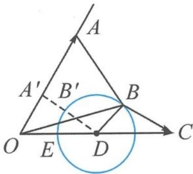
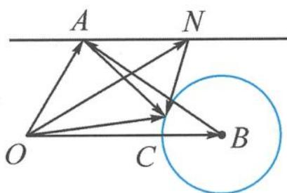

> [!faq]- 《高中数学新体系·向量的秘密》例题解析
>
> > [!success]- **【答案】** A
>
> > [!note]- **【分析】**
> > 本题未单列分析。
>
> > [!note]- **【解析】**
> > 解答 如图 7.3-4, 令 $a=\overrightarrow{OA}, b=\overrightarrow{OB}, e=\overrightarrow{OE}, 2e=\overrightarrow{OD}$ . 向量 a 与 e 的夹角为 $\frac{\pi}{3}$ , 刻画了射线 OA; 代数式 $b^{2}-4e \cdot b+3=0$ 变形为 $(b-2e)^{2}=1$ , 即
> > 
> > $$
> > \vert b - 2 e \vert = 1.
> > $$
> > 图7.3-4
> > 点 B 在以 D 为圆心, 1 为半径的单位圆上, 所以 $\left|a - b\right|$ 的最小值即 AB 的最小值. 显然, 当 $DA' \perp OA$ 时, $\left|\overrightarrow{AB}\right|_{\min} = \left|\overrightarrow{A'B'}\right| = \sqrt{3} - 1$ . 故选 A.
> > 编题 3 如图 7.3-5, 引入 OB 的平行线 AN, $\overrightarrow{ON} = \overrightarrow{OA} + t\overrightarrow{OB}$ , 即 $n = a + tb$ , 求 $|n - c|$ 的最小值.
> > 
> > 图7.3-5
