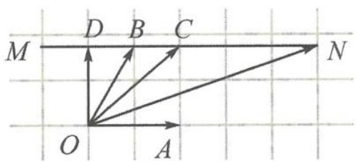

> [!faq]- 《高中数学新体系·向量的秘密》参考答案
>
> > [!success]- **【答案】** 详见解析
>
> > [!note]- **【分析】**
> > 本题未单列分析。
>
> > [!note]- **【解析】**
> > 解答 由相对运动知, 不妨设 $\alpha = 0, \beta = \frac{\pi}{3}$ .
> > 如答图, $a = (1,0), b = \left(\frac{1}{2}, \frac{\sqrt{3}}{2}\right)$ . $|c| = |b + ka|$ 表示点 $O$ 到平行于 $OA$ 的线段 $MN$ 上的点 $C$ 的距离 $|OC|$ .
> > 显然 $|c| \in [|\overrightarrow{OD}|, |\overrightarrow{ON}|] = \left[\frac{\sqrt{3}}{2}, \sqrt{7}\right]$ .
> > 
> > 第1题答图
