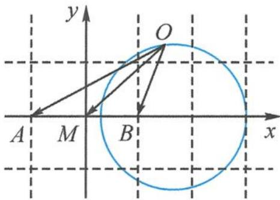

> [!faq]- 《高中数学新体系·向量的秘密》参考答案
>
> > [!success]- **【答案】** 详见解析
>
> > [!note]- **【分析】**
> > 本题未单列分析。
>
> > [!note]- **【解析】**
> > 解答 “以大换小”画图，如答图.
> > 
> > 第5题答图
> > 取 $a=\overrightarrow{OA}, b=\overrightarrow{OB}$ ，则 $a-b=\overrightarrow{BA}$ .
> > 取 $a = OA, b = OB$ ，则 $a - b = BA$ .
> > 题干变为 $|\overrightarrow{OA}| = 2 |\overrightarrow{OB}|$ ， $|\overrightarrow{BA}| = 2$ ，求 $\overrightarrow{OA} \cdot \overrightarrow{OB}$ 的取值范围.
> > 由 $|\overrightarrow{OA}| = 2 |\overrightarrow{OB}|$ 知，点 $O$ 在阿氏圆上.
> > 设 $A(-1,0), B(1,0), O(x,y)$ ,
> > 则 $\sqrt{(x+1)^2 + y^2} = 2 \sqrt{(x-1)^2 + y^2}$ ,
> > 化简得 $\left(x - \frac{5}{3}\right)^2 + y^2 = \frac{16}{9}$ .
> > 因为 $|\overrightarrow{BA}| = 2$ 为定值，所以由“剪刀手”模型知转极化.
> > 取 $AB$ 的中点 $M$ ，则 $\overrightarrow{OA} \cdot \overrightarrow{OB} = |\overrightarrow{OM}|^2 - \frac{|\overrightarrow{AB}|^2}{4} = |\overrightarrow{OM}|^2 - 1$ .
> > 因为 $|\overrightarrow{OM}| \in \left[\frac{1}{3}, 3\right]$ ，所以 $\overrightarrow{OA} \cdot \overrightarrow{OB} \in \left[-\frac{8}{9}, 8\right]$ .
