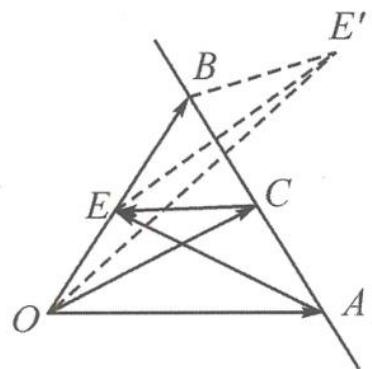

> [!faq]- 《高中数学新体系·向量的秘密》参考答案
>
> > [!success]- **【答案】** C
>
> > [!note]- **【分析】**
> > 本题未单列分析。
>
> > [!note]- **【解析】**
> > 解答 如答图, 记 $a=\overrightarrow{OA}, b=\overrightarrow{OB}$ , 线段 OB 的中点为 E.
> > 
> > 第8题答图
> > 设 $x \overrightarrow{BA} = \overrightarrow{CA}, y \overrightarrow{BA} = \overrightarrow{BC},$ 则 $\left|(1-x)\boldsymbol{a}+xb\right|=\left|\boldsymbol{a}-x(\boldsymbol{a}-\boldsymbol{b})\right|$ $=\left|\overrightarrow{OA}-x\overrightarrow{BA}\right|=\left|\overrightarrow{OA}-\overrightarrow{CA}\right|=\left|\overrightarrow{OC}\right|.$
> > $$
> > \left| y \boldsymbol {a} + \left(\frac {1}{2} - y\right) \boldsymbol {b} \right| = \left| \frac {\boldsymbol {b}}{2} + y (\boldsymbol {a} - \boldsymbol {b}) \right|
> > $$
> > $$
> > = | \overrightarrow {E B} + y \overrightarrow {B A} | = | \overrightarrow {E B} + \overrightarrow {B C} | = | \overrightarrow {E C} |.
> > $$
> > 记点 E 关于直线 AB 的对称点为 $E'$ .
> > $|\overrightarrow{OC}| + |\overrightarrow{EC}| = |\overrightarrow{OC}| + |\overrightarrow{E'C}| \geqslant |\overrightarrow{OE'}| = \sqrt{1^2 + 2^2 - 2 \times 1 \times 2 \times \left(-\frac{1}{2}\right)} = \sqrt{7}.$
> >
> > 故选 **C**.
