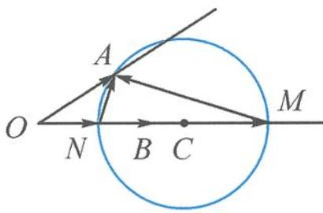
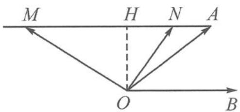

> [!faq]- 《高中数学新体系·向量的秘密》参考答案
>
> > [!success]- **【答案】** 详见解析
>
> > [!note]- **【分析】**
> > 本题未单列分析。
>
> > [!note]- **【解析】**
> > 解答 解法一: 记 $\langle a, b \rangle = \theta, a = \overrightarrow{OA}, b = \overrightarrow{OB}, mb = \overrightarrow{OM}, nb = \overrightarrow{ON}.$
> > 看到向量减法想连线,如答图 1.
> > 
> > 第9题答图1
> > 由 $(a-mb)\perp(a-nb)$ 得 $\overrightarrow{MA}\perp\overrightarrow{NA}.$
> > 故点 A 在以 MN 为直径的圆上. 又点 A 在射线 OA 上, 问题转化为直线与圆 C 有公共点.
> > 圆 C 的半径 $r=\frac{|MN|}{2}=\frac{(m-n)|b|}{2}$ ，圆心 C 到射线 OA 的距离 $d=|OC|\sin\theta=\frac{3}{10}(m+n)|b|$ .
> > 由题意知,要满足 $d \leqslant r$ ,
> > 即 $\frac{3}{10}(m+n)|b|\leqslant\frac{(m-n)|b|}{2}$ , 解得 $\frac{m}{n}\geqslant4$ .
> > 解法二:看到向量 $a + tb$ 的形式想到作平行线.
> > 记 $a - mb = \overrightarrow{OM}, a - nb = \overrightarrow{ON}$ , 则点 $M, N$ 在过点 $A$ 与 $OB$ 平行的射线上, 如答图2.
> > 
> > 第9题答图2
> > 由 $(a-mb)\perp(a-nb)$ 知 $\overrightarrow{OM}\perp\overrightarrow{ON}.$
> > 通过分析图形不难发现,对每一个给定的点 N,都可以作 $OM \perp ON$ , 得到唯一的点 M 与之对应,从而产生一个 $\frac{m}{n}$ 的值.
> > 显然, 当点 N 无限接近于点 A 时, $n \to 0$ . 此时 $\frac{m}{n} \to +\infty$ .
> > 当点 N 无限接近于点 H 时, $m \to +\infty$ . 此时 $\frac{m}{n} \to +\infty$ .
> > 所以, 点 N 位于点 A, H 之间时, 势必存在最小值. 那这个最小值在哪里取呢?
> > 不妨设 $|\pmb{b}| = 1$ ，则 $|\overrightarrow{AM}| = m, |\overrightarrow{AN}| = n,$ $|\overrightarrow{MN}| = m - n.$
> > 因为 $\tan \angle AOB = \frac{3}{4}$ , 又因为是求比值 $\frac{m}{n}$ ,
> > 所以不妨设 $OH = 3, AH = 4$
> > 则 $|HN| = 4 - n, |HM| = m - 4.$
> > 由射影定理知 $3^{2} = (4 - n)(m - 4)$
> > 即 $mn - 4(m + n) + 25 = 0$
> > 设 $\frac{m}{n} = k$ ，则 $kn^2 - 4(k + 1)n + 25 = 0$
> > $$
> > \Delta = 1 6 (k + 1) ^ {2} - 1 0 0 k \geqslant 0,
> > $$
> > 解得 $\frac{m}{n}=k\geqslant4.$
