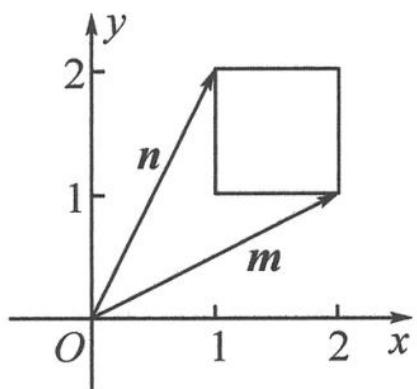

> [!faq]- 《高中数学新体系·向量的秘密》例题解析
>
> > [!success]- **【答案】** 详见解析
>
> > [!note]- **【分析】**
> > 本题未单列分析。
>
> > [!note]- **【解析】**
> > 解答 设 $\boldsymbol{m}=(a,b)$ , $\boldsymbol{n}=(c,d)$ , 则
> > $$
> > \frac {a c + b d}{\sqrt {a ^ {2} + b ^ {2}} \sqrt {c ^ {2} + d ^ {2}}} = \frac {\boldsymbol {m} \cdot \boldsymbol {n}}{| \boldsymbol {m} | | \boldsymbol {n} |} = \cos \theta .
> > $$
> > 由图 8.4-1 可知, 当 $m=(2,1)$ , $n=(1,2)$ 时, m, n 的夹角 $\theta$ 最大, 此时 $\cos\theta=\frac{4}{5}$ ; 当 m=n 时, m, n 的夹角 $\theta$ 最小, 此时 $\cos\theta=1$ .
> > 所以原式的取值范围是 $\left[\frac{4}{5},1\right]$ .
> > 
> > 图8.4-1
