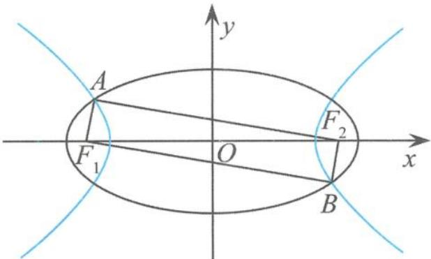
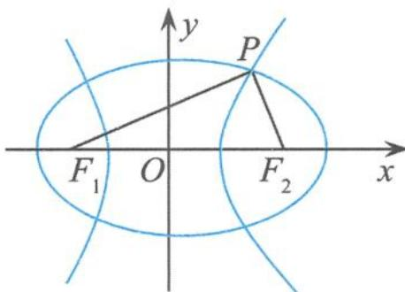

## 4.1 有关共焦点问题

有共同焦点的椭圆与双曲线问题在高考试题中频繁出现,解决这类问题最常见的方法是“算两次”.如可以对焦点三角形的面积“算两次”等.

例 1 如图 4.1-1, $F_{1}, F_{2}$ 是椭圆 $C_{1}: \frac{x^{2}}{4} + y^{2} = 1$ 与双曲线 $C_{2}$ 的公共焦点, A, B 分别是 $C_{1}, C_{2}$ 在第二、四象限的公共点. 若四边形 $AF_{1}BF_{2}$ 为矩形, 则双曲线 $C_{2}$ 的离心率是( ).  
A. $\sqrt{2}$ B. $\sqrt{3}$ C. $\frac{3}{2}$ D. $\frac{\sqrt{6}}{2}$

  
图4.1-1

解答 由题意知 $\angle F_{1}AF_{2} = 90^{\circ}$ , 所以

$$
\frac {1}{e _ {1} ^ {2}} + \frac {1}{e _ {2} ^ {2}} = 2,
$$

所以

$$
e _ {2} = \frac {\sqrt {6}}{2}.
$$

故选D.

例 2 已知椭圆 $C_{1}:\frac{x^{2}}{m^{2}}+y^{2}=1(m>1)$ 与双曲线 $C_{2}:\frac{x^{2}}{n^{2}}-y^{2}=1(n>0)$ 的焦点重合， $e_{1},e_{2}$ 分别为 $C_{1}, C_{2}$ 的离心率，则（）A. m > n 且 $e_{1}e_{2} > 1$ B. m > n 且 $e_{1}e_{2} < 1$ C. m < n 且 $e_{1}e_{2} > 1$ D. m < n 且 $e_{1}e_{2} < 1$

解答 设 $F_{1}, F_{2}$ 是椭圆与双曲线的公共焦点, P 为椭圆与双曲线的交点, 令 $\angle F_{1}PF_{2} = \theta$ , 因为

$$
S _ {\triangle P F _ {1} F _ {2}} = \tan \frac {\theta}{2} = \frac {1}{\tan \frac {\theta}{2}},
$$

所以 $\theta = 90^{\circ}$ ，所以

$$
\frac {1}{e _ {1} ^ {2}} + \frac {1}{e _ {2} ^ {2}} = 2.
$$

再用基本不等式可得 $e_{1}e_{2}>1$ . 因为 $m^{2}-1=n^{2}+1$ , 即 $m^{2}=n^{2}+2$ , 所以 m>n. 故选 A.

结论 已知 $F_{1}, F_{2}$ 为椭圆与双曲线的公共焦点, $P$ 是它们的一个公共点, 设 $\angle F_{1}PF_{2} = \theta$ , 则椭圆的离心率 $e_{1}$ 与双曲线的离心率 $e_{2}$ 的关系为

$$
\frac {\sin^ {2} \frac {\theta}{2}}{e _ {1} ^ {2}} + \frac {\cos^ {2} \frac {\theta}{2}}{e _ {2} ^ {2}} = 1.
$$

例 3 已知 $F_{1}, F_{2}$ 为椭圆与双曲线的公共焦点, P 是它们的一个公共点, 且 $\angle F_{1}PF_{2} = \frac{\pi}{3}$ , 则椭圆的离心率 $e_{1}$ 和双曲线的离心率 $e_{2}$ 的倒数之和的最大值为(). A. $\frac{4\sqrt{3}}{3}$ B. $\frac{2\sqrt{3}}{3}$ C. 3 D. 2

解答 由上述结论得到

$$
\frac {1}{e _ {1} ^ {2}} + \frac {3}{e _ {2} ^ {2}} = 4.
$$

设 $\frac{1}{e_1} = 2\cos \theta, \frac{\sqrt{3}}{e_2} = 2\sin \theta$ ，则

$$
\frac {1}{e _ {1}} + \frac {1}{e _ {2}} = 2 \cos \theta + \frac {2 \sin \theta}{\sqrt {3}} = \frac {4 \sqrt {3}}{3} \sin (\theta + \varphi),
$$

其中 $\tan\varphi=\sqrt{3}$ ，当 $\theta+\varphi=\frac{\pi}{2}$ 时， $\frac{1}{e_{1}}+\frac{1}{e_{2}}$ 取最大值 $\frac{4\sqrt{3}}{3}$ .

也可以由柯西不等式求得答案. 故选 A.

链接1 已知 $F_{1}, F_{2}$ 为椭圆与双曲线的公共焦点, $P$ 是它们的一个公共点, 且 $\angle F_{1}PF_{2}=60^{\circ}$ , 则该椭圆和双曲线的离心率之积的最小值是 ( ).

A. $\frac{\sqrt{3}}{3}$ B. $\frac{\sqrt{3}}{2}$ C. 1

D. $\sqrt{3}$

解答 设椭圆的离心率为 $e_{1}$ 、双曲线的离心率为 $e_{2}$ ，由上述结论得

$$
\frac {1}{e _ {1} ^ {2}} + \frac {3}{e _ {2} ^ {2}} = 4.
$$

由基本不等式得

$$
4 = \frac {1}{e _ {1} ^ {2}} + \frac {3}{e _ {2} ^ {2}} \geqslant 2 \sqrt {\frac {1}{e _ {1} ^ {2}} \cdot \frac {3}{e _ {2} ^ {2}}},
$$

所以

$$
e _ {1} e _ {2} \geqslant \frac {\sqrt {3}}{2},
$$

当且仅当 $\frac{1}{e_1^2} = \frac{3}{e_2^2}$ 即 $e_2 = \sqrt{3} e_1$ 时取等号.故选B.

链接 2 已知椭圆 $C_{1}: m^{2}x^{2} + y^{2} = 1 (0 < m < 1)$ 与双曲线 $C_{2}: n^{2}x^{2} - y^{2} = 1 (n > 0)$ 的焦点重合， $e_{1}, e_{2}$ 分别为 $C_{1}, C_{2}$ 的离心率，则 $e_{1}e_{2}$ 的取值范围是 \_\_\_\_.

解答 设 $F_{1}, F_{2}$ 是椭圆与双曲线的公共焦点, P 为椭圆与双曲线的交点. 设 $\angle F_{1}PF_{2} = \theta$ , 结合上述结论, 因为

$$
S _ {\triangle P F _ {1} F _ {2}} = \tan \frac {\theta}{2} = \frac {1}{\tan \frac {\theta}{2}},
$$

所以 $\theta = 90^{\circ}$ ，所以

$$
\frac {1}{e _ {1} ^ {2}} + \frac {1}{e _ {2} ^ {2}} = 2.
$$

由基本不等式得

$$
2 = \frac {1}{e _ {1} ^ {2}} + \frac {1}{e _ {2} ^ {2}} > 2 \cdot \frac {1}{e _ {1}} \cdot \frac {1}{e _ {2}},
$$

其中 $e_1 \neq e_2$ ，所以 $e_1 e_2$ 的取值范围是

$$
(1, + \infty).
$$

链接3 设点 $P$ 为有公共焦点 $F_{1}, F_{2}$ 的椭圆和双曲线的一个交点，且 $\cos \angle F_{1}PF_{2} = \frac{3}{5}$ ，若椭圆的离心率为 $e_{1}$ ，双曲线的离心率为 $e_{2}$ ，且 $e_{2} = 2e_{1}$ ，则 $e_{1} = (\quad)$ A. $\frac{\sqrt{10}}{4}$ B. $\frac{\sqrt{7}}{5}$ C. $\frac{\sqrt{7}}{4}$ D. $\frac{\sqrt{10}}{5}$

解答 设 $\angle F_{1}PF_{2} = \theta$ ，则有

$$
\sin^ {2} \frac {\theta}{2} = \frac {1 - \cos \theta}{2} = \frac {1}{5}, \cos^ {2} \frac {\theta}{2} = \frac {1 + \cos \theta}{2} = \frac {4}{5}.
$$

由上述结论得

$$
\frac {1}{e _ {1} ^ {2}} + \frac {4}{e _ {2} ^ {2}} = 5.
$$

因为 $e_{2}=2e_{1}$ ，所以

$$
e _ {1} = \frac {\sqrt {1 0}}{5}.
$$

故选D.

链接 4 如图 4.1-2, 已知 $F_{1}, F_{2}$ 为椭圆与双曲线的公共焦点, P 是它们的一个公共点, 且满足 $\angle F_{1}PF_{2}=45^{\circ}$ , 则该椭圆的离心率 $e_{1}$ 与双曲线的离心率 $e_{2}$ 之积的最小值为().

A. $\frac{\sqrt{2}}{4}$ B. $\frac{\sqrt{2}}{2}$ C. 1 D. $\sqrt{2}$ 解答 设 $\angle F_{1}PF_{2} = \theta$ ，由上述结论得

  
图4.1-2

$$
\frac {\sin^ {2} \frac {\theta}{2}}{e _ {1} ^ {2}} + \frac {\cos^ {2} \frac {\theta}{2}}{e _ {2} ^ {2}} = 1.
$$

由基本不等式得 $1 \geqslant 2\sqrt{\frac{\sin^2\frac{\theta}{2}}{e_1^2} \cdot \frac{\cos^2\frac{\theta}{2}}{e_2^2}}$ ，即

$$
e _ {1} e _ {2} \geqslant 2 \sin {\frac {\theta}{2}} \cos {\frac {\theta}{2}} = \sin \theta = \frac {\sqrt {2}}{2},
$$

当且仅当 $\frac{\sin^2\frac{\theta}{2}}{e_1^2} = \frac{\cos^2\frac{\theta}{2}}{e_2^2}$ 即 $e_1\cos \frac{\theta}{2} = e_2\sin \frac{\theta}{2}$ 时取等号.

故选 B.

链接5 已知椭圆 $\frac{x^2}{a^2} +\frac{y^2}{b^2} = 1(a > b > 0)$ 与双曲线 $\frac{x^2}{m^2} -\frac{y^2}{n^2} = 1(m > 0,n > 0)$ 有公共焦点，左、右焦点分别为 $F_{1},F_{2}$ ，且两条曲线在第一象限的交点为 $P,\triangle PF_1F_2$ 是以 $PF_{1}$ 为底边的等腰三角形，椭圆和双曲线的离心率分别为 $e_1$ 和 $e_2$ ，则 $e_2 - e_1$ 的取值范围是（ ）.A.(1， $+\infty$ ) B. $\left(\frac{2}{3}, + \infty\right)$ C. $\left(\frac{6}{5}, + \infty\right)$ D. $\left(\frac{10}{9}, + \infty\right)$

解答 因为 $\triangle PF_{1}F_{2}$ 是以 $PF_{1}$ 为底边的等腰三角形, 所以

$$
\mid F _ {1} F _ {2} \mid = \mid P F _ {2} \mid = 2 c.
$$

由椭圆的定义知

$$
\mid P F _ {1} \mid = 2 a - \mid P F _ {2} \mid = 2 a - 2 c,
$$

由双曲线的定义知

$$
\mid P F _ {1} \mid = 2 m + \mid P F _ {2} \mid = 2 m + 2 c.
$$

所以 $2a - 2m = 4c$ ，即

$$
\frac {1}{e _ {1}} - \frac {1}{e _ {2}} = 2,
$$

从而 $e_2 - e_1 = e_2 - \frac{e_2}{2e_2 + 1}$ . 令 $t = 2e_2 + 1 > 3$ , 则

$$
e _ {2} - e _ {1} = \frac {1}{2} \left(t + \frac {1}{t}\right) - 1 > \frac {2}{3}.
$$

故选 B.

链接6 已知离心率为 $e_1$ 的椭圆与离心率为 $e_2$ 的双曲线有相同的焦点，且椭圆长轴的端点、短轴的端点、焦点到双曲线的一条渐近线的距离依次构成等比数列，则 $\frac{e_1^2 - 1}{e_2^2 - 1} = (\quad)$ A. $-e_1$ B. $-e_2$ C. $-\frac{1}{e_1}$ D. $-\frac{1}{e_2}$

解答 设椭圆的方程为

$$
\frac {x ^ {2}}{a _ {1} ^ {2}} + \frac {y ^ {2}}{b _ {1} ^ {2}} = 1 (a _ {1} > b _ {1} > 0),
$$

双曲线的方程为

$$
\frac {x ^ {2}}{a _ {2} ^ {2}} - \frac {y ^ {2}}{b _ {2} ^ {2}} = 1 (a _ {2} > 0, b _ {2} > 0),
$$

则双曲线的一条渐近线方程为

$$
b _ {2} x - a _ {2} y = 0,
$$

所以 $\frac{a_1b_2}{c},\frac{a_2b_1}{c},\frac{b_2c}{c}$ 成等比数列，即 $\frac{a_1b_2}{c}\cdot \frac{b_2c}{c} = \left(\frac{a_2b_1}{c}\right)^2$ ，即

$$
a _ {2} ^ {2} b _ {1} ^ {2} = a _ {1} c b _ {2} ^ {2} \Rightarrow a _ {2} ^ {2} (a _ {1} ^ {2} - c ^ {2}) = a _ {1} c (c ^ {2} - a _ {2} ^ {2}),
$$

整理得

$$
\frac {e _ {1} ^ {2} - 1}{e _ {2} ^ {2} - 1} = - e _ {1}.
$$

故选 A.

链接7 已知椭圆 $C_1: \frac{x^2}{a_1^2} + \frac{y^2}{b_1^2} = 1 (a_1 > b_1 > 0)$ 和双曲线 $C_2: \frac{x^2}{a_2^2} - \frac{y^2}{b_2^2} = 1 (a_2 > 0, b_2 > 0)$ 有相同的焦点 $F_1, F_2$ ，且椭圆 $C_1$ 与双曲线 $C_2$ 在第一象限的交点为 $P$ . 若 $2\overrightarrow{OF_2} \cdot \overrightarrow{OP} = |\overrightarrow{OF_2}|^2$ （ $O$ 为坐标原点），则双曲线的离心率的取值范围为（ ）.

A. $(\sqrt{2}, +\infty)$ B. $(2, +\infty)$ C. $(\sqrt{3}, +\infty)$ D. $(3, +\infty)$

解答 连接 $PF_{1}$ ，设 $PF_{2}$ 的中点为 M，则由向量的极化恒等式得

$2\overrightarrow{OF_{2}}\cdot\overrightarrow{OP}=2\left[\left(\frac{\overrightarrow{OF_{2}}+\overrightarrow{OP}}{2}\right)^{2}-\left(\frac{\overrightarrow{OF_{2}}-\overrightarrow{OP}}{2}\right)^{2}\right]=2\left[\left|\overrightarrow{OM}\right|^{2}-\left(\frac{\overrightarrow{PF_{2}}}{2}\right)^{2}\right]=2\left[\left(\frac{\overrightarrow{PF_{1}}}{2}\right)^{2}-\left(\frac{\overrightarrow{PF_{2}}}{2}\right)^{2}\right],$ 所以 $|\overrightarrow{PF_{1}}|^{2}-|\overrightarrow{PF_{2}}|^{2}=2c^{2}$ ，即

$$
(| \overrightarrow {P F _ {1}} | + | \overrightarrow {P F _ {2}} |) (| \overrightarrow {P F _ {1}} | - | \overrightarrow {P F _ {2}} |) = 2 c ^ {2}.
$$

由椭圆和双曲线的定义知 $2a_{1} \cdot 2a_{2} = 2c^{2}$ ，所以

$$
e _ {1} e _ {2} = 2.
$$

由于 $0 < e_{1} < 1$ ，所以

$$
e _ {2} > 2.
$$

故选 B.
