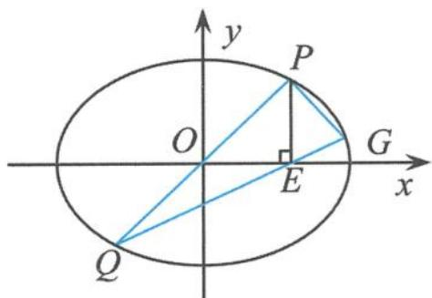
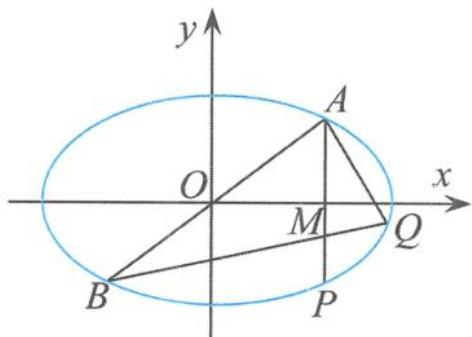
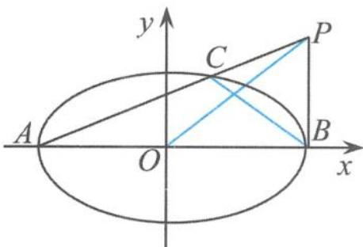
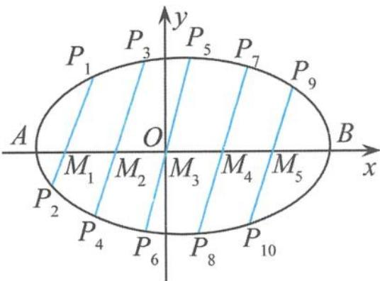
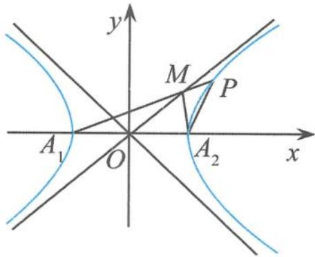
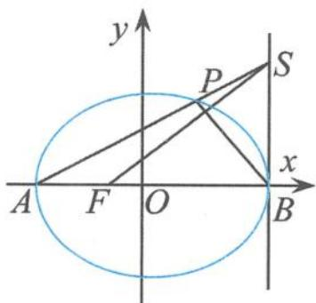
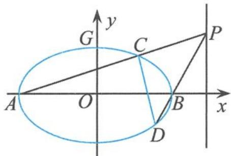

## 4.3.1 与圆锥曲线的对称中心有关的 $e^2 - 1$ 性质

性质1 若 $M, N$ 是椭圆 $\frac{x^2}{a^2} + \frac{y^2}{b^2} = 1 (a > b > 0)$ 上关于原点对称的两个点， $P$ 是椭圆上的任意一点，当直线 $PM, PN$ 的斜率都存在时，并记为 $k_1, k_2$ ，则 $k_1 \cdot k_2 = e^2 - 1$ .

(1) 证明垂直

例 1 已知点 A(-2,0), B(2,0), 动点 M(x,y) 满足直线 AM 和 BM 的斜率之积为 $-\frac{1}{2}$ , 记点 M 的轨迹为曲线 C.

(I)求曲线 C 的方程,并说明 C 是什么曲线.

(Ⅱ)过坐标原点的直线交曲线 C 于 P, Q 两点, 点 P 在第一象限, $PE \perp x$ 轴, 垂足为 E, 连接 QE 并延长, 交曲线 C 于点 G, 证明: $\triangle PQG$ 是直角三角形.

解答 (I)由题意得

$$
\frac {y}{x + 2} \cdot \frac {y}{x - 2} = - \frac {1}{2},
$$

化简得

$$
\frac {x ^ {2}}{4} + \frac {y ^ {2}}{2} = 1 (x \neq \pm 2),
$$

表示焦点在 x 轴上的椭圆(不含与 x 轴的交点).

(Ⅱ)如图4.3-1,依题意设 $P(x_0,y_0)$ ，则 $Q(-x_0, - y_0)$ ，所以

$$
k _ {P Q} = k _ {P O} = \frac {y _ {0}}{x _ {0}}.
$$

因为 $k_{GQ} = k_{QE} = \frac{y_0}{2x_0}$ ，所以

$$
k _ {G Q} = \frac {1}{2} k _ {P Q}.
$$

图4.3-1

又

$$
k _ {G Q} \cdot k _ {G P} = e ^ {2} - 1 = - \frac {1}{2},
$$

所以 $\frac{1}{2} k_{PQ} \cdot k_{GP} = e^2 - 1 = -\frac{1}{2}$ , 即

$$
k _ {P Q} \cdot k _ {P G} = - 1,
$$

即 $PQ \perp PG.$ 故 $\triangle PQG$ 是直角三角形.

引申 如图 4.3-2, 已知过原点 O 的直线 AB 交椭圆 $\frac{x^{2}}{a^{2}} + \frac{y^{2}}{b^{2}} = 1 (a > b > 0)$ 于 A, B 两点, 过点 A 分别作 x 轴和 AB 的垂线 AP 和 AQ, 交椭圆于 P, Q 两点. 连接 BQ, 交 AP 于点 M. 若 $\overrightarrow{AM} = \frac{4}{5}\overrightarrow{AP}$ , 则椭圆的离心率为 \_\_\_\_.

  
图4.3-2

解答 由“性质1”知 $\left\{\begin{aligned}k_{QA}\cdot k_{QB}&=e^{2}-1,\\ k_{QA}\cdot k_{AB}&=-1,\end{aligned}\right.$ 两式相除得

$$
\frac {k _ {Q B}}{k _ {A B}} = 1 - e ^ {2} \quad ①.
$$

设 $A(x_0, y_0)$ ，则 $B(-x_0, -y_0), P(x_0, -y_0)$ 。已知 $\overrightarrow{AM} = \frac{4}{5}\overrightarrow{AP}$ ，则 $M(x_0, -\frac{3}{5}y_0)$ ，且

$$
k _ {A B} = k _ {A O} = \frac {y _ {0}}{x _ {0}}.
$$

因为 $k_{QB} = k_{MB} = \frac{y_0}{5x_0}$ ，所以

$$
k _ {Q B} = \frac {1}{5} k _ {A B} \quad ②.
$$

由①②两式得 $1 - e^{2} = \frac{1}{5}$ ，所以

$$
e = \frac {2 \sqrt {5}}{5}.
$$

例 2 如图 4.3-3, 已知椭圆 $\frac{x^{2}}{2} + y^{2} = 1$ 的左、右顶点分别是 A, B. 设点 $P(\sqrt{2}, t) (t > 0)$ , 连接 PA, 交椭圆于点 C, 点 O 是坐标原点. 证明: $OP \perp BC$ .

证明 由“性质1”得到

  
图4.3-3

$$
k _ {C A} \cdot k _ {C B} = e ^ {2} - 1 = - \frac {1}{2},
$$

即

$$
k _ {P A} \cdot k _ {C B} = - \frac {1}{2}.
$$

因为 $k_{OP}=2k_{PA}$ ，所以

$$
k _ {B C} \cdot k _ {O P} = - 1.
$$

因此 $OP \perp BC$ .

点评 “性质1”的标志性条件是有过原点的直线。以上结论如果换成双曲线，同样成立，这个性质在解决一类圆锥曲线问题中起到了化繁为简的作用，使得问题的解决变得有章可循，直奔问题的本源。

(2) 求离心率的值或范围

例 3 若椭圆 $C: \frac{x^{2}}{4} + \frac{y^{2}}{3} = 1$ 的左、右顶点分别为 $A_{1}, A_{2}$ ，点 P 在椭圆 C 上且直线 $PA_{2}$ 的斜率的取值范围是 $[-2, -1]$ ，那么直线 $PA_{1}$ 的斜率的取值范围是（）.

A. $\left[\frac{1}{2}, \frac{3}{4}\right]$ B. $\left[\frac{3}{8}, \frac{3}{4}\right]$ C. $\left[\frac{1}{2}, 1\right]$ D. $\left[\frac{3}{4}, 1\right]$

解答 由“性质1”得

$$
k _ {P A _ {1}} \cdot k _ {P A _ {2}} = e ^ {2} - 1 = - \frac {3}{4}.
$$

因为 $-2 \leqslant k_{PA_2} \leqslant -1$ ，所以

$$
\frac {3}{8} \leqslant k _ {P A _ {1}} \leqslant \frac {3}{4}.
$$

故选 B.

链接 1 如图 4.3-4, 已知椭圆 $C: \frac{x^2}{2} + y^2 = 1$ , 点 $M_1, M_2, \cdots, M_5$ 为其长轴 $AB$ 的 6 等分点, 分别过这五个点作斜率为 $k (k \neq 0)$ 的一组平行线, 交椭圆 $C$ 于点 $P_1, P_2, \cdots, P_{10}$ , 则直线 $AP_1, AP_2, \cdots, AP_{10}$ 这 10 条直线的斜率的乘积为 ( ).

A. $-\frac{1}{16}$ B. $-\frac{1}{32}$ C. $\frac{1}{64}$ D. $-\frac{1}{1024}$

  
图4.3-4

解答 由椭圆的对称性知, 点 $P_{1}$ 与点 $P_{10}$ 关于原点对称, 点 $P_{2}$ 与点 $P_{9}$ 关于原点对称, 点 $P_{3}$ 与点 $P_{8}$ 关于原点对称, 点 $P_{4}$ 与点 $P_{7}$ 关于原点对称, 点 $P_{5}$ 与点 $P_{6}$ 关于原点对称. 由“性质 1”得

$$
k _ {A P _ {1}} \cdot k _ {A P _ {1 0}} = e ^ {2} - 1.
$$

同理,其余四组中每一组直线的斜率的乘积都等于 $e^{2}-1$ ,所以直线 $AP_{1},AP_{2},\cdots,AP_{10}$ 这10条直线的斜率乘积为

$$
(e ^ {2} - 1) ^ {5} = - \frac {1}{3 2}.
$$

故选 B.

链接2 如图4.3-5, 已知双曲线 $\frac{x^2}{a^2} - \frac{y^2}{b^2} = 1 (a > b > 0)$ 的左、右顶点分别为 $A_1, A_2, P$ 为双曲线右支上的点, 直线 $A_1P$ 交双曲线的一条渐近线于点 $M$ , 若直线 $A_2M, A_2P$ 的斜率分别为 $k_1, k_2$ , 且 $A_2M \perp A_1P, k_1 + 4k_2 = 0$ , 则双曲线的离心率为 \_\_\_\_.

  
图4.3-5

解答 由“性质1”得

$$
k _ {P A _ {1}} \cdot k _ {P A _ {2}} = e ^ {2} - 1.
$$

因为 $A_{2}M \perp A_{1}P$ ，所以 $k_{PA_{1}} = -\frac{1}{k_{1}}$ ，即

$$
\left(- \frac {1}{k _ {1}}\right) k _ {2} = e ^ {2} - 1.
$$

又因为 $\frac{k_2}{k_1} = -\frac{1}{4}$ 所以 $\frac{1}{4} = e^2 - 1$ ，解得

$$
e = \frac {\sqrt {5}}{2}.
$$

链接3 如图4.3-6, 已知 $A, B$ 分别为椭圆 $\frac{x^2}{a^2} + \frac{y^2}{b^2} = 1 (a > b > 0)$ 的左、右顶点, $F$ 为椭圆的左焦点, 点 $S$ 在直线 $x = a$ 上, 且 $SA$ 与椭圆交于点 $P$ . 若 $BP \perp SF$ , 则椭圆的离心率为

解答 设点 $S(a,t)$ . 因为 $BP \perp SF$ , 所以

  
图4.3-6

$$
k _ {B P} \cdot k _ {S F} = - 1,
$$

解得

$$
k _ {B P} = - \frac {a + c}{t}.
$$

因为 $k_{PA} = k_{SA} = \frac{t}{2a}$ ，所以

$$
k _ {P A} \cdot k _ {P B} = \frac {t}{2 a} \left(- \frac {a + c}{t}\right) = - \frac {a + c}{2 a} = - \frac {1 + e}{2}.
$$

因为

$$
k _ {P A} \cdot k _ {P B} = e ^ {2} - 1,
$$

所以 $e^2 - 1 = -\frac{1 + e}{2}$ . 从而椭圆的离心率

$$
e = \frac {1}{2}.
$$

链接4 已知双曲线 $x^{2} - y^{2} = 2020$ 的左、右顶点分别为 $A_{1}, A_{2}$ , 点 $P$ 为其右支上一点, 且 $\angle A_{1}PA_{2} = 4\angle PA_{1}A_{2}$ , 则 $\angle PA_{1}A_{2} =$ \_\_\_\_.

解答 设 $\angle PA_{1}A_{2} = \alpha$ ，则 $\angle A_{1}PA_{2} = 4\alpha$ 。因为双曲线为等轴双曲线，离心率为 $\sqrt{2}$ ，由“性质1”得

$$
k _ {P A _ {1}} \cdot k _ {P A _ {2}} = e ^ {2} - 1 = 1,
$$

即 $\tan \alpha \cdot \tan 5\alpha = 1$ ，得 $\tan 5\alpha = \tan \left(\frac{\pi}{2} -\alpha\right)$ ，即

$$
\alpha = \frac {\pi}{1 2},
$$

所以

$$
\angle P A _ {1} A _ {2} = \frac {\pi}{1 2}.
$$

(3) 证明直线过定点

例4 设 $A, B$ 分别为椭圆 $E: \frac{x^2}{a^2} + y^2 = 1 (a > 1)$ 的左、右顶点， $G$ 为椭圆 $E$ 的上顶点， $\overrightarrow{AG} \cdot \overrightarrow{GB} = 8, P$ 为直线 $x = 6$ 上的任意动点，直线 $PA$ 与椭圆 $E$ 的另一个交点为 $C$ ，直线 $PB$ 与椭圆 $E$ 的另一个交点为 $D$ .

(Ⅰ)求椭圆 E 的方程.

(Ⅱ)证明:直线 CD 过定点.

解答 (I)如图4.3-7,设椭圆的中心为 $O$ ,由向量的极化恒等式得

$$
\overrightarrow {A G} \cdot \overrightarrow {G B} = a ^ {2} - | \overrightarrow {G O} | ^ {2} = a ^ {2} - 1 = 8.
$$

故椭圆 $E$ 的方程为

$$
\frac {x ^ {2}}{9} + y ^ {2} = 1.
$$

  
图4.3-7

(Ⅱ)由“性质1”得

$$
k _ {D A} \cdot k _ {D B} = e ^ {2} - 1 = - \frac {1}{9}.
$$

设 $P(6,n)$ ，则 $k_{AC} = \frac{n}{9}, k_{DB} = k_{PB} = \frac{n}{3}$ 所以 $k_{DB} = 3k_{AC}$ ，代入上式得 $k_{DA}(3k_{AC}) = -\frac{1}{9}$ ，即

$$
k _ {A D} \cdot k _ {A C} = - \frac {1}{2 7}.
$$

设 $C(x_{1},y_{1}),D(x_{2},y_{2})$ ，直线 $CD$ 的方程为

$$
x = m y + t,
$$

把 $x = my + t$ 代入椭圆方程并整理得

$$
(m ^ {2} + 9) y ^ {2} + 2 m t y + t ^ {2} - 9 = 0,
$$

所以

$$
y _ {1} + y _ {2} = \frac {- 2 m t}{m ^ {2} + 9}, y _ {1} y _ {2} = \frac {t ^ {2} - 9}{m ^ {2} + 9}.
$$

从而

$$
\begin{array}{r l} & k _ {A D} \cdot k _ {A C} = \frac {y _ {1}}{x _ {1} + 3} \cdot \frac {y _ {2}}{x _ {2} + 3} = \frac {y _ {1} y _ {2}}{(m y _ {1} + t + 3) (m y _ {1} + t + 3)} \\ & = \frac {y _ {1} y _ {2}}{m ^ {2} y _ {1} y _ {2} + m (t + 3) (y _ {1} + y _ {2}) + (t + 3) ^ {2}} = \frac {t - 3}{9 (t + 3)}. \end{array}
$$

而 $k_{AD} \cdot k_{AC} = -\frac{1}{27}$ , 得到

$$
t = \frac {3}{2}.
$$

所以直线 CD 的方程为 $x=my+\frac{3}{2}$ ，即直线 CD 过定点 $\left(\frac{3}{2},0\right)$ .

点评 从整体上把握知识的内在规律,不仅能帮助我们完善知识结构,构建完整的知识网络,而且能突出问题的本质,切中问题的要害.
