## 4.3.2 与圆锥曲线的中点弦有关的 $e^{2} - 1$ 性质

性质2 已知椭圆 $\frac{x^2}{a^2} +\frac{y^2}{b^2} = 1(a > b > 0)$ ，斜率为 $k_{1}$ 的直线交椭圆于 $A,B$ 两点，若点 $M$ 是线段 $AB$ 的中点且直线 $OM$ 的斜率为 $k_{2}$ ，则 $k_{1}\cdot k_{2} = e^{2} - 1.$

如果把“性质2”中的“椭圆 $\frac{x^{2}}{a^{2}}+\frac{y^{2}}{b^{2}}=1(a>b>0)$ ”换成“双曲线 $\frac{x^{2}}{a^{2}}-\frac{y^{2}}{b^{2}}=1(a>0,b>0)$ ”，结论同样成立。这一组结论看似简单，但应用广泛，值得关注。

特例 若 $A, B$ 是双曲线 $\frac{x^2}{a^2} - \frac{y^2}{b^2} = 1 (a > 0, b > 0)$ 的渐近线上的两个点， $M$ 是 $AB$ 的中点，则直线 $AB, OM$ 的斜率之积为 $e^2 - 1$ .

## (1) 求直线的斜率或方程

例 5 已知椭圆 $\frac{x^{2}}{a^{2}} + \frac{y^{2}}{b^{2}} = 1 (a > b > 0)$ 的一个顶点为 A(0, -3)、右焦点为 F，且 $|OA| = |OF|$ ，其中 O 为原点。

(Ⅰ)求椭圆的方程.

(Ⅱ)已知点 C 满足 $3 \overrightarrow{OC} = \overrightarrow{OF}$ ，点 B 在椭圆上（点 B 异于椭圆的顶点），直线 AB 与以 C 为圆心的圆相切于点 P，且 P 为线段 AB 的中点。求直线 AB 的方程。

解答 (I)椭圆的方程为

$$
\frac {x ^ {2}}{1 8} + \frac {y ^ {2}}{9} = 1.
$$

(Ⅱ)如图4.3-8,设 $P(x_0,y_0)$ ，由 $3\overrightarrow{OC} = \overrightarrow{OF}$ 得点 $C$ 的坐标为(1,0).由条件及“性质2”得

$$
\left\{ \begin{array}{l} k _ {A B} \cdot k _ {O P} = e ^ {2} - 1 = - \frac {1}{2}, \\ k _ {A B} \cdot k _ {C P} = - 1. \end{array} \right.
$$

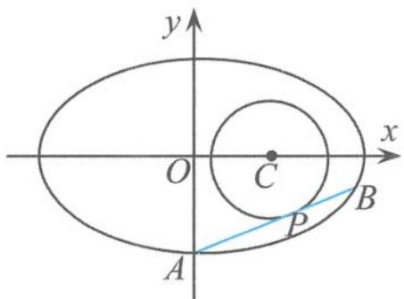  
图4.3-8

消去 $k_{AB}$ 得 $k_{CP} = 2k_{OP}$ ，即

$$
\frac {y _ {0}}{x _ {0} - 1} = 2 \frac {y _ {0}}{x _ {0}},
$$

所以 $x_{0}=2$ . 因为 $A(0,-3)$ , 所以 $x_{B}=4$ , 即

$$
B (4, \pm 1).
$$

因此,直线 AB 的方程为

$$
y = \frac {1}{2} x - 3   \text {或}   y = x - 3.
$$

例 6 如图 4.3-9, 椭圆 $C: \frac{x^2}{a^2} + \frac{y^2}{b^2} = 1 (a > b > 0)$ 的离心率为 $\frac{1}{2}$ , 其左焦点到点 $P(2,1)$ 的距离为 $\sqrt{10}$ , 不过原点 $O$ 的直线 $l$ 与椭圆 $C$ 相交于 $A, B$ 两点, 且线段 $AB$ 被直线 $OP$ 平分.

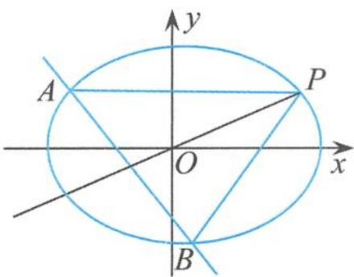

(Ⅰ)求椭圆 C 的方程.

图4.3-9

(Ⅱ)求 $\triangle APB$ 的面积取最大值时直线l的方程.

解答 (I)椭圆 $C$ 的方程为

$$
\frac {x ^ {2}}{4} + \frac {y ^ {2}}{3} = 1.
$$

(Ⅱ)设直线 $PO$ 与线段 $AB$ 交于点 $R$ , 由“性质 2”得到

$$
k _ {A B} \cdot k _ {O R} = e ^ {2} - 1 = - \frac {3}{4}.
$$

因为 $k_{OR}=k_{OP}=\frac{1}{2}$ ，所以

$$
k _ {A B} = - \frac {3}{2}.
$$

(得到直线的斜率之后,剩下的计算则是“一马平川”,直奔问题的主题)设直线 AB 的方程为

$$
l: y = - \frac {3}{2} x + m (m \neq 0),
$$

代入椭圆方程得

$$
3 x ^ {2} - 3 m x + m ^ {2} - 3 = 0.
$$

显然 $\Delta = (3m)^2 - 4 \times 3(m^2 - 3) = 3(12 - m^2) > 0$ ，所以

$$
- \sqrt {1 2} <   m <   \sqrt {1 2} \text {且} m \neq 0.
$$

由韦达定理知

$$
x _ {A} + x _ {B} = m, x _ {A} x _ {B} = \frac {m ^ {2} - 3}{3}.
$$

所以

$$
\vert A B \vert = \sqrt {1 + k _ {A B} ^ {2}} \left| x _ {A} - x _ {B} \right| = \sqrt {1 + k _ {A B} ^ {2}} \sqrt {\left(x _ {A} + x _ {B}\right) ^ {2} - 4 x _ {A} x _ {B}} = \frac {\sqrt {3 9}}{6} \sqrt {1 2 - m ^ {2}}.
$$

因为点 $P(2,1)$ 到直线 $l$ 的距离

$$
d = \frac {| 8 - 2 m |}{\sqrt {1 3}} = \frac {2 | 4 - m |}{\sqrt {1 3}},
$$

所以

$$
S _ {\triangle A B P} = \frac {1}{2} d | A B | = \frac {\sqrt {3}}{6} \sqrt {(4 - m) ^ {2} (1 2 - m ^ {2})},
$$

其中 $-\sqrt{12}<m<\sqrt{12}$ 且 $m\neq0$ . 利用导数求解,令

$$
u (m) = (4 - m) ^ {2} (1 2 - m ^ {2}),
$$

则

$$
u ^ {\prime} (m) = - 4 (m - 4) \left(m ^ {2} - 2 m - 6\right) = - 4 (m - 4) \left(m - 1 - \sqrt {7}\right) (m - 1 + \sqrt {7}).
$$

当 $m=1-\sqrt{7}$ 时，有 $(S_{\triangle ABP})_{\max}$ ，此时直线 l 的方程为

$$
3 x + 2 y + 2 \sqrt {7} - 2 = 0.
$$

例 7 如图 4.3-10, 已知 $F_{1}, F_{2}$ 是离心率为 $\frac{\sqrt{2}}{2}$ 的椭圆 $C: \frac{x^{2}}{a^{2}} + \frac{y^{2}}{b^{2}} = 1$ $(a > b > 0)$ 的左、右焦点, 直线 $l: x = -\frac{1}{2}$ 将线段 $F_{1}F_{2}$ 分成两段, 其长度之比为 1:3. 设 A, B 是椭圆 C 上的两个动点, 线段 AB 的中垂线与椭圆 C 交于 P, Q 两点, 线段 AB 的中点 M 在直线 l 上.

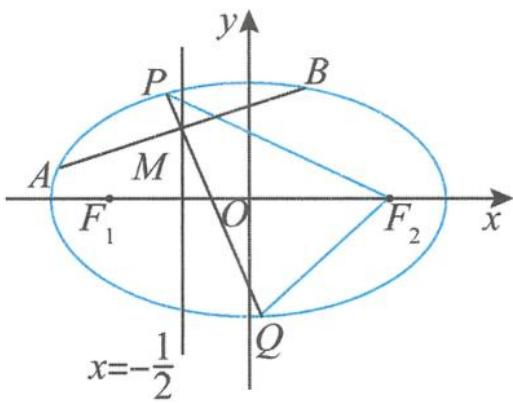  
图4.3-10

(I)求椭圆 C 的方程.

(Ⅱ)求 $\overrightarrow{F_{2}P}\cdot\overrightarrow{F_{2}Q}$ 的取值范围.

解答 (I)椭圆 $C$ 的方程为

$$
\frac {x ^ {2}}{2} + y ^ {2} = 1.
$$

(Ⅱ)当直线 AB 垂直于 x 轴时, 直线 AB 的方程为 $x = -\frac{1}{2}$ , 此时 $P(-\sqrt{2}, 0)$ , $Q(\sqrt{2}, 0)$ , 则 $\overrightarrow{F_{2}P} \cdot \overrightarrow{F_{2}Q} = -1$ .

当直线 AB 不垂直于 x 轴时, 设直线 AB 的斜率为 k, $M\left(-\frac{1}{2}, m\right) (m \neq 0)$ , $A(x_{1}, y_{1})$ , $B(x_{2}, y_{2})$ . 由“性质 2”得

$$
k _ {O M} \cdot k _ {A B} = e ^ {2} - 1 = - \frac {1}{2},
$$

所以

$$
k = \frac {1}{4 m}.
$$

所以直线 $PQ$ 的斜率 $k_{1} = -4m$ ，直线 $PQ$ 的方程为 $y - m = -4m\left(x + \frac{1}{2}\right)$ ，即

$$
y = - 4 m x - m.
$$

联立 $\left\{\begin{aligned}y&=-4mx-m,\\ \frac{x^{2}}{2}+y^{2}&=1,\end{aligned}\right.$ 消去 y，整理得

$$
(3 2 m ^ {2} + 1) x ^ {2} + 1 6 m ^ {2} x + 2 m ^ {2} - 2 = 0.
$$

所以

$$
x _ {1} + x _ {2} = - \frac {1 6 m ^ {2}}{3 2 m ^ {2} + 1}, x _ {1} x _ {2} = \frac {2 m ^ {2} - 2}{3 2 m ^ {2} + 1}.
$$

于是 $\overrightarrow{F_2P} \cdot \overrightarrow{F_2Q} = (x_1 - 1)(x_2 - 1) + y_1y_2 = x_1x_2 - (x_1 + x_2) + 1 + (4mx_1 + m)(4mx_2 + m)$ $= (1 + 16m^2)x_1x_2 + (4m^2 - 1)(x_1 + x_2) + 1 + m^2$ $= \frac{(1 + 16m^2)(2m^2 - 2)}{32m^2 + 1} + \frac{(4m^2 - 1)(-16m^2)}{32m^2 + 1} + 1 + m^2 = \frac{19m^2 - 1}{32m^2 + 1}$ .

令 $t = 1 + 32m^{2}\left(0 < m^{2} < \frac{7}{8}\right), 1 < t < 29$ ，则

$$
\overrightarrow {F _ {2} P} \cdot \overrightarrow {F _ {2} Q} = \frac {1 9}{3 2} - \frac {5 1}{3 2 t}.
$$

因为 1 < t < 29，所以

$$
- 1 <   \overrightarrow {F _ {2} P} \cdot \overrightarrow {F _ {2} Q} <   \frac {1 2 5}{2 3 2}.
$$

综上， $\overrightarrow{F_{2}P}\cdot\overrightarrow{F_{2}Q}$ 的取值范围是

$$
\left[ - 1, \frac {1 2 5}{2 3 2}\right).
$$

例 8 已知椭圆 $\frac{x^{2}}{2} + y^{2} = 1$ 上两个不同的点 A, B 关于直线 $y = mx + \frac{1}{2}$ 对称, 求实数 m 的取值范围.

解答 如图 4.3-11, 设 AB 的中点为 M, 由“性质 2”得

$$
k _ {O M} \cdot k _ {A B} = e ^ {2} - 1,
$$

所以 $k_{OM} \cdot \frac{-1}{m} = -\frac{1}{2}$ , 所以

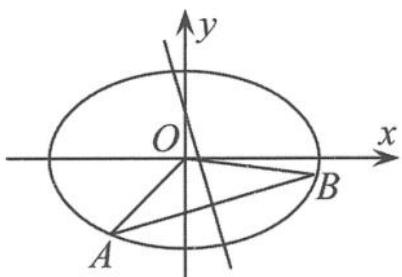  
图4.3-11

$$
k _ {O M} = \frac {m}{2},
$$

故直线 $OM$ 的方程为

由 $\left\{\begin{aligned}y=mx+\frac{1}{2},\\ y=\frac{m}{2}x\end{aligned}\right.$ 得到

$$
y = \frac {m}{2} x.
$$

$$
M \left(- \frac {1}{m}, - \frac {1}{2}\right).
$$

由点 $M$ 在椭圆内得到 $\frac{1}{2m^2} +\frac{1}{4} <  1$ ，即 $m^2 >\frac{2}{3}$ 所以

$m > \frac{\sqrt{6}}{3}$ 或 $m < -\frac{\sqrt{6}}{3}$ .

例 9 已知斜率为 k 的直线 l 与椭圆 C: $\frac{x^{2}}{4} + \frac{y^{2}}{3} = 1$ 交于 A, B 两点, 线段 AB 的中点为 $M(1, m) (m > 0)$ . 证明: $k < -\frac{1}{2}$ .

证明 因为 $k_{AB} \cdot k_{OM} = km = e^2 - 1 = -\frac{3}{4}$ , 所以

$$
k = - \frac {3}{4 m}.
$$

又因为点 $M(1,m)$ 在椭圆内，则 $\frac{1^2}{4} +\frac{m^2}{3} <  1$ ，得

$$
0 <   m <   \frac {3}{2},
$$

所以 $k=-\frac{3}{4m}<-\frac{1}{2}.$

链接1 已知椭圆 $\frac{x^2}{4} + y^2 = 1, P$ 是椭圆的上顶点, 过点 $P$ 作斜率为 $k (k \neq 0)$ 的直线 $l$ , 交椭圆于另一点 $A$ , 设点 $A$ 关于原点的对称点为 $B$ .

(I) 求 $\triangle PAB$ 面积的最大值.

(Ⅱ)设线段 $PB$ 的中垂线与 $y$ 轴交于点 $N$ , 若点 $N$ 在椭圆内部, 求斜率 $k$ 的取值范围.

解答 （Ⅰ）如图 4.3-12, 由题意得, 椭圆的上顶点 P 的坐标为 (0,1). 设点 $A(x_{0}, y_{0})$ , 因为点 B 是点 A 关于原点 O 的对称点, 所以点 B 的坐标为 $(-x_{0}, -y_{0})$ . 设 $\triangle PAB$ 的面积为 S, 则

$$
S = S _ {\triangle P A O} + S _ {\triangle P B O} = 2 S _ {\triangle P A O} = 2 \times \frac {1}{2} | P O | | x _ {0} | = | x _ {0} |.
$$

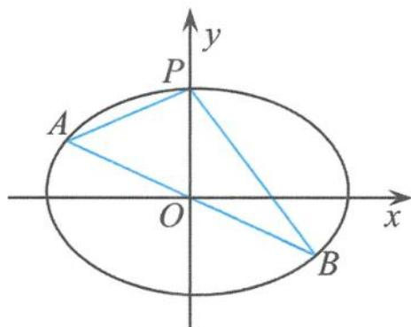  
图4.3-12

因为

$$
- 2 \leqslant x _ {0} \leqslant 2,
$$

所以当 $x_{0}=\pm2$ 时，S 有最大值 2.

(Ⅱ)设 PB 的中点为 M, 因为

$$
k _ {O M} \cdot k _ {P B} = k _ {P A} \cdot k _ {P B} = e ^ {2} - 1 = - \frac {1}{4},
$$

所以直线 $PB$ 的方程为

$$
y = - \frac {1}{4 k} x + 1.
$$

由 $\left\{\begin{aligned}y=kx,\\ y=-\frac{1}{4k}x+1\end{aligned}\right.$ 得

$$
M \left(\frac {4 k}{4 k ^ {2} + 1}, \frac {4 k ^ {2}}{4 k ^ {2} + 1}\right),
$$

所以线段 $PB$ 的中垂线方程为

$$
y - \frac {4 k ^ {2}}{4 k ^ {2} + 1} = 4 k \left(x - \frac {4 k}{4 k ^ {2} + 1}\right),
$$

从而

$$
y _ {N} = - \frac {1 2 k ^ {2}}{4 k ^ {2} + 1} \in (- 1, 1).
$$

所以

$$
k \in \left(- \frac {\sqrt {2}}{4}, 0\right) \cup \left(0, \frac {\sqrt {2}}{4}\right).
$$

链接2 已知椭圆 $\frac{x^{2}}{a^{2}}+\frac{y^{2}}{b^{2}}=1(a>b>0)$ 的离心率为 $\frac{\sqrt{3}}{2}$ ，△ABC的三个顶点都在椭圆上，设△ABC三条边AB,BC,AC的中点分别为D,E,M，且三条边所在直线的斜率分别为 $k_{1},k_{2},k_{3}$ ，且均不为0,O为坐标原点。若直线OD,OE,OM的斜率之和为2，则 $\frac{1}{k_{1}}+\frac{1}{k_{2}}+\frac{1}{k_{3}}=$ \_\_\_\_。

解答 由“性质2”得

$$
k _ {1} \cdot k _ {O D} = e ^ {2} - 1 = - \frac {1}{4},
$$

$$
k _ {2} \cdot k _ {O E} = e ^ {2} - 1 = - \frac {1}{4},
$$

$$
k _ {3} \cdot k _ {O M} = e ^ {2} - 1 = - \frac {1}{4},
$$

所以

$$
\frac {1}{k _ {1}} + \frac {1}{k _ {2}} + \frac {1}{k _ {3}} = - 4 (k _ {O D} + k _ {O E} + k _ {O M}) = - 8.
$$

链接3 已知直线 $l: y = kx + m$ 与椭圆 $\frac{x^2}{4} + \frac{y^2}{3} = 1$ 交于 $A, B$ 两点，且直线 $l$ 与 $x$ 轴、 $y$ 轴分别交于点 $C, D$ . 若点 $C, D$ 三等分线段 $AB$ ，则（ ）.

A. $k^2 = \frac{1}{4}$ B. $k^2 = \frac{9}{16}$ C. $m^2 = \frac{3}{2}$ D. $m^2 = \frac{3}{5}$

解答 易求点 $C\left(-\frac{m}{k},0\right),D(0,m)$ ，所以 $CD$ 的中点为

$$
M \left(- \frac {m}{2 k}, \frac {m}{2}\right),
$$

所以

$$
k _ {O M} = - k.
$$

因为点 C, D 三等分线段 AB, 所以 CD 的中点与 AB 的中点重合, 从而

$$
k (- k) = e ^ {2} - 1 = - \frac {3}{4},
$$

即

$$
k ^ {2} = \frac {3}{4}.
$$

由于点 $A\left(\frac{m}{k}, 2m\right)$ 在椭圆上，得 $\frac{m^2}{4k^2} + \frac{4m^2}{3} = 1$ ，从而

$$
m ^ {2} = \frac {3}{5}.
$$

故选D.

链接4 已知椭圆 $C: \frac{x^2}{4} + y^2 = 1$ 上的三点 $A, B, C$ , 斜率为负数的直线 $BC$ 与 $y$ 轴交于点 $M$ , 若原点 $O$ 是 $\triangle ABC$ 的重心, 且 $\triangle BMA$ 与 $\triangle CMO$ 的面积之比为 $\frac{3}{2}$ , 则直线 $BC$ 的斜率为 \_\_\_\_.

解答 如图 4.3-13, 由于 $\triangle BMA$ 与 $\triangle CMO$ 的面积之比为 $\frac{3}{2}$ , 所以 $|MC|=2|BM|$ .

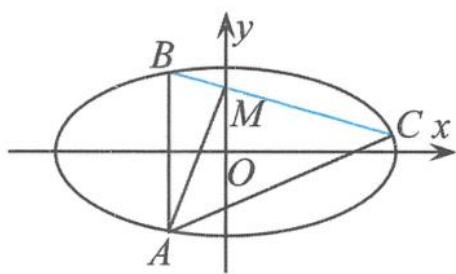

延长 AO, 交 BC 于点 N, 则 N 为 BC 的中点, 所以

$$
\vert B M \vert = 2 \vert M N \vert .
$$

图4.3-13

因为 $|AO|=2|ON|$ ，所以

$$
A B \parallel O M.
$$

设 $A(x_0, y_0)$ , 则 $B(x_0, -y_0)$ . 由 $\overrightarrow{AO} = 2\overrightarrow{ON}$ 得 $N\left(-\frac{x_0}{2}, -\frac{y_0}{2}\right)$ , 所以 $k_{ON} = \frac{y_0}{x_0}, k_{BC} = k_{BN} = -\frac{y_0}{3x_0}$ , 即

$$
k _ {O N} = - 3 k _ {B C}.
$$

因为

$$
k _ {O N} \cdot k _ {B C} = e ^ {2} - 1 = - \frac {1}{4},
$$

又 $k_{BC} < 0$ ，所以

$$
k _ {B C} = - \frac {\sqrt {3}}{6}.
$$

例 10 若椭圆 $\frac{x^{2}}{25}+\frac{y^{2}}{9}=1$ 上不同的三点 $A(x_{1},y_{1}), B(4,\frac{9}{5}), C(x_{2},y_{2})$ 到椭圆右焦点 F 的距离依次成等差数列，线段 AC 的中垂线交 x 轴于点 T，求直线 BT 的方程.

解答 如图 4.3-14, 设线段 AC 的中点为 $M(x_{0}, y_{0})$ , $T(t, 0)$ , 因为

$$
\vert A F \vert + \vert C F \vert = 2 \vert B F \vert ,
$$

所以由焦半径公式得 $(a - ex_{1}) + (a - ex_{2}) = 2(a - 4e)$ ，即

$$
x _ {1} + x _ {2} = 8,
$$

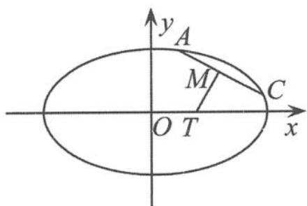

因此

$$
x _ {0} = 4.
$$

图4.3-14

由条件知

$$
\left\{ \begin{array}{l} k _ {A C} \cdot k _ {O M} = e ^ {2} - 1 = - \frac {9}{2 5}, \\ k _ {A C} \cdot k _ {M T} = - 1, \end{array} \right.
$$

两式相除得

$$
\frac {k _ {O M}}{k _ {M T}} = \frac {9}{2 5},
$$

故 $\frac{y_{0}}{x_{0}}\cdot\frac{x_{0}-t}{y_{0}}=\frac{9}{25}$ ，解得

$$
t = \frac {6 4}{2 5}, T \left(\frac {6 4}{2 5}, 0\right).
$$

从而直线 $BT$ 的方程为

$$
2 5 x - 2 0 y = 6 4.
$$

(2) 求离心率的值或范围

例 11 如图 4.3-15, $F_{1}, F_{2}$ 分别是双曲线 $C: \frac{x^{2}}{a^{2}} - \frac{y^{2}}{b^{2}} = 1 (a, b > 0)$ 的左、右焦点, $B$ 是虚轴的端点, 直线 $F_{1} B$ 与双曲线 $C$ 的两条渐近线分别交于 $P, Q$ 两点, 线段 $PQ$ 的垂直平分线与 $x$ 轴交于点 $M$ . 若 $|MF_{2}| = |F_{1} F_{2}|$ , 则双曲线 $C$ 的离心率是( ).

$$
\frac {2 \sqrt {3}}{3}
$$

B. $\frac{\sqrt{6}}{2}$

$$
\sqrt {2}
$$

$$
\sqrt {3}
$$

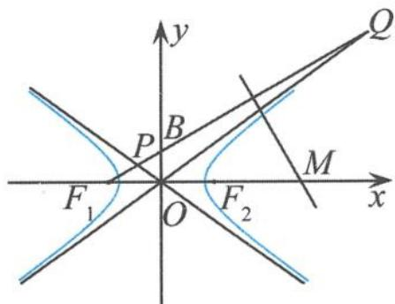  
图4.3-15

解答 设 N 是线段 PQ 的中点, 由 $\left|MF_{2}\right|=\left|F_{1}F_{2}\right|$ 得 $M(3c,0)$ .

所以线段 PQ 的垂直平分线方程为

$$
y = - \frac {c}{b} (x - 3 c).
$$

由 $\left\{\begin{aligned}y&=\frac{b}{c}(x+c),\\ y&=-\frac{c}{b}(x-3c)\end{aligned}\right.$ 得

$$
N \left(\frac {3 c ^ {3} - b ^ {2} c}{b ^ {2} + c ^ {2}}, \frac {4 b c ^ {2}}{b ^ {2} + c ^ {2}}\right),
$$

故

$$
k _ {O N} = \frac {4 b c ^ {2}}{3 c ^ {3} - b ^ {2} c} = \frac {4 b c}{3 c ^ {2} - b ^ {2}}.
$$

由“性质 2”的“特例”得

$$
k _ {P Q} \cdot k _ {O N} = e ^ {2} - 1,
$$

即 $\frac{b}{c} \cdot \frac{4bc}{3c^2 - b^2} = e^2 - 1$ ，所以离心率

$$
e = \frac {\sqrt {6}}{2}.
$$

故选B.

例 12 设直线 $x-3y+m=0(m\neq0)$ 与双曲线 $\frac{x^{2}}{a^{2}}-\frac{y^{2}}{b^{2}}=1(a>b>0)$ 的两条渐近线分别交于点 A, B, 若点 $P(m,0)$ 满足 $|PA|=|PB|$ , 则该双曲线的离心率是 \_\_\_\_.

分析 这道试题很多考生的失误就在于疲于运算,结果半途而废,如果能看清问题的本质,利用“性质2”解题,将会“柳暗花明又一村”.利用“性质2”解题可谓是点睛之笔,不可多得.

解答 如图 4.3-16, 设 AB 的中点为 M, 由条件 $\left|PA\right| = \left|PB\right|$ 得

$$
P M \perp A B.
$$

所以直线 $PM$ 的方程为

$$
y = - 3 (x - m).
$$

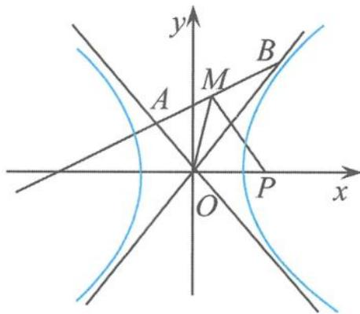

由 $\left\{\begin{aligned}x-3y+m=0,\\ y=-3(x-m)\end{aligned}\right.$ 得 $M\left(\frac{4m}{5},\frac{3m}{5}\right)$ ，因为

图4.3-16

$$
k _ {A B} \cdot k _ {O M} = e ^ {2} - 1,
$$

所以 $\frac{1}{3} \cdot \frac{3}{4} = e^2 - 1$ ，所以

$$
e = \frac {\sqrt {5}}{2}.
$$

例 13 如图 4.3-17, 设椭圆 $C: \frac{x^{2}}{a^{2}} + y^{2} = 1 (a > 1)$ .

(I)求直线 $y=kx+1$ 被椭圆截得的弦长。(用 a, k 表示)

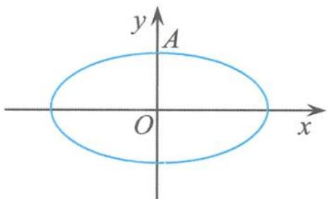  
图4.3-17

(Ⅱ)若以点 A(0,1) 为圆心的圆与椭圆至多有三个公共点, 求椭圆

离心率的取值范围.

分析 对于第(Ⅱ)问,很多同学感到有点怪异,不知如何下手,似乎脱离了常规训练套路,没有了直线,没有了弦,似乎也没有韦达定理.自己空有一身的本领,却无用武之地.如果能正难则反,从反面来考虑,再利用“性质2”,那就可以轻而易举地拿下.

解答 (I) $\frac{2a^2|k|}{1 + a^2k^2} \cdot \sqrt{1 + k^2}$ .

(II)从反面考虑,若以点 $A(0,1)$ 为圆心的圆与椭圆有四个公共点,由图形的对称性可知,在 $y$ 轴的左、右两侧各有两个交点 $\Leftrightarrow$ 椭圆的一侧存在一个等腰三角形 $APQ$ 且 $|AP|=|AQ|$ .

如图 4.3-18, 设 PQ 的中点为 $M(x_{0}, y_{0})$ , 由“性质 2”得

$$
k _ {O M} \cdot k _ {P Q} = e ^ {2} - 1 = \frac {- 1}{a ^ {2}}.
$$

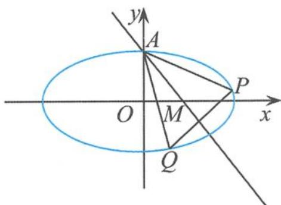

因为

$$
k _ {A M} \cdot k _ {P Q} = \frac {y _ {0} - 1}{x _ {0}} \cdot k _ {P Q} = - 1,
$$

图4.3-18

两式相除得

$$
\frac {y _ {0} - 1}{y _ {0}} = a ^ {2},
$$

所以 $y_0 = \frac{1}{1 - a^2} \in (-1, 0) \Rightarrow a^2 > 2$ ，从而

$$
e ^ {2} = 1 - \frac {1}{a ^ {2}} \in \left(\frac {1}{2}, 1\right).
$$

当 $e \in \left(\frac{\sqrt{2}}{2}, 1\right)$ 时, 圆与椭圆有四个公交点, 所以所求椭圆离心率的取值范围是

$$
\left(0, \frac {\sqrt {2}}{2} \right].
$$

链接5 已知双曲线 $\frac{x^{2}}{a^{2}} - \frac{y^{2}}{b^{2}} = 1 (a > 0, b > 0)$ 的左焦点为 $F$ 、离心率为 $e$ , 过点 $F$ 且斜率为 1 的直线交双曲线的渐近线于 $A, B$ 两点, $AB$ 的中点为 $M$ . 若 $|FM|$ 等于半焦距, 则 $e^{2} =$ \_\_\_\_.

解答 如图 4.3-19, 因为

所以

$$
k _ {A B} \cdot k _ {O M} = e ^ {2} - 1,
$$

$$
k _ {O M} = e ^ {2} - 1.
$$

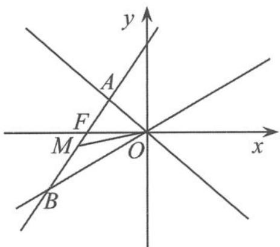

因为 $|FM| = c = \sqrt{2} (-c - x_M)$ ，所以

$$
x _ {M} = - c - \frac {\sqrt {2}}{2} c,
$$

图4.3-19

所以

$$
y _ {M} = - \frac {\sqrt {2}}{2} c,
$$

从而 $k_{OM} = \sqrt{2} - 1 = e^2 - 1$ ，即

$$
e ^ {2} = \sqrt {2}.
$$

链接6 已知椭圆 $\Gamma: \frac{x^2}{a^2} + \frac{y^2}{b^2} = 1 (a > b > 0)$ 内有一定点 $P(1,1)$ , 过点 $P$ 的两条直线 $l_1$ 和 $l_2$ 分别与椭圆 $\Gamma$ 交于点 $A, C$ 和点 $B, D$ , 且满足 $\overrightarrow{AP} = \lambda \overrightarrow{PC}, \overrightarrow{BP} = \lambda \overrightarrow{PD}$ . 当 $\lambda$ 变化时, 直线 $CD$ 的斜率总为 $-\frac{1}{4}$ , 则椭圆 $\Gamma$ 的离心率为 ( ).

A. $\frac{\sqrt{3}}{2}$ B. $\frac{1}{2}$ C. $\frac{\sqrt{2}}{2}$ D. $\frac{\sqrt{5}}{5}$

解答 (1)如图4.3-20,由于 $\overrightarrow{AP} = \lambda \overrightarrow{PC},\overrightarrow{BP} = \lambda \overrightarrow{PD}$ ,得 $AB / / CD.$

(2)设 $AB$ 的中点为 $M, CD$ 的中点为 $N$ , 则

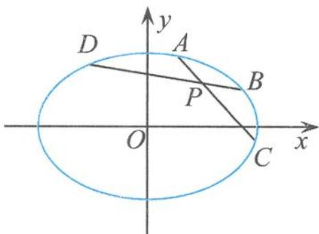

$$
k _ {O M} \cdot k _ {A B} = k _ {O N} \cdot k _ {C D} = e ^ {2} - 1.
$$

所以

图4.3-20

$$
k _ {O M} = k _ {O N},
$$

从而 $O, M, N$ 三点共线，所以 $O, M, N, P$ 四点共线，所以 $k_{OP} \cdot k_{CD} = 1 \times \left(-\frac{1}{4}\right) = e^2 - 1$ ，所以

$$
e = \frac {\sqrt {3}}{2}.
$$

故选 A.

(3) 综合问题

例 14 如图 4.3-21, 已知椭圆 $C_{1}:\frac{x^{2}}{2}+y^{2}=1$ 和抛物线 $C_{2}:y^{2}=2px\ (p>0)$ , 点 A 是椭圆

$C_{1}$ 和抛物线 $C_{2}$ 的交点, 过点 A 的直线交椭圆 $C_{1}$ 于点 B、交抛物线 $C_{2}$ 于点 M (点 B, M 不同于点 A).

(I) 若 $p=\frac{1}{16}$ ，求抛物线的焦点坐标.

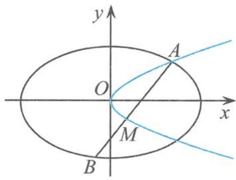

(Ⅱ)若存在不过原点的直线 l 使 M 为线段 AB 的中点, 求 p 的最大值.

图4.3-21

解答 (I) 因为 $p = \frac{1}{16}$ , 所以抛物线的焦点坐标为

$$
\left(\frac {1}{3 2}, 0\right).
$$

(Ⅱ)设 $A(2pt^{2},2pt)$ , $M(2pm^{2},2pm)$ ，由点 A 在椭圆上得 $\frac{(2pt^{2})^{2}}{2}+(2pt)^{2}=1$ ，即

$$
2 p ^ {2} = \frac {1}{t ^ {4} + 2 t ^ {2}}
$$

由“性质 2”得

$$
k _ {O M} \cdot k _ {A B} = e ^ {2} - 1 = - \frac {1}{2} = \frac {2 p m}{2 p m ^ {2}} \cdot \frac {2 p t - 2 p m}{2 p t ^ {2} - 2 p m ^ {2}} = \frac {1}{m (m + t)},
$$

所以 $2 = -m(m + t)\leqslant \left[\frac{(-m) + (m + t)}{2}\right]^2 = \frac{1}{4} t^2$ ，得

$$
t ^ {2} \geqslant 8 \quad ②.
$$

由①②得 $2p^{2} = \frac{1}{t^{4} + 2t^{2}}\leqslant \frac{1}{80}$ ，所以

$$
p _ {\max} = \frac {\sqrt {1 0}}{4 0}.
$$

点评 利用设点求解该高考试题,在 $e^{2}-1$ 性质的助推下,洋洋洒洒的解答过程简直就是“神运算”.一种方法与一个性质天衣无缝结合,简直完美.

例 15 已知点 $P(0,1)$ ，椭圆 $\frac{x^{2}}{4} + y^{2} = m (m > 1)$ 上两点 A, B 满足 $\overrightarrow{AP} = 2 \overrightarrow{PB}$ ，则当 m = \_\_\_\_ 时，点 B 横坐标的绝对值最大.

解答 如图 4.3-22, 设 $A(x_{1}, y_{1}), B(x_{2}, y_{2})$ , 当直线 AB 的斜率存在时, 设 $AB: y = kx + 1 (k \neq 0)$ , 因为 $\overrightarrow{AP} = 2\overrightarrow{PB}$ , 所以 $x_{1} + x_{2} = -x_{2}, y_{1} + y_{2} = 3 - y_{2} = 2 - kx_{2}$ . 设 AB 的中点为 M, 则 $M\left(\frac{-x_{2}}{2}, \frac{2 - kx_{2}}{2}\right)$ . 由“性质 2”得

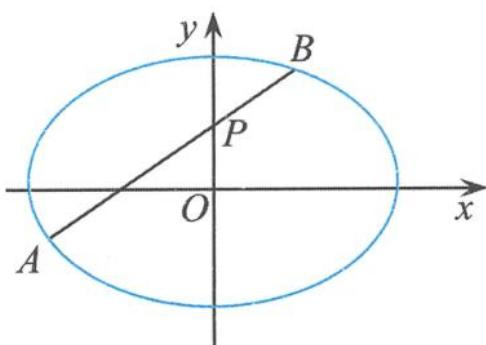  
图4.3-22

$$
k _ {A B} \cdot k _ {O M} = e ^ {2} - 1,
$$

即 $k\left(-\frac{2 - kx_2}{x_2}\right) = e^2 - 1 = -\frac{1}{4}$ , 所以

$$
x _ {2} = \frac {2}{k + \frac {1}{4 k}},
$$

得

$$
\mid x _ {2} \mid = \frac {2}{\mid k \mid + \frac {1}{4 \mid k \mid}} \leqslant 2,
$$

当且仅当 $|k| = \frac{1}{2}$ 时取等号，可得 $B(\pm 2,2)$ ，所以

$$
m = 5.
$$

例 16 已知椭圆 C: $9x^{2} + y^{2} = m^{2} (m > 0)$ ，直线 l 不过原点 O 且不平行于坐标轴，直线 l 与椭圆 C 有两个交点 A, B，线段 AB 的中点为 M。证明：直线 OM 的斜率与直线 l 的斜率的乘积为定值。

解答 直接考查“性质 2”的推导, 得

$$
k _ {A B} \cdot k _ {O M} = e ^ {2} - 1 = - 9.
$$

链接 7 已知椭圆方程为 $\frac{x^{2}}{4} + y^{2} = 1$ ，圆 $C: (x - 1)^{2} + y^{2} = r^{2}$ .

(I)求椭圆上动点 P 与圆心 C 距离的最小值.

(II)如图4.3-23,直线 $l$ 与椭圆相交于 $A,B$ 两点,且与圆 $C$ 相切于点 $M$ ,若以 $M$ 为线段 $AB$ 中点的直线 $l$ 有4条,求半径 $r$ 的取值范围.

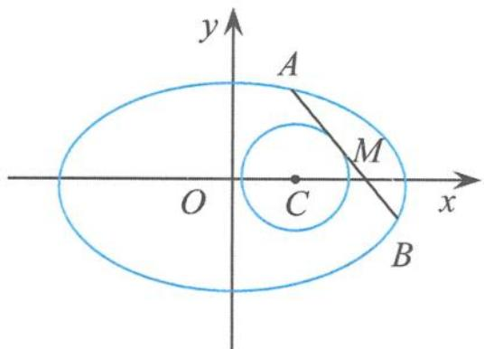

解答 (Ⅰ)略。

(Ⅱ)(i)当直线 AB 的斜率不存在时,显然有 2 条.

图4.3-23

(ii) 当直线 $AB$ 的斜率存在时, 由“性质 2”得

$$
k _ {O M} \cdot k _ {A B} = e ^ {2} - 1 = - \frac {1}{4}.
$$

因为 $k_{CM} \cdot k_{AB} = -1$ ，所以

$$
k _ {C M} = 4 k _ {O M} \neq 0.
$$

由 $\left\{\begin{aligned}y&=k_{OM}x,\\ y&=4k_{OM}(x-1)\end{aligned}\right.$ 得

$$
M \left(\frac {4}{3}, \frac {4}{3} k _ {O M}\right).
$$

由点 $M$ 在椭圆内得

$$
\frac {4}{9} + \frac {1 6 k _ {O M} ^ {2}}{9} <   1,
$$

所以 $16k_{OM}^{2}<5$ . 因为 $r^{2}=\frac{1}{9}+\frac{16k_{OM}^{2}}{9}$ , 所以

$$
r \in \left(\frac {1}{3}, \frac {\sqrt {6}}{3}\right).
$$

点评 通过对上面几道题目解题过程的剖析,我们可以清楚地看到,高考对于数学核心内容的考查绝不手软,重点主干知识重点考查.高考试题一如既往地重复考查这个性质,也在情理之中.在学习中,我们不仅需要关注一题多解,而且还需要关注多题一解,因为一题多解能拓展我们的数学思维,是训练发散思维的重要途径,而多题一解则能抓住问题的本质,体现万变不离其宗的思想,透过“性质2”这个视角,我们就可以把历年的高考试题统一在一起,发现题源之所在,揭下其神秘的面纱.
