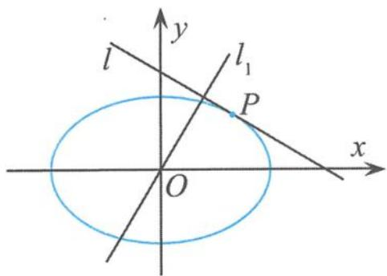
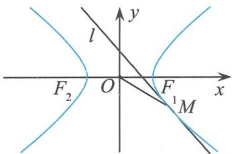

## 4.3.3 与圆锥曲线的切线有关的 $e^2 - 1$ 性质

性质3 过椭圆 $\frac{x^2}{a^2} + \frac{y^2}{b^2} = 1 (a > b > 0)$ 上任意一点 $P$ （不是椭圆的顶点）作椭圆的切线，设切线的斜率为 $k_1$ ，直线 $OP$ 的斜率为 $k_2$ ，则 $k_1 \cdot k_2 = e^2 - 1$

证明 由于椭圆的对称性,不妨设点 P 在第一象限内,设点 $P(x_{0}, y_{0})$ ,由椭圆方程 $\frac{x^{2}}{a^{2}} + \frac{y^{2}}{b^{2}} = 1$ 可得

$$
y = \frac {b}{a} \sqrt {a ^ {2} - x ^ {2}},
$$

所以 $y_0 = \frac{b}{a}\sqrt{a^2 - x_0^2}$ . 因此, 椭圆在点 $P$ 处的切线斜率

$$
k _ {1} = y ^ {\prime} \mid_ {x = x _ {0}} = - \frac {b x _ {0}}{a \sqrt {a ^ {2} - x _ {0} ^ {2}}} = - \frac {b ^ {2} x _ {0}}{a ^ {2} y _ {0}}.
$$

所以 $k_{1} \cdot \frac{y_{0}}{x_{0}} = -\frac{b^{2}}{a^{2}}$ ，即

$$
k _ {1} \cdot k _ {2} = e ^ {2} - 1.
$$

例 17 如图 4.3-24, 设椭圆 $\frac{x^{2}}{a^{2}} + \frac{y^{2}}{b^{2}} = 1 (a > b > 0)$ ，动直线 l 与椭圆 C 只有一个公共点 P，且点 P 在第一象限.

(I)已知直线 l 的斜率为 k，用 a, b, k 表示点 P 的坐标.

(Ⅱ)若过原点 O 的直线 $l_{1}$ 与 l 垂直,证明: 点 P 到直线 $l_{1}$ 的距离的最大值为 a-b.

图4.3-24

解答 (Ⅰ)设点 $P(x_0, y_0)$ , 由“性质3”得

$$
k _ {O P} \cdot k = e ^ {2} - 1,
$$

所以 $P\left(x_0, - \frac{b^2}{ka^2} x_0\right)$ .由于点 $P$ 在椭圆 $\frac{x^2}{a^2} +\frac{y^2}{b^2} = 1(a > b > 0)$ 上，得到

$$
\frac {x _ {0} ^ {2}}{a ^ {2}} + \frac {\left(- \frac {b ^ {2}}{k a ^ {2}} x _ {0}\right) ^ {2}}{b ^ {2}} = 1,
$$

即

$$
P \left(\frac {- a ^ {2} k}{\sqrt {b ^ {2} + a ^ {2} k ^ {2}}}, \frac {b ^ {2}}{\sqrt {b ^ {2} + a ^ {2} k ^ {2}}}\right).
$$

(Ⅱ) 因为

$$
k _ {O P} \cdot k = e ^ {2} - 1,
$$

所以 $k \cdot \frac{y_0}{x_0} = -\frac{b^2}{a^2}$ , 所以

$$
k y _ {0} = - \frac {b ^ {2}}{a ^ {2}} x _ {0}.
$$

点 $P$ 到直线

$$
l _ {1}: x + k y = 0
$$

的距离

$$
d = \frac {\left| x _ {0} + k y _ {0} \right|}{\sqrt {1 + k ^ {2}}} = \frac {\left| x _ {0} \right| \left(1 - \frac {b ^ {2}}{a ^ {2}}\right)}{\sqrt {1 + \frac {b ^ {4}}{a ^ {4}} \frac {x _ {0} ^ {2}}{y _ {0} ^ {2}}}} = \frac {1 - \frac {b ^ {2}}{a ^ {2}}}{\frac {b}{a} \sqrt {\frac {a ^ {2}}{b ^ {2} x _ {0} ^ {2}} + \frac {b ^ {2}}{a ^ {2} y _ {0} ^ {2}}}} \leqslant \frac {1 - \frac {b ^ {2}}{a ^ {2}}}{\frac {b}{a} \sqrt {\frac {(a + b) ^ {2}}{b ^ {2} x _ {0} ^ {2} + a ^ {2} y _ {0} ^ {2}}}} = \frac {1 - \frac {b ^ {2}}{a ^ {2}}}{\frac {b}{a} \cdot \frac {a + b}{a b}} = a - b.
$$

(利用二维权方和不等式)

二维权方和不等式 若 $x > 0, y > 0$ ，则

$$
\frac {m ^ {2}}{x} + \frac {n ^ {2}}{y} \geqslant \frac {(m + n) ^ {2}}{x + y},
$$

当且仅当 $\frac{m}{x} = \frac{n}{y}$ 时取等号.（可以看作二维的柯西不等式的变式）

例 18 已知椭圆 $C: \frac{x^{2}}{a^{2}} + \frac{y^{2}}{b^{2}} = 1 (a > b > 0)$ 的左、右焦点分别是 $F_{1}, F_{2}$ ，离心率为 $\frac{\sqrt{3}}{2}$ ，过点 $F_{1}$ 且垂直于 x 轴的直线被椭圆 C 截得的线段长为 1.

(I)求椭圆 C 的方程.

(II) $P$ 是椭圆 $C$ 上除了长轴端点的任一点, 过点 $P$ 作斜率为 $k$ 的直线 $l$ , 使得 $l$ 与椭圆 $C$ 有且只有一个公共点. 设直线 $PF_{1}, PF_{2}$ 的斜率分别为 $k_{1}, k_{2}$ , 若 $k \neq 0$ , 试证明 $\frac{1}{k \cdot k_{1}} + \frac{1}{k \cdot k_{2}}$ 为定值, 并求出这个定值.

解答 (I)椭圆 $C$ 的方程为

$$
\frac {x ^ {2}}{4} + y ^ {2} = 1.
$$

(Ⅱ)设 $P(x_{0},y_{0})$ ，由题意可知，l 为椭圆在点 P 处的切线，

$$
k _ {1} = \frac {y _ {0}}{x _ {0} + \sqrt {3}}, k _ {2} = \frac {y _ {0}}{x _ {0} - \sqrt {3}},
$$

所以

$$
\frac {1}{k _ {1}} + \frac {1}{k _ {2}} = \frac {x _ {0} + \sqrt {3}}{y _ {0}} + \frac {x _ {0} - \sqrt {3}}{y _ {0}} = \frac {2 x _ {0}}{y _ {0}},
$$

故

$$
\frac {1}{k \bullet k _ {1}} + \frac {1}{k \bullet k _ {2}} = \frac {1}{k} \big (\frac {1}{k _ {1}} + \frac {1}{k _ {2}} \big) = \frac {1}{k} \bullet \frac {2 x _ {0}}{y _ {0}} = \frac {2}{k \bullet k _ {O P}} = \frac {2}{e ^ {2} - 1} = - 8 (\text {定值}).
$$

引申 在平面直角坐标系 $xOy$ 中, 已知 $M$ 是双曲线 $\frac{x^2}{a^2} - \frac{y^2}{b^2} = 1 (a > 0, b > 0)$ 上异于顶点的任意一点, 过点 $M$ 作双曲线的切线 $l$ . 若 $k_{OM} \cdot k_l = \frac{1}{3}$ , 则双曲线的离心率 $e = \_$ .

解答 如图 4.3-25, 由“性质 3”得

$$
k _ {O M} \cdot k _ {l} = e ^ {2} - 1 = \frac {1}{3},
$$

解得

$$
e = \frac {2 \sqrt {3}}{3}.
$$

  
图4.3-25

点评 利用 $e^{2} - 1$ 性质去考虑问题,使得原本错综复杂的问题变得思路清晰明朗,解题过程干净利落,简捷优美,给人“清水出芙蓉”的感觉.同时,利用 $e^{2} - 1$ 性质去考虑问题,也让我们站到一定的高度去看问题,更容易看出问题的数学本质.
