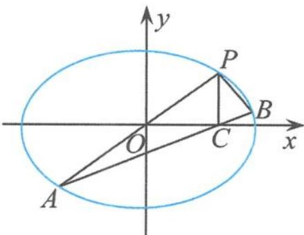
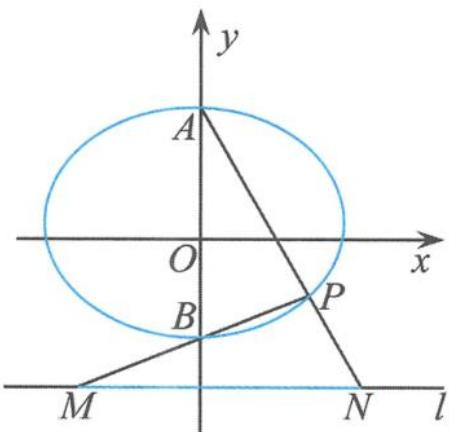
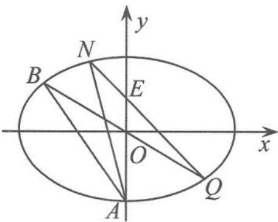
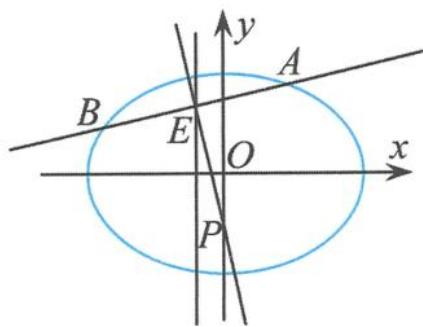

## 思考题

1. 已知 A, B, P 是双曲线 $\frac{x^{2}}{a^{2}} - \frac{y^{2}}{b^{2}} = 1 (a > 0, b > 0)$ 上不同的三点，且点 A, B 的连线经过坐标原点，若直线 PA, PB 的斜率乘积 $k_{PA} \cdot k_{PB} = \frac{2}{3}$ ，则该双曲线的离心率为（）.
A. $\frac{\sqrt{5}}{2}$ B. $\frac{\sqrt{6}}{2}$ C. $\sqrt{2}$ D. $\frac{\sqrt{15}}{3}$

2. 已知双曲线 $x^{2}-y^{2}=a^{2}(a>0)$ 的左、右顶点分别为 A, B，双曲线在第一象限的图象上有一点 P，记 $\angle PAB=\alpha, \angle PBA=\beta, \angle APB=\gamma$ ，则（）.
A. $\tan \alpha + \tan \beta + \tan \gamma = 0$ B. $\tan \alpha + \tan \beta - \tan \gamma = 0$ C. $\tan \alpha + \tan \beta + 2\tan \gamma = 0$ D. $\tan \alpha + \tan \beta - 2\tan \gamma = 0$

3. 已知 A, B 是双曲线 $\frac{x^{2}}{4}-y^{2}=1$ 的两个顶点，P 是双曲线上异于点 A, B 的一点，连接 PO (O 为坐标原点)，交椭圆 $\frac{x^{2}}{4}+y^{2}=1$ 于点 Q。如果设直线 PA, PB, QA 的斜率分别为 $k_{1}, k_{2}$ ， $k_{3}$ ，且 $k_{1}+k_{2}=-\frac{15}{8}$ ，假设 $k_{3}>0$ ，则 $k_{3}$ 的值为（）。
A. 1
B. $\frac{1}{2}$ C. 2
D. 4

4. 已知中心在原点的椭圆与双曲线有公共焦点, 左、右焦点分别为 $F_{1}, F_{2}$ , 且两条曲线在第一象限的交点为 $P, \triangle PF_{1}F_{2}$ 是以 $PF_{1}$ 为底边的等腰三角形. 若 $|PF_{1}| = 10$ , 椭圆与双曲线的离心率分别为 $e_{1}, e_{2}$ , 则 $e_{1}e_{2} + 1$ 的取值范围是 ( ).

A. $(1, +\infty)$ B. $\left(\frac{4}{3}, +\infty\right)$ C. $\left(\frac{6}{5}, +\infty\right)$ D. $\left(\frac{10}{9}, +\infty\right)$

5. 已知 $\frac{x^{2}}{a^{2}} + \frac{y^{2}}{b^{2}} = 1 (a > b > 0), M, N$ 是椭圆的左、右顶点， $P$ 是椭圆上的任意一点，且直线 $PM, PN$ 的斜率分别为 $k_{1}, k_{2} (k_{1} k_{2} \neq 0)$ . 若 $|k_{1}| + |k_{2}|$ 的最小值为 1，则椭圆的离心率为 \_\_\_\_.

6. 已知椭圆 $\frac{x^2}{2} + y^2 = 1$ 与 $y$ 轴交于 $M, N$ 两点, 直线 $y = x$ 交椭圆于 $A_1, A_2$ 两点, 点 $P$ 为椭圆上除了 $A_1, A_2$ 的一个动点. 若点 $Q$ 满足 $\overrightarrow{QA_1} \cdot \overrightarrow{PA_1} = 0, \overrightarrow{QA_2} \cdot \overrightarrow{PA_2} = 0$ , 则 $|QM| + |QN|$ = \_\_\_\_.

7. 如图, 在平面直角坐标系 $xOy$ 中, 过坐标原点的直线交椭圆 $\frac{x^2}{a^2} + \frac{y^2}{b^2} = 1 (a > b > 0)$ 于 $P$ , $A$ 两点. 其中, 点 $P$ 在第一象限, 过点 $P$ 作 $x$ 轴的垂线, 垂足为 $C$ . 连接 $AC$ 并延长, 交椭圆于点 $B$ . 若 $PA \perp PB$ , 求椭圆的离心率.

  
(第 7 题)

8. 如图, 椭圆 $\frac{x^{2}}{a^{2}} + \frac{y^{2}}{b^{2}} = 1 (a > b > 0)$ 的上、下两个顶点分别为 $A, B$ , 直线 $l: y = -2, P$ 是椭圆上异于点 $A, B$ 的任意一点. 连接 $AP$ 并延长, 交直线 $l$ 于点 $N$ ; 连接 $PB$ 并延长, 交直线 $l$ 于点 $M$ . 设 $AP$ 所在的直线的斜率为 $k_{1}, BP$ 所在的直线的斜率为 $k_{2}$ , 若椭圆的离心率为 $\frac{\sqrt{3}}{2}$ , 且过点 $A(0,1)$ .

(I)求椭圆 C 的方程.

(Ⅱ)求 $|MN|$ 的最小值.

  
(第8题)

9. 如图, 已知椭圆 $\frac{x^{2}}{6} + \frac{y^{2}}{4} = 1$ 及其顶点 $A(0, -2)$ , 经过点 $E(0, 1)$ 且斜率存在的直线 $l$ 交椭圆于 $Q, N$ 两点, 点 $B$ 与点 $Q$ 关于坐标原点对称, 连接 $AB, AN$ . 问: 是否存在实数 $\lambda$ 使得 $k_{AN} = \lambda k_{AB}$ 成立? 若存在, 求出 $\lambda$ 的值; 若不存在, 请说明理由.

  
(第9题)

10. 已知椭圆 $C: \frac{x^2}{a^2} + \frac{y^2}{b^2} = 1 (a > b > 0)$ 的离心率为 $\frac{1}{2}$ , 且过点 $(-1, \frac{3}{2})$ .

(I)求椭圆 C 的方程.

(Ⅱ)如图,直线 l 交椭圆 C 于不同的两点 A, B, 且 AB 的中点 E 在直线 x = -1 上,线段 AB 的垂直平分线交 y 轴于点 $P(0, m)$ , 求 m 的取值范围.

  
(第 10 题)

11. 已知双曲线 C 的离心率 $e=\sqrt{3}$ ，左焦点 $F_{1}(-c,0)$ 到其渐近线的距离为 $\sqrt{6}$ .

(I)求双曲线 C 的方程.

(Ⅱ)设 $T$ 是 $y$ 轴上的点, 过点 $T$ 作两条直线, 分别交双曲线 $C$ 的左支于 $P, Q$ 两点和 $A, B$ 两点. 若 $\frac{|TA|}{|TB|} = \frac{|TP|}{|TQ|}$ , $PQ$ 的中点为 $M, AB$ 的中点为 $N, O$ 为坐标原点, 求两条直线 $OM$ 和 $ON$ 的斜率之和.

## 第五章

# 撑一支长篙,向更青处漫溯
