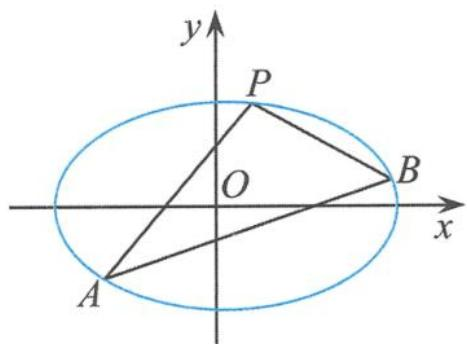
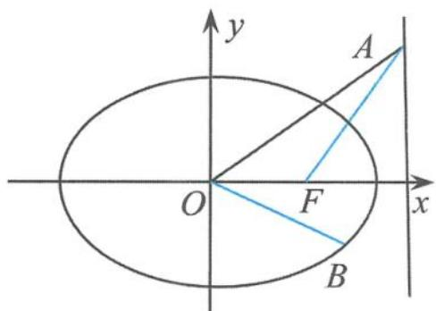

## 5.1.3 问题的变式探究——淡妆浓抹总相宜

问题是数学的心脏. 对于一个问题, 不仅要剖析其本质, 还要不断地探究问题的知识结构和系统性, 对问题蕴含的知识进行纵向深入地引申探究, 加强知识间的横向联系, 把问题所蕴含孤立的知识点, 扩展到系统的知识面. 通过不断地拓展、联系、加强对知识结构的理解, 进而形成认知结构中知识的系统性. 在解析几何中与 $e^2 - 1$ 有关的定值问题是非常活跃的, 所以我们有必要从正向、逆向、类比等多个方面加以引申拓展.

## (2)正向引申探究——接天莲叶无穷碧

引申1 已知不过原点 $O$ 的直线 $l$ 与椭圆 $C: \frac{x^2}{a^2} + \frac{y^2}{b^2} = 1 (a > b > 0)$ 相交于 $A, B$ 两点， $P$ 为线段 $AB$ 的中点，设直线 $AB$ 和直线 $OP$ 斜率分别为 $k_1$ 和 $k_2$ ，则 $k_1 \cdot k_2 = e^2 - 1$ .

证明 设 $P(x_0, y_0), A(x_1, y_1), B(x_2, y_2)$ , 则

$$
2 x _ {0} = x _ {1} + x _ {2}, 2 y _ {0} = y _ {1} + y _ {2} \quad ①.
$$

因为点 A, B 在椭圆 C 上, 所以

$$
\frac {x _ {1} ^ {2}}{a ^ {2}} + \frac {y _ {1} ^ {2}}{b ^ {2}} = 1, \frac {x _ {2} ^ {2}}{a ^ {2}} + \frac {y _ {2} ^ {2}}{b ^ {2}} = 1,
$$

两式相减得

$$
\frac {(x _ {1} - x _ {2}) (x _ {1} + x _ {2})}{a ^ {2}} + \frac {(y _ {1} - y _ {2}) (y _ {1} + y _ {2})}{b ^ {2}} = 0 \quad ②.
$$

把①代入②得

$$
k _ {1} \cdot k _ {2} = e ^ {2} - 1.
$$

引申 2 过椭圆 $\frac{x^{2}}{a^{2}} + \frac{y^{2}}{b^{2}} = 1 (a > b > 0)$ 上的任意一点 $P(P$ 不是椭圆的顶点)作倾斜角互补的两条直线, 交该椭圆于 $A, B$ 两点, $O$ 为椭圆的中心, 则 $k_{AB} \cdot k_{OP} = -(e^{2} - 1)$ .

证明 设点 P 的坐标为 $(x_{0}, y_{0})$ ，直线 PA 的方程为

$$
y - y _ {0} = k (x - x _ {0}),
$$

则直线 $PB$ 的方程为

$$
y - y _ {0} = - k (x - x _ {0}).
$$

把直线 $PA$ 的方程代入椭圆方程得

$$
(a ^ {2} k ^ {2} + b ^ {2}) x ^ {2} - 2 a ^ {2} k (k x _ {0} - y _ {0}) x + (a ^ {2} k ^ {2} x _ {0} ^ {2} - 2 a ^ {2} k x _ {0} y _ {0} + a ^ {2} y _ {0} ^ {2} - a ^ {2} b ^ {2}) = 0.
$$

由题意知 $x_{0}$ 是上式的一个解. 因为

$$
x _ {0} + x _ {A} = \frac {2 a ^ {2} k (k x _ {0} - y _ {0})}{a ^ {2} k ^ {2} + b ^ {2}},
$$

所以

$$
x _ {A} = \frac {a ^ {2} k ^ {2} x _ {0} - 2 a ^ {2} k y _ {0} - b ^ {2} x _ {0}}{a ^ {2} k ^ {2} + b ^ {2}}.
$$

只需把上式中的 k 换成 -k，得

$$
x _ {B} = \frac {a ^ {2} k ^ {2} x _ {0} + 2 a ^ {2} k y _ {0} - b ^ {2} x _ {0}}{a ^ {2} k ^ {2} + b ^ {2}},
$$

从而

$$
x _ {B} - x _ {A} = \frac {4 a ^ {2} k y _ {0}}{a ^ {2} k ^ {2} + b ^ {2}}.
$$

因为 $k_{AB} = \frac{y_B - y_A}{x_B - x_A} = \frac{-k(x_A + x_B - 2x_0)}{x_B - x_A} = \frac{b^2x_0}{a^2y_0}$ ，所以

$$
k _ {A B} \cdot k _ {O P} = \frac {b ^ {2}}{a ^ {2}} = - (e ^ {2} - 1).
$$

链接 已知椭圆 $C: \frac{x^2}{a^2} + \frac{y^2}{b^2} = 1 (a > b > 0)$ 经过点 $P(3, \frac{16}{5})$ ，离心率为 $\frac{3}{5}$ . 过椭圆 $C$ 的右焦点作斜率为 $k$ 的直线 $l$ ，交椭圆于 $A, B$ 两点，记直线 $PA, PB$ 的斜率分别为 $k_1, k_2$ .

(Ⅰ)求椭圆的标准方程.

(Ⅱ) 若 $k_{1} + k_{2} = 0$ ，求实数 k 的值.

解答 （Ⅰ）如图 5.1-1，椭圆的标准方程为

$$
\frac {x ^ {2}}{2 5} + \frac {y ^ {2}}{1 6} = 1.
$$

(Ⅱ)因为 $k_{1} + k_{2} = 0$ ，所以直线 $PA, PB$ 的倾斜角互补，由“引申2”知

  
图5.1-1

$$
k _ {A B} \cdot k _ {O P} = - (e ^ {2} - 1) = \frac {1 6}{2 5}.
$$

而 $k_{OP} = \frac{16}{15}$ ，故

$$
k _ {A B} = \frac {3}{5}.
$$

(注:本题中的条件“过椭圆 C 的右焦点”是多余的)

(3)逆向拓展探究——横看成岭侧成峰

引申3 已知椭圆的方程为 $\frac{x^2}{a^2} +\frac{y^2}{b^2} = 1 (a > b > 0)$ , 设直线 $l_{1}: y = k_{1}x + p$ 交椭圆于 $A, B$ 两点, 交直线 $l_{2}: y = k_{2}x$ 于点 $E$ . 若 $k_{1} \cdot k_{2} = e^{2} - 1$ , 则 $E$ 为 $AB$ 的中点.

证明 设 $A(x_{1},y_{1}),B(x_{2},y_{2})$ ，线段 $AB$ 的中点为 $M(x_0,y_0)$ ，则

$$
\frac {x _ {1} ^ {2}}{a ^ {2}} + \frac {y _ {1} ^ {2}}{b ^ {2}} = 1 \quad ①,
$$

$$
\frac {x _ {2} ^ {2}}{a ^ {2}} + \frac {y _ {2} ^ {2}}{b ^ {2}} = 1 \quad ②,
$$

且 $x_0 = \frac{x_1 + x_2}{2}, y_0 = \frac{y_1 + y_2}{2}$ . 由①-②得

$$
k _ {1} \cdot k _ {O M} = - \frac {b ^ {2}}{a ^ {2}}.
$$

已知 $k_{1} \cdot k_{2} = e^{2} - 1 = -\frac{b^{2}}{a^{2}}$ ，故

$$
k _ {2} = k _ {O M}.
$$

因为直线 $OM$ 和直线 $OE$ 都过原点 $O$ , 直线 $OM$ 与直线 $OE$ 为同一条直线, 所以点 $M$ 与点 $E$ 重合, 于是 $E$ 为 $AB$ 的中点.

引申 4 过椭圆 $\frac{x^{2}}{a^{2}}+\frac{y^{2}}{b^{2}}=1(a>b>0)$ 上任意一点 A 作两条线段, 分别交椭圆于点 P, Q (不是长轴的端点), O 为坐标原点, 若直线 AP 和直线 AQ 的斜率分别为 $k_{1}$ 和 $k_{2}$ , 且满足 $k_{1} \cdot k_{2}=e^{2}-1$ , 则 P, O, Q 三点共线.

证明 设 $A(x_{0}, y_{0})$ , $P(x_{1}, y_{1})$ , $Q(x_{2}, y_{2})$ , 则

$$
\frac {x _ {0} ^ {2}}{a ^ {2}} + \frac {y _ {0} ^ {2}}{b ^ {2}} = 1, \frac {x _ {1} ^ {2}}{a ^ {2}} + \frac {y _ {1} ^ {2}}{b ^ {2}} = 1,
$$

两式相减得

$$
\frac {y _ {0} ^ {2} - y _ {1} ^ {2}}{x _ {0} ^ {2} - x _ {1} ^ {2}} = - \frac {b ^ {2}}{a ^ {2}} = e ^ {2} - 1 \quad ①.
$$

又

$$
k _ {1} \cdot k _ {2} = \frac {y _ {0} - y _ {1}}{x _ {0} - x _ {1}} \cdot \frac {y _ {0} - y _ {2}}{x _ {0} - x _ {2}} = e ^ {2} - 1 \quad ②,
$$

由①②得

$$
\frac {y _ {0} - y _ {1}}{x _ {0} - x _ {1}} \cdot \frac {y _ {0} - y _ {2}}{x _ {0} - x _ {2}} = \frac {y _ {0} ^ {2} - y _ {1} ^ {2}}{x _ {0} ^ {2} - x _ {1} ^ {2}},
$$

整理得

$$
\frac {y _ {0} - y _ {2}}{x _ {0} - x _ {2}} = \frac {y _ {0} + y _ {1}}{x _ {0} + x _ {1}}.
$$

所以 $A(x_{0},y_{0})$ , $P'(-x_{1},-y_{1})$ , $Q(x_{2},y_{2})$ 三点共线. 又因为点 $P'(-x_{1},-y_{1})$ 在椭圆上, 所以点 $P'(-x_{1},-y_{1})$ 与点 $Q(x_{2},y_{2})$ 重合, 显然点 $P(x_{1},y_{1})$ 与点 $P'(-x_{1},-y_{1})$ 关于原点对称, 所以弦 PQ 过中心 O, 即 P, O, Q 三点共线.

引申 5 过椭圆 $\frac{x^{2}}{a^{2}} + \frac{y^{2}}{b^{2}} = 1 (a > b > 0)$ 上的任意一点 P (不是椭圆的顶点) 作斜率为 $k_{1}$ 的直线 l，设直线 OP 的斜率为 $k_{2}$ ，且 $k_{1} \cdot k_{2} = e^{2} - 1$ ，则直线 l 为椭圆的切线。

证明 设点 P 的坐标为 $(x_{0}, y_{0})$ ，则

$$
k _ {2} = \frac {y _ {0}}{x _ {0}}.
$$

因为 $k_{1} \cdot k_{2} = e^{2} - 1 = -\frac{b^{2}}{a^{2}}$ ，所以

$$
k _ {1} = - \frac {b ^ {2} x _ {0}}{a ^ {2} y _ {0}},
$$

即 $k_{1}$ 为过点 P 的椭圆切线的斜率, 故直线 l 为椭圆的切线.

引申 6 已知点 A 在椭圆 $\frac{x^{2}}{a^{2}} + \frac{y^{2}}{b^{2}} = 1 (a > b > 0)$ 的右准线上，点 B 在椭圆上，若直线 OA 和直线 OB 的斜率分别为 $k_{1}$ 和 $k_{2}$ ，且满足 $k_{1} \cdot k_{2} = e^{2} - 1$ （O 为坐标原点），F 为椭圆的右焦点，则 $\overrightarrow{FA} \cdot \overrightarrow{OB} = 0$ 。

证明 如图 5.1-2, 设 $A\left(\frac{a^{2}}{c}, y_{1}\right)$ , $B(x_{2}, y_{2})$ , 因为 $k_{OA} \cdot k_{OB} = e^{2} - 1 = -\frac{b^{2}}{a^{2}}$ , 即

  
图5.1-2

$$
y _ {1} y _ {2} c = - b ^ {2} x _ {2},
$$

所以

$$
k _ {F A} \cdot k _ {O B} = \frac {y _ {1} - 0}{\frac {a ^ {2}}{c} - c} \cdot \frac {y _ {2}}{x _ {2}} = \frac {c y _ {1} y _ {2}}{b ^ {2} x _ {2}} = - 1,
$$

则 $FA \perp OB$ ，即

$$
\overrightarrow {F A} \cdot \overrightarrow {O B} = 0.
$$

引申 7 若椭圆 $\frac{x^{2}}{a^{2}}+\frac{y^{2}}{b^{2}}=1(a>b>0)$ 上有两点 P, Q (不是长轴的端点), O 为原点, 若直线 OP 和直线 OQ 的斜率分别为 $k_{1}$ 和 $k_{2}$ , 且满足 $k_{1} \cdot k_{2}=e^{2}-1$ , 则 $|\overrightarrow{OP}|^{2}+|\overrightarrow{OQ}|^{2}$ 为定值.

证明 由于 $P, Q$ 两点都在椭圆 $\frac{x^2}{a^2} + \frac{y^2}{b^2} = 1$ 上，可以设点

$$
P (a \cos \alpha , b \sin \alpha), Q (a \cos \beta , b \sin \beta),
$$

则

$$
k _ {1} \cdot k _ {2} = \frac {b \sin \alpha}{a \cos \alpha} \cdot \frac {b \sin \beta}{a \cos \beta} = e ^ {2} - 1 = - \frac {b ^ {2}}{a ^ {2}},
$$

整理得

$$
\begin{array}{r l} & {\cos (\alpha - \beta) = 0.} \\ & {\text {从而} | \overrightarrow {O P} | ^ {2} + | \overrightarrow {O Q} | ^ {2} = (a ^ {2} \cos^ {2} \alpha + b ^ {2} \sin^ {2} \alpha) + (a ^ {2} \cos^ {2} \beta + b ^ {2} \sin^ {2} \beta)} \\ & {= a ^ {2} (\cos^ {2} \alpha + \cos^ {2} \beta) + b ^ {2} (\sin^ {2} \alpha + \sin^ {2} \beta)} \\ & {= a ^ {2} \left(\frac {1 + \cos 2 \alpha}{2} + \frac {1 + \cos 2 \beta}{2}\right) + b ^ {2} \left(\frac {1 - \cos 2 \alpha}{2} + \frac {1 - \cos 2 \beta}{2}\right)} \\ & {= a ^ {2} + b ^ {2} + \frac {a ^ {2} - b ^ {2}}{2} (\cos 2 \alpha + \cos 2 \beta)} \\ & {= a ^ {2} + b ^ {2} + (a ^ {2} - b ^ {2}) \cos (\alpha + \beta) \cos (\alpha - \beta)} \\ & {= a ^ {2} + b ^ {2} (\text {定值}).} \end{array}
$$

引申 8 已知椭圆 $\frac{x^2}{a^2} + \frac{y^2}{b^2} = 1 (a > b > 0)$ 上两点 $A, B$ , 若直线 $OA$ 和直线 $OB$ 的斜率分别为 $k_1$ 和 $k_2$ , 且满足 $k_1 \cdot k_2 = e^2 - 1 (O$ 为坐标原点), 则线段 $AB$ 的中点的轨迹是已知椭圆的相似椭圆 (离心率相等的椭圆称为相似椭圆).

证明 设椭圆 $\frac{x^2}{a^2} +\frac{y^2}{b^2} = 1 (a > b > 0)$ 上的两点坐标为 $A(x_{1},y_{1}), B(x_{2},y_{2})$ ，线段 $AB$ 的中点为 $M(x,y)$ ，则

$$
\frac {x _ {1} ^ {2}}{a ^ {2}} + \frac {y _ {1} ^ {2}}{b ^ {2}} = 1, \frac {x _ {2} ^ {2}}{a ^ {2}} + \frac {y _ {2} ^ {2}}{b ^ {2}} = - 1,
$$

且 $x = \frac{x_1 + x_2}{2}, y = \frac{y_1 + y_2}{2}$ , 于是

$$
\begin{array}{r l} \frac {x ^ {2}}{a ^ {2}} + \frac {y ^ {2}}{b ^ {2}} & = \frac {(x _ {1} + x _ {2}) ^ {2}}{4 a ^ {2}} + \frac {(y _ {1} + y _ {2}) ^ {2}}{4 b ^ {2}} = \frac {1}{4} \left(\frac {x _ {1} ^ {2}}{a ^ {2}} + \frac {y _ {1} ^ {2}}{b ^ {2}} + \frac {x _ {2} ^ {2}}{a ^ {2}} + \frac {y _ {2} ^ {2}}{b ^ {2}} + \frac {2 x _ {1} x _ {2}}{a ^ {2}} + \frac {2 y _ {1} y _ {2}}{b ^ {2}}\right) \\ & = \frac {1}{4} \left(2 + \frac {2 x _ {1} x _ {2}}{a ^ {2}} + \frac {2 y _ {1} y _ {2}}{b ^ {2}}\right) \quad ①. \end{array}
$$

由于 $k_{OA} \cdot k_{OB} = -\frac{b^2}{a^2}$ , 即 $\frac{y_1}{x_1} \cdot \frac{y_2}{x_2} = -\frac{b^2}{a^2}$ , 整理得

$$
\frac {x _ {1} x _ {2}}{a ^ {2}} + \frac {y _ {1} y _ {2}}{b ^ {2}} = 0 \quad ②.
$$

由①②得 $\frac{x^2}{\left(\frac{a}{\sqrt{2}}\right)^2} + \frac{y^2}{\left(\frac{b}{\sqrt{2}}\right)^2} = 1$ ，则点 $M$ 的轨迹方程为

$$
\frac {x ^ {2}}{\left(\frac {a}{\sqrt {2}}\right) ^ {2}} + \frac {y ^ {2}}{\left(\frac {b}{\sqrt {2}}\right) ^ {2}} = 1.
$$

## (4)类比引申探究——淡妆浓抹总相宜

上述结论,对于双曲线是否成立? 我们对问题的探究从椭圆拓展到了双曲线. 在探究中不断挖掘、变换问题的角度,对问题进行开发和加工,捕捉和拓展,以期构建动态生成模式,继而挖掘其潜在的智能训练因素. 或启迪思路,提炼方法;或引申问题,丰富内涵;或串联知识,扩大成果;或鼓励创新,提升智慧.
