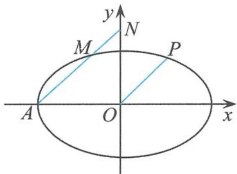
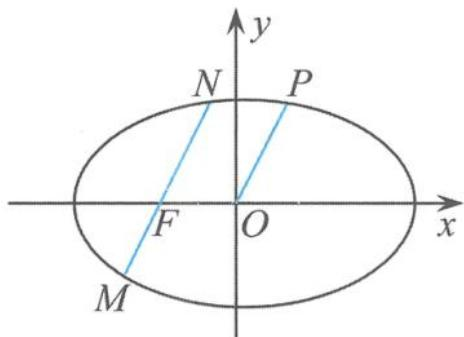
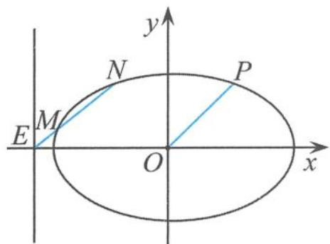
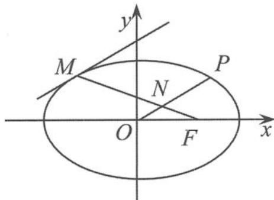
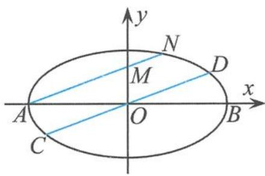

## 5.2.1 一类圆锥曲线中平行弦的定值问题探究

(1) 问题的呈现

例 1 已知椭圆 $\frac{x^{2}}{a^{2}} + \frac{y^{2}}{b^{2}} = 1 (a > b > 0)$ ，直线 l 过点 A (-a, 0)，与椭圆交于点 M、与 y 轴交于点 N，过原点且平行于 l 的直线与椭圆交于点 P。证明： $|\overrightarrow{AM}|, \sqrt{2}|\overrightarrow{OP}|, |\overrightarrow{AN}|$ 成等比数列。

证明 如图 5.2-1, 设直线 OP 的方程为

$$
y = k x,
$$

则直线 $AM$ 的方程为

$$
y = k (x + a).
$$

则 $N(0,ka)$ ，所以

图5.2-1

$$
| A N | = \sqrt {1 + k ^ {2}} a.
$$

$$
\text { 由 } \left\{ \begin{array}{l l} y = k (x + a) \\ \frac {x ^ {2}}{a ^ {2}} + \frac {y ^ {2}}{b ^ {2}} = 1 \end{array} \right. \text { 得到 }
$$

$$
| A M | = \frac {2 a b ^ {2} \sqrt {1 + k ^ {2}}}{a ^ {2} k ^ {2} + b ^ {2}},
$$

所以

$$
\vert A M \vert \vert A N \vert = \frac {2 a ^ {2} b ^ {2} (1 + k ^ {2})}{a ^ {2} k ^ {2} + b ^ {2}};
$$

由 $\left\{\begin{aligned}y&=kx\\ \frac{x^{2}}{a^{2}}+\frac{y^{2}}{b^{2}}&=1\end{aligned}\right.$ 得到

$$
\mid O P \mid^ {2} = \frac {a ^ {2} b ^ {2} (1 + k ^ {2})}{a ^ {2} k ^ {2} + b ^ {2}}.
$$

因此

$$
\frac {| \overrightarrow {A M} | | \overrightarrow {A N} |}{| \overrightarrow {O P} | ^ {2}} = 2,
$$

即 $|\overrightarrow{AM}|, \sqrt{2} |\overrightarrow{OP}|, |\overrightarrow{AN}|$ 成等比数列.

点评 这是一道以圆锥曲线的平行弦问题为载体考查学生解析几何思想方法的试题,内容丰富多彩、结构浑然一体,定值、定点、定向问题三足鼎立,知识、能力考查平分秋色.该试题蕴含着椭圆许多有趣的几何性质,是我们高考复习研究的重要素材.

## (2) 有关性质的探讨

高考试题往往是一个重要的知识生长点,是我们自主探究的重要平台,能激活我们的理性思维.

性质1 若点 $P$ 是椭圆 $\frac{x^2}{a^2} +\frac{y^2}{b^2} = 1(a > b > 0)$ 上的一个动点， $O$ 为椭圆的中心，过椭圆的左顶点 $A$ 且平行于弦 $OP$ 的直线与椭圆交于点 $M$ ，与 $y$ 轴交于点 $N$ ，则 $\frac{\overrightarrow{AM}\cdot\overrightarrow{AN}}{|\overrightarrow{OP}|^2} = 2.$

引申1 若点 $P$ 是椭圆 $\frac{x^2}{a^2} + \frac{y^2}{b^2} = 1 (a > b > 0)$ 上的一个动点， $O$ 为椭圆的中心，过椭圆的左焦点 $F$ 且平行于弦 $OP$ 的直线与椭圆交于点 $M, N$ ，则 $\frac{\overrightarrow{FM} \cdot \overrightarrow{FN}}{|\overrightarrow{OP}|^2} = e^2 - 1$ .（其中 $e$ 为椭圆的离心率）

证明 如图 5.2-2, 设直线 OP 的方程为

$$
y = k x,
$$

把 $y = kx$ 代入椭圆方程得

$$
| \overrightarrow {O P} | ^ {2} = \frac {a ^ {2} b ^ {2} (1 + k ^ {2})}{a ^ {2} k ^ {2} + b ^ {2}} \quad ①.
$$

  
图5.2-2

设直线 $MN$ 的方程为

$$
\left\{ \begin{array}{l} x = t \cos \alpha - c, \\ y = t \sin \alpha \end{array} \right.
$$

(t 为参数, $\alpha$ 为倾斜角), 将其代入椭圆方程得

$$
\left(a ^ {2} \sin^ {2} \alpha + b ^ {2} \cos^ {2} \alpha\right) t ^ {2} - 2 b ^ {2} c t \cos \alpha + b ^ {2} c ^ {2} - a ^ {2} b ^ {2} = 0,
$$

其中 $k=\tan\alpha$ . 由韦达定理得

$$
t _ {1} t _ {2} = \frac {b ^ {2} c ^ {2} - a ^ {2} b ^ {2}}{a ^ {2} \sin^ {2} \alpha + b ^ {2} \cos^ {2} \alpha} = \frac {(b ^ {2} c ^ {2} - a ^ {2} b ^ {2}) (1 + k ^ {2})}{a ^ {2} k ^ {2} + b ^ {2}},
$$

即

$$
\overrightarrow {F M} \cdot \overrightarrow {F N} = \frac {(b ^ {2} c ^ {2} - a ^ {2} b ^ {2}) (1 + k ^ {2})}{a ^ {2} k ^ {2} + b ^ {2}} \quad ②.
$$

由①②得

$$
\frac {\overrightarrow {F M} \cdot \overrightarrow {F N}}{| \overrightarrow {O P} | ^ {2}} = e ^ {2} - 1.
$$

引申 2 若点 P 是椭圆 $\frac{x^{2}}{a^{2}} + \frac{y^{2}}{b^{2}} = 1 (a > b > 0)$ 上的一个动点，O 为椭圆的中心，过椭圆的左准线与 x 轴的交点 E 且平行于弦 OP 的直线与椭圆交于点 M, N，则 $\frac{\overrightarrow{EM} \cdot \overrightarrow{EN}}{|\overrightarrow{OP}|^{2}} = \frac{1}{e^{2}} - 1$ . (e 为椭圆的离心率)

证明 如图 5.2-3, 设直线 OP 的方程为

$$
y = k x,
$$

把 $y = kx$ 代入椭圆方程得

$$
| \overrightarrow {O P} | ^ {2} = \frac {a ^ {2} b ^ {2} (1 + k ^ {2})}{a ^ {2} k ^ {2} + b ^ {2}}\tag{①.}
$$

设直线 $MN$ 的方程为

$$
\left\{ \begin{array}{l} x = t \cos \alpha - \frac {a ^ {2}}{c}, \\ y = t \sin \alpha \end{array} \right.
$$

图5.2-3

(t 为参数, $\alpha$ 为倾斜角), 将其代入椭圆方程得

$$
(a ^ {2} \sin^ {2} \alpha + b ^ {2} \cos^ {2} \alpha) t ^ {2} - \frac {2 a ^ {2} b ^ {2}}{c} t \cos \alpha + \frac {a ^ {4} b ^ {2}}{c ^ {2}} - a ^ {2} b ^ {2} = 0,
$$

其中 $k=\tan\alpha$ . 由韦达定理得

$$
t _ {1} t _ {2} = \frac {a ^ {2} b ^ {2} (a ^ {2} - c ^ {2})}{c ^ {2} (a ^ {2} \sin^ {2} \alpha + b ^ {2} \cos^ {2} \alpha)} = \frac {a ^ {2} b ^ {4} (1 + k ^ {2})}{c ^ {2} (a ^ {2} k ^ {2} + b ^ {2})},
$$

即

$$
\overrightarrow {E M} \cdot \overrightarrow {E N} = \frac {a ^ {2} b ^ {4} (1 + k ^ {2})}{c ^ {2} (a ^ {2} k ^ {2} + b ^ {2})}\tag{②.}
$$

由①②得

$$
\frac {\overrightarrow {E M} \cdot \overrightarrow {E N}}{| \overrightarrow {O P} | ^ {2}} = \frac {1}{e ^ {2}} - 1.
$$

点评 以上从向量的数量积的角度来探讨椭圆的平行弦性质,都是过椭圆的特征点(如椭圆的顶点、准线与对称轴的交点、焦点等)的平行弦问题,得到一系列耐人寻味的性质.那么,对椭圆内一般的点,是否也有统一的结论呢?答案是肯定的,这样又从统一的角度引导我们探究圆锥曲线的内在奇异美.

性质2 若点 $P$ 是椭圆 $\frac{x^2}{a^2} +\frac{y^2}{b^2} = 1(a > b > 0)$ 上的一个动点， $O$ 为椭圆的中心，过椭圆内的任意一点 $E(x_0,y_0)$ 且平行于弦 $OP$ 的直线与椭圆交于点 $M,N$ ，则 $\frac{\overrightarrow{EM}\cdot\overrightarrow{EN}}{|\overrightarrow{OP}|^2} = \left(\frac{x_0^2}{a^2} +\right.$ $\frac{y_0^2}{b^2}\Big) - 1$ （为定值）.

证明 设直线 $OP$ 的方程为 $y = kx$ , 把 $y = kx$ 代入椭圆方程得

$$
| \overrightarrow {O P} | ^ {2} = \frac {a ^ {2} b ^ {2} (1 + k ^ {2})}{a ^ {2} k ^ {2} + b ^ {2}}\tag{①.}
$$

设直线 $MN$ 的方程为

$$
\left\{ \begin{array}{l} x = x _ {0} + t \cos \alpha , \\ y = y _ {0} + t \sin \alpha \end{array} \right.
$$

(t 为参数, $\alpha$ 为倾斜角), 将其代入椭圆方程得

$$
(a ^ {2} \sin^ {2} \alpha + b ^ {2} \cos^ {2} \alpha) t ^ {2} + 2 (b ^ {2} x _ {0} \cos \alpha + a ^ {2} y _ {0} \sin \alpha) t + b ^ {2} x _ {0} ^ {2} + a ^ {2} y _ {0} ^ {2} - a ^ {2} b ^ {2} = 0.
$$

由韦达定理得

$$
t _ {1} t _ {2} = \frac {b ^ {2} x _ {0} ^ {2} + a ^ {2} y _ {0} ^ {2} - a ^ {2} b ^ {2}}{a ^ {2} \sin^ {2} \alpha + b ^ {2} \cos^ {2} \alpha} = \frac {(b ^ {2} x _ {0} ^ {2} + a ^ {2} y _ {0} ^ {2} - a ^ {2} b ^ {2}) (1 + k ^ {2})}{a ^ {2} k ^ {2} + b ^ {2}},
$$

其中 $k = \tan \alpha$ ，即

$$
\overrightarrow {E M} \cdot \overrightarrow {E N} = \frac {(b ^ {2} x _ {0} ^ {2} + a ^ {2} y _ {0} ^ {2} - a ^ {2} b ^ {2}) (1 + k ^ {2})}{a ^ {2} k ^ {2} + b ^ {2}}\tag{②.}
$$

由①②得

$$
\frac {\overrightarrow {E M} \cdot \overrightarrow {E N}}{| \overrightarrow {O P} | ^ {2}} = \left(\frac {x _ {0} ^ {2}}{a ^ {2}} + \frac {y _ {0} ^ {2}}{b ^ {2}}\right) - 1 (\text {定值}).
$$

性质3 若点 $P$ 是椭圆 $\frac{x^2}{a^2} +\frac{y^2}{b^2} = 1(a > b > 0)$ 上的一个动点， $O$ 为椭圆的中心，过椭圆的左焦点 $F$ 且平行于弦 $OP$ 的直线与椭圆交于点 $M,N$ ，则 $\frac{|\overrightarrow{OP}|^2}{|\overrightarrow{MN}|} = \frac{a}{2}$

证明 设直线 $OP$ 的方程为

$$
x = m y,
$$

则直线 $MN$ 的方程为

$$
x = m y - c.
$$

把 $x = my$ 代入 $\frac{x^2}{a^2} +\frac{y^2}{b^2} = 1$ 得

$$
| \overrightarrow {O P} | ^ {2} = \frac {(1 + m ^ {2}) a ^ {2} b ^ {2}}{a ^ {2} + m ^ {2} b ^ {2}} \quad ①;
$$

把 $x = my - c$ 代入 $\frac{x^2}{a^2} +\frac{y^2}{b^2} = 1$ 得

$$
(a ^ {2} + b ^ {2} m ^ {2}) y ^ {2} - 2 b ^ {2} m c y + b ^ {2} c ^ {2} - a ^ {2} b ^ {2} = 0.
$$

由韦达定理得

$$
y _ {1} + y _ {2} = \frac {2 m c b ^ {2}}{a ^ {2} + m ^ {2} b ^ {2}},
$$

故

$$
| \overrightarrow {M N} | = (a + e x _ {1}) + (a + e x _ {2}) = 2 a + e m (y _ {1} + y _ {2}) - \frac {2 c ^ {2}}{a} = \frac {2 (1 + m ^ {2}) a b ^ {2}}{a ^ {2} + m ^ {2} b ^ {2}}\tag{②.}
$$

由①②得

$$
\frac {| \overrightarrow {O P} | ^ {2}}{| \overrightarrow {M N} |} = \frac {a}{2}.
$$

性质 4 若点 P 是椭圆 $\frac{x^{2}}{a^{2}} + \frac{y^{2}}{b^{2}} = 1 (a > b > 0)$ 上的一个动点，O 为椭圆的中心，F 为椭圆的右焦点，过椭圆在第二象限内的任意一点 M 的切线 l 平行于弦 OP，MF 交 OP 于点 N，则 $|MN| = a$ .

证明 如图 5.2-4, 设 $M(x_{0}, y_{0})$ , 则椭圆在点 M 处的切线 l 的方程为

$$
\frac {x x _ {0}}{a ^ {2}} + \frac {y y _ {0}}{b ^ {2}} = 1,
$$

直线 $OP$ 的方程为

$$
y = - \frac {b ^ {2} x _ {0}}{a ^ {2} y _ {0}} x,
$$

  
图5.2-4

直线 $MF$ 的方程为

$$
y = \frac {y _ {0}}{x _ {0} - c} (x - c).
$$

易得 $N\left(\frac{a^{2}y_{0}^{2}c}{b^{2}(a^{2}-cx_{0})},\frac{-x_{0}y_{0}c}{a^{2}-cx_{0}}\right)$ ,

$$
\begin{array}{l} \mid M N \mid^ {2} = \left[ \frac {a ^ {2} y _ {0} ^ {2} c}{b ^ {2} (a ^ {2} - c x _ {0})} - x _ {0} \right] ^ {2} + \left(\frac {- x _ {0} y _ {0} c}{a ^ {2} - c x _ {0}} - y _ {0}\right) ^ {2} = \left[ \frac {(c - x _ {0}) ^ {2}}{(a ^ {2} - c x _ {0}) ^ {2}} + \frac {y _ {0} ^ {2}}{(a ^ {2} - c x _ {0}) ^ {2}} \right] \times a ^ {4} \\ = \frac {(c - x _ {0}) ^ {2} + y _ {0} ^ {2}}{(a ^ {2} - c x _ {0}) ^ {2}} \times a ^ {4} = \frac {(c - x _ {0}) ^ {2} + \left(1 - \frac {x _ {0} ^ {2}}{a ^ {2}}\right) b ^ {2}}{(a ^ {2} - c x _ {0}) ^ {2}} \times a ^ {4} = \frac {a ^ {2} (c - x _ {0}) ^ {2} + (a ^ {2} - x _ {0} ^ {2}) b ^ {2}}{(a ^ {2} - c x _ {0}) ^ {2}} \times a ^ {2} \\ = \frac {(a ^ {2} - c x _ {0}) ^ {2}}{(a ^ {2} - c x _ {0}) ^ {2}} \times a ^ {2} = a ^ {2}. \end{array}
$$

因此

$$
\mid M N \mid = a.
$$

## (3) 有关试题链接

如图 5.2-5, CD 是椭圆 $\frac{x^{2}}{a^{2}} + \frac{y^{2}}{b^{2}} = 1$ 的一条直径, 过椭圆长轴的左顶点 A 作 CD 的平行线, 交椭圆于另一点 N, 交椭圆短轴所在直线于 M, 证明: $|AM||AN| = |CO||CD|$ .

  
图5.2-5

“水无华,相荡乃生涟漪,石无光,相击而生火光。”试题因探究而精彩,有效的学习应该以“问题”为核心、以“探究”为途径、以“发现”为目的,体验数学发现、数学探究、数学创造的过程,这也是新课程学习所重点推崇的。
