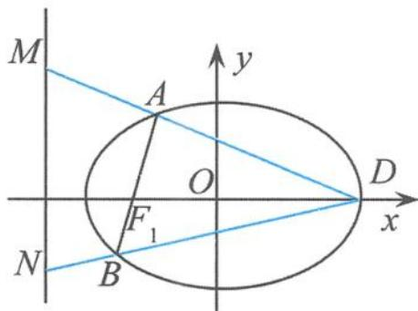
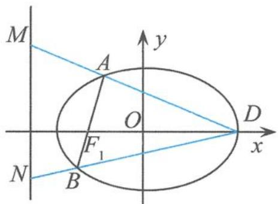

## 5.2.2 一类与准线相关的定值问题溯源

## (1)典型问题的回放

例 2 已知椭圆 $\frac{x^{2}}{5^{2}} + \frac{y^{2}}{4^{2}} = 1$ ，过其左焦点 $F_{1}$ 作一条直线，交椭圆于 A, B 两点， $D(a,0)$ 为点 $F_{1}$ 右侧一点，连接 DA, DB 并延长，分别交椭圆左准线于点 M, N。若以 MN 为直径的圆恰好过点 $F_{1}$ ，求 a 的值。

解答 如图 5.2-6, 易得 $F_{1}(-3,0)$ , 左准线方程为 $x=-\frac{25}{3}$ , 当直线 AB 的斜率 k 存在时, 设其方程为

$$
y = k (x + 3).
$$

设 $A(x_{1},y_{1}),B(x_{2},y_{2})$ ，由 $\left\{ \begin{array}{l}y = k(x + 3),\\ \frac{x^2}{25} +\frac{y^2}{16} = 1 \end{array} \right.$ 得

图5.2-6

$$
(1 6 + 2 5 k ^ {2}) x ^ {2} + 1 5 0 k ^ {2} x + 2 2 5 k ^ {2} - 4 0 0 = 0,
$$

从而

$$
x _ {1} + x _ {2} = - \frac {1 5 0 k ^ {2}}{1 6 + 2 5 k ^ {2}}, x _ {1} x _ {2} = \frac {2 2 5 k ^ {2} - 4 0 0}{1 6 + 2 5 k ^ {2}}.
$$

所以

$$
y _ {1} y _ {2} = k ^ {2} (x _ {1} + 3) (x _ {2} + 3) = - \frac {2 5 6 k ^ {2}}{1 6 + 2 5 k ^ {2}}.
$$

设 $M\left(-\frac{25}{3},y_3\right),N\left(-\frac{25}{3},y_4\right)$ . 由点 $M,A,D$ 共线得

$$
y _ {3} = \frac {(3 a + 2 5) y _ {1}}{3 (a - x _ {1})}.
$$

同理

$$
y _ {4} = \frac {(3 a + 2 5) y _ {2}}{3 (a - x _ {2})}.
$$

又 $\overrightarrow{F_1M} = \left(-\frac{16}{3},y_3\right),\overrightarrow{F_1N} = \left(-\frac{16}{3},y_4\right)$ ，由已知得 $\overrightarrow{F_1M}\bot \overrightarrow{F_1N}$ ，即 $\overrightarrow{F_1M}\cdot \overrightarrow{F_1N} = 0$ ，得

$$
y _ {3} y _ {4} = - \frac {2 5 6}{9}.
$$

而 $y_{3}y_{4} = \frac{(3a + 25)^{2}y_{1}y_{2}}{9(a - x_{1})(a - x_{2})}$ 即 $-\frac{256k^2}{16 + 25k^2}\cdot \frac{(3a + 25)^2}{9(a - x_1)(a - x_2)} = -\frac{256}{9}$ 整理得

$$
(1 + k ^ {2}) (1 6 a ^ {2} - 4 0 0) = 0 \Rightarrow a = \pm 5.
$$

又因为 a > -3，所以 a = 5。

当直线 AB 的斜率不存在时, 经计算得 a=5, 符合题意.

综上所述，a=5。

点评 这是一道看似平淡,其实内涵丰富的解析几何问题,蕴含着圆锥曲线的一个非常重要的几何性质.整个试题设计隽永、背景深刻、构思巧妙、结构优美和谐、内容别具一格,是一道值得我们进行教学探究的经典之作.其实,题目中的点 $D$ 恰好是椭圆的右顶点.题目的美妙之处在于,它不仅深刻地揭示了圆锥曲线的焦点与准线的内在联系,而且具有推广和引申的价值,可以演变出一组妙趣横生的结论.

## (2)问题的本原探究

如果我们能够围绕着某个典型例题进行展开剖析、引申、拓展,充分利用经典试题的营养价值在学习中的重要作用,让我们的思维纵横驰骋,将有利于构筑完整的认知结构和思想体系,提高学习数学理性思维的灵活性和广阔性,拓宽数学视野.

探究 1 （一般化）过椭圆 $\frac{x^{2}}{a^{2}} + \frac{y^{2}}{b^{2}} = 1 (a > b > 0)$ 的左焦点 F 作一条直线，交椭圆于 A, B 两点，D 为椭圆的右顶点，连接 DA, DB 并延长，分别交椭圆的左准线于点 M, N，则以线段 MN 为直径的圆过点 F.

证明 设 $A(x_{1},y_{1}),B(x_{2},y_{2})$ ，直线 $AB$ 的方程为

$$
x = m y - c,
$$

把直线 $AB$ 的方程代入椭圆方程得

$$
(b ^ {2} m ^ {2} + a ^ {2}) y ^ {2} - 2 b ^ {2} c m y + b ^ {2} c ^ {2} - a ^ {2} b ^ {2} = 0,
$$

所以

$$
y _ {1} + y _ {2} = \frac {2 b ^ {2} c m}{b ^ {2} m ^ {2} + a ^ {2}}, y _ {1} y _ {2} = \frac {b ^ {2} c ^ {2} - a ^ {2} b ^ {2}}{b ^ {2} m ^ {2} + a ^ {2}}.
$$

从而

$$
\begin{array}{r l} & (m y _ {1} - a - c) (m y _ {2} - a - c) = m ^ {2} y _ {1} y _ {2} - m (a + c) (y _ {1} + y _ {2}) + (a + c) ^ {2} \\ & \quad = \frac {m ^ {2} (b ^ {2} c ^ {2} - a ^ {2} b ^ {2})}{m ^ {2} b ^ {2} + a ^ {2}} - (a + c) \frac {2 b ^ {2} m ^ {2} c}{m ^ {2} b ^ {2} + a ^ {2}} + (a + c) ^ {2} = \frac {a ^ {2} (a + c) ^ {2}}{a ^ {2} + m ^ {2} b ^ {2}}, \end{array}
$$

故 $\frac{y_1y_2}{(my_1 - a - c)(my_2 - a - c)} = \frac{b^2(c^2 - a^2)}{a^2(a + c)^2}$ . 因此

$$
\begin{array}{r l} \overrightarrow {F M} \cdot \overrightarrow {F N} & = \left(\frac {a ^ {2}}{c} - c\right) ^ {2} + \frac {a ^ {2} (a + c) ^ {2}}{c ^ {2}} \cdot \frac {y _ {1} y _ {2}}{(m y _ {1} - a - c) (m y _ {2} - a - c)} \\ & = \left(\frac {a ^ {2}}{c} - c\right) ^ {2} + \frac {a ^ {2} (a + c) ^ {2}}{c ^ {2}} \cdot \frac {b ^ {2} (c ^ {2} - a ^ {2})}{a ^ {2} (a + c) ^ {2}} = 0. \end{array}
$$

故以线段 MN 为直径的圆过点 F.

## (3) 相关问题的引申探究

通过引申探究展示知识的发生、发展和形成的过程,从而弄清知识的来龙去脉,形成知识网络,抓住问题的本质,加深对问题的理解.

探究 2 过椭圆 $\frac{x^{2}}{a^{2}} + \frac{y^{2}}{b^{2}} = 1 (a > b > 0)$ 的左焦点 $F_{1}$ 作一条直线, 交椭圆于 A, B 两点, D 为椭圆的右顶点, 连接 AD, BD 并延长, 分别交椭圆左准线于点 M, N, 则直线 DM, DN 的斜率之积为定值 $-(e-1)^{2}$ . (其中 e 为椭圆的离心率)

证明 如图 5.2-7, 设 $A(x_{1}, y_{1}), B(x_{2}, y_{2})$ , 直线 AB 的方程为 x = my - c,

把直线 AB 的方程代入椭圆方程, 整理得

$$
(b ^ {2} m ^ {2} + a ^ {2}) y ^ {2} - 2 b ^ {2} c m y + b ^ {2} c ^ {2} - a ^ {2} b ^ {2} = 0,
$$

所以

图5.2-7

$$
y _ {1} + y _ {2} = \frac {2 b ^ {2} c m}{b ^ {2} m ^ {2} + a ^ {2}}, y _ {1} y _ {2} = \frac {b ^ {2} c ^ {2} - a ^ {2} b ^ {2}}{b ^ {2} m ^ {2} + a ^ {2}}.
$$

因此

$$
\begin{array}{r l} k _ {D M} \cdot k _ {D N} & = k _ {D A} \cdot k _ {D B} = \frac {y _ {1}}{x _ {1} - a} \cdot \frac {y _ {2}}{x _ {2} - a} = \frac {y _ {1} y _ {2}}{(m y _ {1} - a - c) (m y _ {2} - a - c)} \\ & = \frac {y _ {1} y _ {2}}{m ^ {2} y _ {1} y _ {2} - m (a + c) (y _ {1} + y _ {2}) + (a + c) ^ {2}} (*). \end{array}
$$

又 $(\ast)$ 式的分母 $= \frac{m^2(b^2c^2 - a^2b^2)}{m^2b^2 + a^2} -(a + c)\frac{2b^2m^2c}{m^2b^2 + a^2} +(a + c)^2 = \frac{a^2(a + c)^2}{a^2 + m^2b^2}$ ，而 $(\ast)$ 式的分子 $= \frac{b^2c^2 - a^2b^2}{b^2m^2 + a^2}$ ，所以

$$
k _ {D M} \cdot k _ {D N} = \frac {b ^ {2} c ^ {2} - a ^ {2} b ^ {2}}{a ^ {2} (a + c) ^ {2}} = - (e - 1) ^ {2}.
$$

证毕.

探究 3 过椭圆 $\frac{x^{2}}{a^{2}} + \frac{y^{2}}{b^{2}} = 1 (a > b > 0)$ 的左焦点 F 作一条直线, 交椭圆于 A, B 两点, D 为椭圆的右顶点, 连接 DA, DB 并延长, 分别交椭圆左准线于点 M, N, 则点 M, N 的纵坐标之积为定值 $-\frac{b^{4}}{c^{2}}$ .

证明 由“探究2”可知

$$
k _ {D M} \cdot k _ {D N} = - (e - 1) ^ {2}.
$$

所以 $k_{DM} \cdot k_{DN} = \frac{-y_M}{\frac{a^2}{c} + a} \cdot \frac{-y_N}{\frac{a^2}{c} + a} = -(e - 1)^2$ ，从而

$$
y _ {M} \cdot y _ {N} = - \frac {b ^ {4}}{c ^ {2}}.
$$

利用“探究 3”, 我们就可以轻松地证明“探究 1”. 由“探究 3”可知

$$
y _ {M} \cdot y _ {N} = - \frac {b ^ {4}}{c ^ {2}},
$$

所以

$$
k _ {F M} \cdot k _ {F N} = \frac {y _ {M}}{- \frac {a ^ {2}}{c} + c} \cdot \frac {y _ {N}}{- \frac {a ^ {2}}{c} + c} = \frac {y _ {M} \cdot y _ {N}}{\frac {b ^ {4}}{c ^ {2}}} = - 1.
$$

因此 $\angle MFN=90^{\circ}$ .证毕.

点评 利用“探究 3”重新来审视这道高考试题,解题思路变得豁然开朗,解题过程一目了然,问题的解决也变得轻而易举.同时,“探究 3”也使得问题的解决变得有规可循,让我们解题做到胸有成竹.

探究 4 过椭圆 $\frac{x^{2}}{a^{2}} + \frac{y^{2}}{b^{2}} = 1 (a > b > 0)$ 的左焦点 F 作一条直线，交椭圆于 A, B 两点，D 为椭圆的右顶点，连接 DA, DB 并延长，分别交椭圆左准线于点 M, N，则 $\overrightarrow{OM} \cdot \overrightarrow{ON} = a^{2} + b^{2}$ （定值）.

探究 5 过椭圆 $\frac{x^{2}}{a^{2}} + \frac{y^{2}}{b^{2}} = 1 (a > b > 0)$ 的左焦点 F 作一条直线，交椭圆于 A, B 两点，D 为椭圆的右顶点，连接 DA, DB 并延长，分别交椭圆左准线于点 M, N，则直线 AN 与直线 BM 相交于左顶点 $D'$ .

证明 设 $A(x_{1},y_{1}),B(x_{2},y_{2})$ ，直线 $AB$ 的方程为

$$
x = m y - c,
$$

把直线 AB 的方程代入椭圆方程, 整理得

$$
(b ^ {2} m ^ {2} + a ^ {2}) y ^ {2} - 2 b ^ {2} c m y + b ^ {2} c ^ {2} - a ^ {2} b ^ {2} = 0,
$$

所以

$$
y _ {1} + y _ {2} = \frac {2 b ^ {2} c m}{b ^ {2} m ^ {2} + a ^ {2}}, y _ {1} y _ {2} = \frac {b ^ {2} c ^ {2} - a ^ {2} b ^ {2}}{b ^ {2} m ^ {2} + a ^ {2}} \quad ①.
$$

直线 $AD$ 的方程为 $y = \frac{y_1}{x_1 - a} (x - a)$ , 与左准线方程 $x = -\frac{a^2}{c}$ 联立, 可得点 $M$ 的纵坐标

$$
y _ {M} = \frac {y _ {1}}{x _ {1} - a} \left(- \frac {a ^ {2}}{c} - a\right).
$$

同理可得

$$
y _ {N} = \frac {y _ {2}}{x _ {2} - a} \left(- \frac {a ^ {2}}{c} - a\right).
$$

所以 $k_{D'A} = \frac{y_1}{x_1 + a} = \frac{y_1}{my_1 - c + a}, k_{D'N} = \frac{y_N}{-\frac{a^2}{c} + a} = \frac{a + c}{a - c} \cdot \frac{y_2}{my_2 - c - a}$ . 从而

$$
k _ {D ^ {\prime} A} - k _ {D ^ {\prime} N} = \frac {y _ {1}}{m y _ {1} - c + a} - \frac {(a + c) y _ {2}}{(a - c) (m y _ {2} - c - a)} = \frac {- b ^ {2} (y _ {1} + y _ {2}) - 2 m c y _ {1} y _ {2}}{(m y _ {1} - c + a) (m y _ {2} - c - a) (a - c)}\tag{②.}
$$

把①代入②可得

$$
k _ {D ^ {\prime} A} - k _ {D ^ {\prime} N} = 0,
$$

所以直线 AN 与 x 轴相交于左顶点 $D'$ . 同理, 直线 BM 与 x 轴相交于左顶点 $D'$ , 所以直线 AN 与直线 BM 相交于左顶点 $D'$ .

(4) 相关问题链接

以上有关椭圆的性质在双曲线中同样成立. 我们把问题再延伸探究, 触类旁通, 链接高考试题.

链接 已知定点 $A(-1,0), F(2,0)$ , 定直线 $l: x = \frac{1}{2}$ , 不在 $x$ 轴上的动点 $P$ 与点 $F$ 的距离是它到直线 $l$ 的距离的 2 倍. 设点 $P$ 的轨迹为 $E$ , 过点 $F$ 的直线交轨迹 $E$ 于 $B, C$ 两点, 直线 $AB, AC$ 分别交直线 $l$ 于点 $M, N$ .

(I)求轨迹 $E$ 的方程.

(Ⅱ)试判断以线段 MN 为直径的圆是否过点 F, 并说明理由.

解答 （Ⅰ）设 $P(x,y)$ ，则 $\sqrt{(x-2)^{2}+y^{2}}=2\left|x-\frac{1}{2}\right|$ ，化简得

$$
x ^ {2} - \frac {y ^ {2}}{3} = 1 (y \neq 0).
$$

(Ⅱ)以线段 MN 为直径的圆经过点 F. 理由略.

点评 再现经典试题,以问题为载体,按照“提出问题—探究问题—解答问题”的学习路线层层展开,达到“放马于原野之中,牵其于晚霞之时”的潇洒境界.体验探究的乐趣,将探究的过程演绎得波澜壮阔、悬念迭起、扣人心弦,令人感到荡气回肠!
