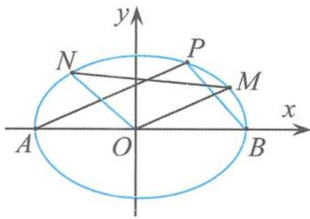
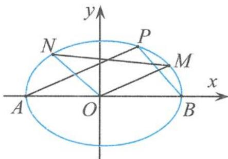
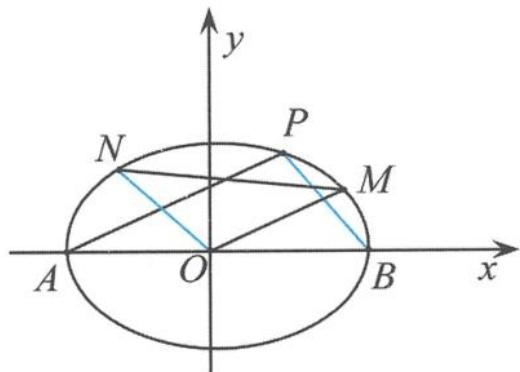
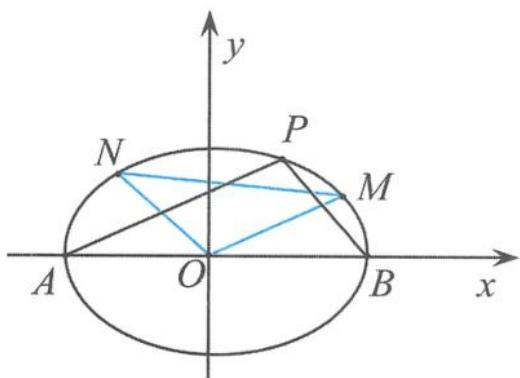

## 5.2.3 一类以 $e^2 - 1$ 为背景的定值问题溯源

(1) 问题的呈现

例 3 如图 5.2-8, 已知椭圆 $C: \frac{x^2}{a^2} + \frac{y^2}{b^2} = 1 (a > b > 0)$ 经过点 (1, $\frac{\sqrt{6}}{2}$ ), 其离心率等于 $\frac{\sqrt{2}}{2}$ . 点 $A, B$ 分别为椭圆 $C$ 的左、右顶点, $M, N$ 是椭圆 $C$ 上非顶点的两点, 且 $\triangle MON$ 的面积等于 $\sqrt{2}$ .

  
图5.2-8

(Ⅰ)求椭圆 C 的方程.

(Ⅱ) 过点 A 作 AP ∥ OM, 交椭圆 C 于点 P, 证明: BP ∥ ON.

解答 (I)由题意得椭圆 $C$ 的方程为

$$
\frac {x ^ {2}}{4} + \frac {y ^ {2}}{2} = 1.
$$

(Ⅱ)解法1:设直线OM,ON的方程分别为

$$
y = k _ {O M} x, y = k _ {O N} x.
$$

联立方程组 $\left\{\begin{aligned}y&=k_{OM}x,\\ \frac{x^{2}}{4}&+\frac{y^{2}}{2}=1,\end{aligned}\right.$ 解得

$$
M \left(\frac {2}{\sqrt {1 + 2 k _ {O M} ^ {2}}}, \frac {2 k _ {O M}}{\sqrt {1 + 2 k _ {O M} ^ {2}}}\right).
$$

同理可得

$$
N \left(- \frac {2}{\sqrt {1 + 2 k _ {O N} ^ {2}}}, - \frac {2 k _ {O N}}{\sqrt {1 + 2 k _ {O N} ^ {2}}}\right).
$$

作 $MM' \perp x$ 轴， $NN' \perp x$ 轴， $M', N'$ 是垂足，则

$$
\begin{array}{r l} & {S _ {\triangle O M N} = S _ {\text {梯形} M M ^ {\prime} N ^ {\prime} N} - S _ {\triangle O M M ^ {\prime}} - S _ {\triangle O N N ^ {\prime}} = \frac {1}{2} [ (y _ {M} + y _ {N}) (x _ {M} - x _ {N}) - x _ {M} y _ {M} + x _ {N} y _ {N} ]} \\ & {\qquad = \frac {1}{2} (x _ {M} y _ {N} - x _ {N} y _ {M})} \\ & {\qquad = \frac {1}{2} \big (\frac {- 4 k _ {O N}}{\sqrt {1 + 2 k _ {O M} ^ {2}} \sqrt {1 + 2 k _ {O N} ^ {2}}} + \frac {4 k _ {O M}}{\sqrt {1 + 2 k _ {O M} ^ {2}} \sqrt {1 + 2 k _ {O N} ^ {2}}} \big)} \\ & {\qquad = \frac {2 (k _ {O M} - k _ {O N})}{\sqrt {1 + 2 k _ {O M} ^ {2}} \sqrt {1 + 2 k _ {O N} ^ {2}}}.} \end{array}
$$

已知 $S_{\triangle OMN} = \sqrt{2}$ ，化简可得

$$
k _ {O M} \cdot k _ {O N} = - \frac {1}{2}.
$$

设 $P(x_{P},y_{P})$ ，则 $4 - x_{P}^{2} = 2y_{P}^{2}$ .已知 $k_{AP} = k_{OM}$ ，所以要证明 $k_{BP} = k_{ON}$ ，只要证明

$$
k _ {A P} \cdot k _ {B P} = - \frac {1}{2}.
$$

而 $k_{AP} \cdot k_{BP} = \frac{y_P}{x_P + 2} \cdot \frac{y_P}{x_P - 2} = \frac{y_P^2}{x_P^2 - 4} = -\frac{1}{2}$ , 所以可得

$$
B P \parallel O N.
$$

(点 M, N 在 y 轴同侧的情况同理可得)

解法 2: 设直线 AP 的方程为

$$
y = k _ {O M} (x + 2),
$$

代入 $x^{2}+2y^{2}=4$ 得

$$
(2 k _ {O M} ^ {2} + 1) x ^ {2} + 8 k _ {O M} ^ {2} x + 8 k _ {O M} ^ {2} - 4 = 0.
$$

它的两个根为-2和 $x_{P}$ ，可得

$$
x _ {P} = \frac {2 - 4 k _ {O M} ^ {2}}{2 k _ {O M} ^ {2} + 1}, y _ {P} = \frac {4 k _ {O M}}{2 k _ {O M} ^ {2} + 1}.
$$

从而 $k_{BP} = \frac{\frac{4k_{OM}}{2k_{OM}^2 + 1}}{\frac{2 - 4k_{OM}^2}{2k_{OM}^2 + 1} - 2} = -\frac{1}{2k_{OM}}.$ 所以只需证明 $-\frac{1}{2k_{OM}} = k_{ON}$ ，即

$$
k _ {O M} \cdot k _ {O N} = - \frac {1}{2}.
$$

设 $M(x_{1},y_{1}),N(x_{2},y_{2})$ ，若直线MN的斜率不存在，易得 $x_{1} = x_{2} = \pm \sqrt{2}$ ，从而可得 $k_{OM}\cdot k_{ON} = -\frac{1}{2}$ .若直线MN的斜率存在，设直线MN的方程为

$$
y = k x + m,
$$

代入椭圆方程 $\frac{x^2}{4} +\frac{y^2}{2} = 1$ 得

$$
(2 k ^ {2} + 1) x ^ {2} + 4 k m x + 2 m ^ {2} - 4 = 0,
$$

则

$$
x _ {1} + x _ {2} = - \frac {4 k m}{2 k ^ {2} + 1}, x _ {1} x _ {2} = \frac {2 m ^ {2} - 4}{2 k ^ {2} + 1}.
$$

因为 $\Delta=8(4k^{2}+2-m^{2})>0$ ，所以

$$
S _ {\triangle O M N} = \frac {1}{2} | m | | x _ {1} - x _ {2} | = \frac {1}{2} | m | \cdot \frac {\sqrt {8 (4 k ^ {2} + 2 - m ^ {2})}}{2 k ^ {2} + 1} = \sqrt {2},
$$

化简得 $m^4 - (4k^2 + 2)m^2 + (2k^2 + 1)^2 = 0$ ，得

$$
m ^ {2} = 2 k ^ {2} + 1,
$$

故

$$
k _ {O M} \cdot k _ {O N} = \frac {y _ {1} y _ {2}}{x _ {1} x _ {2}} = \frac {k ^ {2} x _ {1} x _ {2} + k m (x _ {1} + x _ {2}) + m ^ {2}}{x _ {1} x _ {2}} = \frac {m ^ {2} - 4 k ^ {2}}{2 m ^ {2} - 4} = \frac {2 k ^ {2} + 1 - 4 k ^ {2}}{2 (2 k ^ {2} + 1) - 4} = - \frac {1}{2}.
$$

得证.

点评 本试题立意之新、内涵之广、选材之妙不得不令人叹服。以新颖的视角、创新的手法进行精心地构思，彰显新课程的理念。所以，这是一道创新而不落俗套的好试题，有利于甄别学生的思维层次，具有较好的区分度。这个问题反映了 $\frac{x^2}{a^2} + \frac{y^2}{b^2} = 1 (a > b > 0)$ 的一组性质，不仅设计独特新颖，而且具有推广和引申的价值，可以演变出一组妙趣横生的结论。

(2)问题的逆向探究

“重门深锁无寻处,疑有碧桃千树花.”对于一个数学问题,需要多角度地剖析、探究.对于一个数学问题的探究思考,最基本的切入点就是对条件与结论进行变式思考,可以考虑其逆命题是否成立.

引申1 如图5.2-9, 已知椭圆 $C: \frac{x^2}{a^2} + \frac{y^2}{b^2} = 1 (a > b > 0)$ 经过点 $(1, \frac{\sqrt{6}}{2})$ , 其离心率为 $\frac{\sqrt{2}}{2}$ . 点 $A, B$ 分别为椭圆 $C$ 的左、右顶点, $M, N$ 是椭圆 $C$ 上非顶点的两点.

  
图5.2-9

(Ⅰ)求椭圆 C 的方程.

(Ⅱ) 过椭圆 C 上的点 P 作 AP ∥ OM, 且 BP ∥ ON. 证明: △MON 的面积为 $\sqrt{2}$ .

解答 (I)由题意得椭圆 $C$ 的方程为

$$
\frac {x ^ {2}}{4} + \frac {y ^ {2}}{2} = 1.
$$

(Ⅱ)由于 $k_{PA} \cdot k_{PB} = e^{2} - 1$ ，所以

$$
k _ {O M} \cdot k _ {O N} = e ^ {2} - 1 = - \frac {1}{2}.
$$

设 $M(x_{1},y_{1}),N(x_{2},y_{2})$ ，直线 $MN:x = my + t$ ，将其代入椭圆方程 $\frac{x^2}{4} +\frac{y^2}{2} = 1$ 并整理得

$$
(2 + m ^ {2}) y ^ {2} + 2 m t y + t ^ {2} - 4 = 0,
$$

从而

$$
y _ {1} + y _ {2} = - \frac {2 m t}{2 + m ^ {2}}, y _ {1} y _ {2} = \frac {t ^ {2} - 4}{2 + m ^ {2}}.
$$

所以 $k_{OM} \cdot k_{ON} = \frac{y_1 y_2}{x_1 x_2} = \frac{y_1 y_2}{m^2 y_1 y_2 + mt(y_1 + y_2) + t^2} = \frac{t^2 - 4}{2t^2 - 4m^2} = -\frac{1}{2}$ , 得到

$$
t ^ {2} = 2 + m ^ {2}.
$$

所以

$$
S _ {\triangle O M N} = \frac {1}{2} | t | | y _ {1} - y _ {2} | = \frac {\sqrt {2} | t | \sqrt {4 - t ^ {2} + 2 m ^ {2}}}{2 + m ^ {2}} = \frac {\sqrt {2} | t | \sqrt {2 t ^ {2} - t ^ {2}}}{t ^ {2}} = \sqrt {2}.
$$

## (3) 问题的一般化探究

为了能把问题看得更清楚些,我们往往考虑把问题进行一般化研究,容易得到下列引申 2.

引申 2 已知点 A, B 分别为椭圆 C: $\frac{x^{2}}{a^{2}} + \frac{y^{2}}{b^{2}} = 1 (a > b > 0)$ 的左、右顶点，M, N 是椭圆 C 上非顶点的两点，且 $\triangle MON$ 的面积等于 $\frac{1}{2}ab$ . 过点 A 作 AP // OM，交椭圆 C 于点 P，证明：BP // ON.

分析 由于 $k_{PA} \cdot k_{PB} = e^{2} - 1$ ，所以只需要证明 $k_{OM} \cdot k_{ON} = e^{2} - 1$ 。

解答 如图 5.2-10, 设 MN: x=my+t, 将其代入椭圆方程 $\frac{x^{2}}{a^{2}} + \frac{y^{2}}{b^{2}} = 1$ 并整理得

$$
(a ^ {2} + b ^ {2} m ^ {2}) y ^ {2} + 2 b ^ {2} m t y + b ^ {2} t ^ {2} - a ^ {2} b ^ {2} = 0,
$$

  
图5.2-10

从而

$$
y _ {1} + y _ {2} = - \frac {2 b ^ {2} m t}{a ^ {2} + b ^ {2} m ^ {2}}, y _ {1} y _ {2} = \frac {b ^ {2} t ^ {2} - a ^ {2} b ^ {2}}{a ^ {2} + b ^ {2} m ^ {2}}.
$$

所以

$$
S _ {\triangle O M N} = \frac {1}{2} | t | | y _ {1} - y _ {2} | = \frac {| t | a b \sqrt {a ^ {2} - t ^ {2} + b ^ {2} m ^ {2}}}{a ^ {2} + b ^ {2} m ^ {2}} = \frac {1}{2} a b,
$$

化简得 $4t^{4} - 4t^{2}(a^{2} + b^{2}m^{2}) + (a^{2} + b^{2}m^{2})^{2} = 0$ ，即

$$
2 t ^ {2} = a ^ {2} + b ^ {2} m ^ {2}.
$$

所以

$$
k _ {\mathrm{OM}} \cdot k _ {\mathrm{ON}} = \frac {y _ {1} y _ {2}}{x _ {1} x _ {2}} = \frac {y _ {1} y _ {2}}{m ^ {2} y _ {1} x _ {2} + m t (y _ {1} + y _ {2}) + t ^ {2}} = \frac {b ^ {2} t ^ {2} - a ^ {2} b ^ {2}}{a ^ {2} t ^ {2} - a ^ {2} b ^ {2} m ^ {2}} = \frac {b ^ {2} (m ^ {2} b ^ {2} - a ^ {2})}{a ^ {2} (a ^ {2} - b ^ {2} m ^ {2})} = - \frac {b ^ {2}}{a ^ {2}} = e ^ {2} - 1.
$$

证毕.

引申 3 已知点 M, N 是椭圆 $C: \frac{x^{2}}{a^{2}} + \frac{y^{2}}{b^{2}} = 1 (a > b > 0)$ 上非顶点的两点，且 $\triangle MON$ 的面积等于 $\frac{1}{2}ab$ ，则 $k_{OM} \cdot k_{ON} = e^{2} - 1$ .

引申 4 已知点 A, B 分别为椭圆 C: $\frac{x^{2}}{a^{2}} + \frac{y^{2}}{b^{2}} = 1 (a > b > 0)$ 的左、右顶点，P, M, N 是椭圆 C 上非顶点的三点，若 AP // OM, BP // ON，则 $\triangle MON$ 的面积等于 $\frac{1}{2} ab$ .

解答 如图 5.2-11, 因为 $k_{PA} \cdot k_{PB} = e^{2} - 1$ , 所以

$$
k _ {O M} \cdot k _ {O N} = e ^ {2} - 1 = - \frac {b ^ {2}}{a ^ {2}}.
$$

设 $MN: x = my + t$ ，将其代入椭圆方程 $\frac{x^2}{a^2} + \frac{y^2}{b^2} = 1$ 并整理得

$$
(a ^ {2} + b ^ {2} m ^ {2}) y ^ {2} + 2 b ^ {2} m t y + b ^ {2} t ^ {2} - a ^ {2} b ^ {2} = 0,
$$

图5.2-11

从而

$$
y _ {1} + y _ {2} = - \frac {2 b ^ {2} m t}{a ^ {2} + b ^ {2} m ^ {2}}, y _ {1} y _ {2} = \frac {b ^ {2} t ^ {2} - a ^ {2} b ^ {2}}{a ^ {2} + b ^ {2} m ^ {2}}.
$$

所以 $k_{OM} \cdot k_{ON} = \frac{y_1 y_2}{x_1 x_2} = \frac{y_1 y_2}{m^2 y_1 y_2 + mt(y_1 + y_2) + t^2} = \frac{b^2 t^2 - a^2 b^2}{a^2 t^2 - a^2 b^2 m^2} = -\frac{b^2}{a^2}$ , 得到 $2t^2 = a^2 + b^2 m^2$ .

所以

$$
S _ {\triangle O M N} = \frac {1}{2} | t | | y _ {1} - y _ {2} | = \frac {| t | a b \sqrt {a ^ {2} - t ^ {2} + b ^ {2} m ^ {2}}}{a ^ {2} + b ^ {2} m ^ {2}} = \frac {| t | a b \sqrt {2 t ^ {2} - t ^ {2}}}{2 t ^ {2}} = \frac {1}{2} a b.
$$

(4) 问题的本原探究

问题的本原:已知点 M, N 是椭圆 $C: \frac{x^{2}}{a^{2}} + \frac{y^{2}}{b^{2}} = 1 (a > b > 0)$ 上非顶点的两点, 且 $\triangle MON$ 的面积等于 $\frac{1}{2}ab$ 的充要条件是 $k_{OM} \cdot k_{ON} = e^{2} - 1$ .
